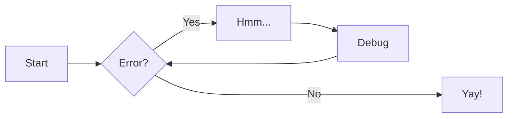
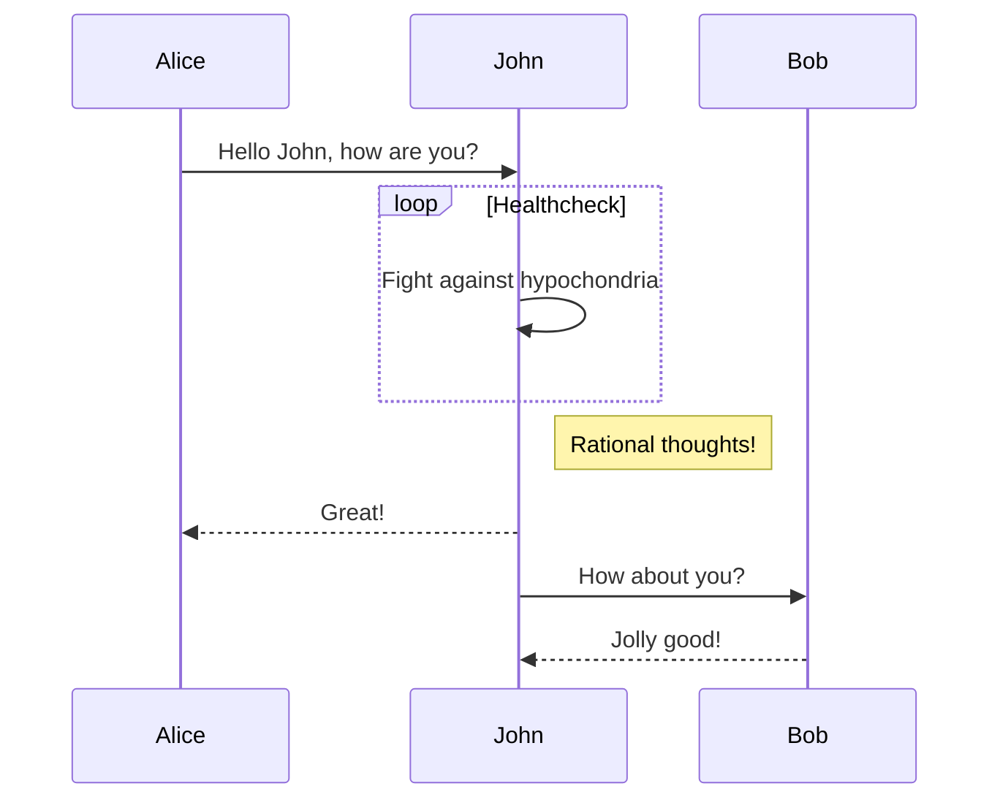

- H~2~O
- A^T^A
- ==This was marked==
- ^^This was inserted^^
- ~~This was deleted~~

<div class="grid cards" markdown>

- :fontawesome-brands-html5: __HTML__ for content and structure
- :fontawesome-brands-js: __JavaScript__ for interactivity
- :fontawesome-brands-css3: __CSS__ for text running out of boxes
- :fontawesome-brands-internet-explorer: __Internet Explorer__ ... huh?

</div>
***
<div class="grid cards" markdown>

-   :material-clock-fast:{ .lg .middle } __Set up in 5 minutes__

    ---

    Install [`mkdocs-material`](#) with [`pip`](#) and get up
    and running in minutes

    [:octicons-arrow-right-24: Getting started](#)

-   :fontawesome-brands-markdown:{ .lg .middle } __It's just Markdown__

    ---

    Focus on your content and generate a responsive and searchable static site

    [:octicons-arrow-right-24: Reference](#)

-   :material-format-font:{ .lg .middle } __Made to measure__

    ---

    Change the colors, fonts, language, icons, logo and more with a few lines

    [:octicons-arrow-right-24: Customization](#)

-   :material-scale-balance:{ .lg .middle } __Open Source, MIT__

    ---

    Material for MkDocs is licensed under MIT and available on [GitHub]

    [:octicons-arrow-right-24: License](#)

</div>

***

=== "C"

    ``` c
    #include <stdio.h>

    int main(void) {
      printf("Hello world!\n");
      return 0;
    }
    ```

=== "C++"

    ``` c++
    #include <iostream>

    int main(void) {
      std::cout << "Hello world!" << std::endl;
      return 0;
    }
    ```

``` py hl_lines="2 3"
def bubble_sort(items):
    for i in range(len(items)):
        for j in range(len(items) - 1 - i):
            if items[j] > items[j + 1]:
                items[j], items[j + 1] = items[j + 1], items[j]
```

***
!!! note

    Lorem ipsum dolor sit amet, consectetur adipiscing elit. Nulla et euismod
    nulla. Curabitur feugiat, tortor non consequat finibus, justo purus auctor
    massa, nec semper lorem quam in massa.

!!! note "Phasellus posuere in sem ut cursus"

    Lorem ipsum dolor sit amet, consectetur adipiscing elit. Nulla et euismod
    nulla. Curabitur feugiat, tortor non consequat finibus, justo purus auctor
    massa, nec semper lorem quam in massa.

??? Tip

    Lorem ipsum dolor sit amet, consectetur adipiscing elit. Nulla et euismod
    nulla. Curabitur feugiat, tortor non consequat finibus, justo purus auctor
    massa, nec semper lorem quam in massa.

!!! info inline end

    Lorem ipsum dolor sit amet, consectetur
    adipiscing elit. Nulla et euismod nulla.
    Curabitur feugiat, tortor non consequat
    finibus, justo purus auctor massa, nec
    semper lorem quam in massa.


***
[Subscribe to our newsletter](#){ .md-button }

[Send :fontawesome-solid-paper-plane:](mailto:<1135801806@qq.com>){ .md-button }

| Method      | Description                          |
| ----------- | ------------------------------------ |
| `GET`       | :material-check:     Fetch resource  |
| `PUT`       | :material-check-all: Update resource |
| `DELETE`    | :material-close:     Delete resource |

***

- [x] Lorem ipsum dolor sit amet, consectetur adipiscing elit
- [ ] Vestibulum convallis sit amet nisi a tincidunt
    * [x] In hac habitasse platea dictumst
    * [x] In scelerisque nibh non dolor mollis congue sed et metus
    * [ ] Praesent sed risus massa
- [ ] Aenean pretium efficitur erat, donec pharetra, ligula non scelerisque


$$
\operatorname{ker} f=\{g\in G:f(g)=e_{H}\}{\mbox{.}}
$$

<!-- { data-title="Madeira, Portugal." data-description="Madeira, an autonomous region of Portugal, is an archipelago comprising 4 islands off the northwest coast of Africa. - Google" } -->

左对齐，右对齐  
{ align=left }
<!-- { align=right } -->


<figure markdown>
  { width="300" }
  <figcaption>图片说明</figcaption>
</figure>

**明暗**







!!! pied-piper "Pied Piper"

    Lorem ipsum dolor sit amet, consectetur adipiscing elit. Nulla et
    euismod nulla. Curabitur feugiat, tortor non consequat finibus, justo
    purus auctor massa, nec semper lorem quam in massa.

++ctrl+alt+del++  


<div class="progress progress-60plus">
    <div class="progress-bar" style="width:50.00%">
        <p class="progress-label">50%</p>
    </div>
</div>
:octicons-arrow-right-24: [点我回到顶部](#) 
