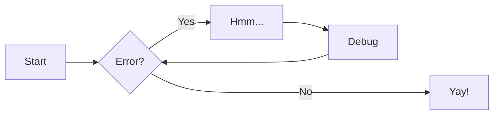
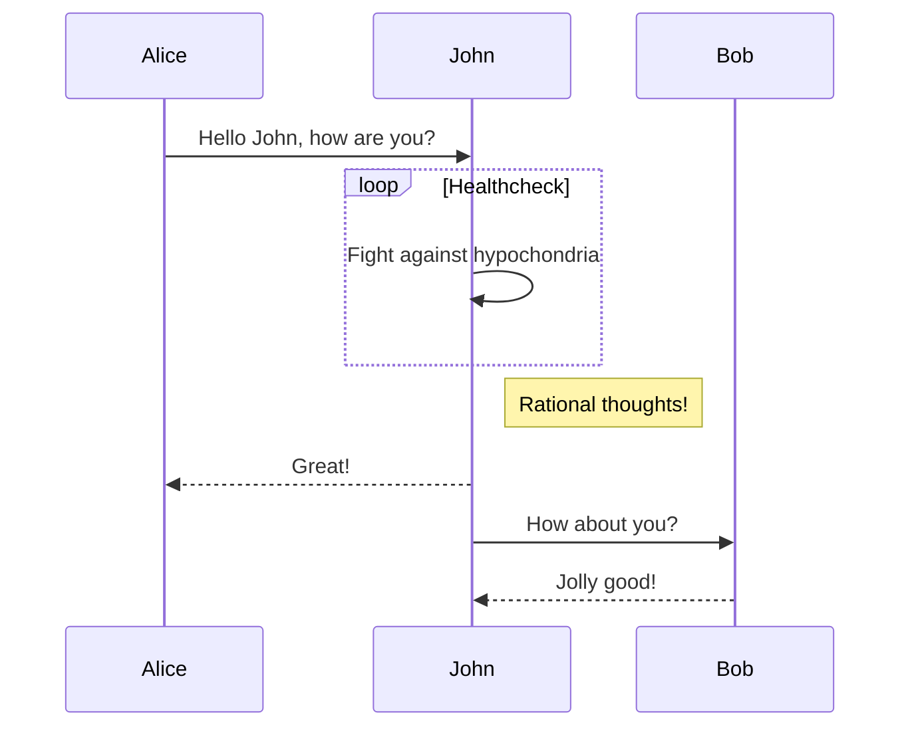

- H~2~O
- A^T^A
- ==This was marked==
- ^^This was inserted^^
- ~~This was deleted~~

:flag_cn:

<!-- 关闭自带的自动补全功能 -->
<form autocomplete="off" action="/action_page.php">
  <div class="autocomplete" style="width:300px;">
    <input id="myInput" type="text" name="myCountry" placeholder="输入国家或地区英文名...">
  </div>
  <input type="submit">
</form>

<!-- 触发弹窗 - 图片改为你的图片地址 -->

 
<!-- 弹窗 -->
<div id="myModal" class="modal">
 
  <!-- 关闭按钮 -->
  <span class="close" onclick="document.getElementById(&#039;myModal&#039;).style.display=&#039;none&#039;">&times;</span>
 
  <!-- 弹窗内容 -->
  
 
  <!-- 文本描述 -->
  <div id="caption">wkw</div>
</div>

</p><h1 id="01" name="01"><strong>01</strong></h1><p>

<div class="grid cards" markdown>

- :fontawesome-brands-html5: __HTML__ for content and structure
- :fontawesome-brands-js: __JavaScript__ for interactivity
- :fontawesome-brands-css3: __CSS__ for text running out of boxes
- :fontawesome-brands-internet-explorer: __Internet Explorer__ ... huh?

</div>


***
<div class="grid cards" markdown>

-   :material-clock-fast:{ .lg .middle } __Set up in 5 minutes__

    ---

    Install [`mkdocs-material`](#) with [`pip`](#) and get up
    and running in minutes

    [:octicons-arrow-right-24: Getting started](#)

-   :fontawesome-brands-markdown:{ .lg .middle } __It's just Markdown__

    ---

    Focus on your content and generate a responsive and searchable static site

    [:octicons-arrow-right-24: Reference](#)

-   :material-format-font:{ .lg .middle } __Made to measure__

    ---

    Change the colors, fonts, language, icons, logo and more with a few lines

    [:octicons-arrow-right-24: Customization](#)

-   :material-scale-balance:{ .lg .middle } __Open Source, MIT__

    ---

    Material for MkDocs is licensed under MIT and available on [GitHub]

    [:octicons-arrow-right-24: License](#)

</div>

***

=== "C"

    ``` c
    #include <stdio.h>

    int main(void) {
      printf("Hello world!\n");
      return 0;
    }
    ```

=== "C++"

    ``` c++
    #include <iostream>

    int main(void) {
      std::cout << "Hello world!" << std::endl;
      return 0;
    }
    ```

``` py hl_lines="2 3"
def bubble_sort(items):
    for i in range(len(items)):
        for j in range(len(items) - 1 - i):
            if items[j] > items[j + 1]:
                items[j], items[j + 1] = items[j + 1], items[j]
```

***
!!! note

    Lorem ipsum dolor sit amet, consectetur adipiscing elit. Nulla et euismod
    nulla. Curabitur feugiat, tortor non consequat finibus, justo purus auctor
    massa, nec semper lorem quam in massa.

!!! note "Phasellus posuere in sem ut cursus"

    Lorem ipsum dolor sit amet, consectetur adipiscing elit. Nulla et euismod
    nulla. Curabitur feugiat, tortor non consequat finibus, justo purus auctor
    massa, nec semper lorem quam in massa.

??? Tip

    Lorem ipsum dolor sit amet, consectetur adipiscing elit. Nulla et euismod
    nulla. Curabitur feugiat, tortor non consequat finibus, justo purus auctor
    massa, nec semper lorem quam in massa.

!!! info inline end

    Lorem ipsum dolor sit amet, consectetur
    adipiscing elit. Nulla et euismod nulla.
    Curabitur feugiat, tortor non consequat
    finibus, justo purus auctor massa, nec
    semper lorem quam in massa.


***
[Subscribe to our newsletter](#){ .md-button }

[Send :fontawesome-solid-paper-plane:](mailto:<1135801806@qq.com>){ .md-button }

| Method      | Description                          |
| ----------- | ------------------------------------ |
| `GET`       | :material-check:     Fetch resource  |
| `PUT`       | :material-check-all: Update resource |
| `DELETE`    | :material-close:     Delete resource |

***

- [x] Lorem ipsum dolor sit amet, consectetur adipiscing elit
- [ ] Vestibulum convallis sit amet nisi a tincidunt
    * [x] In hac habitasse platea dictumst
    * [x] In scelerisque nibh non dolor mollis congue sed et metus
    * [ ] Praesent sed risus massa
- [ ] Aenean pretium efficitur erat, donec pharetra, ligula non scelerisque


$$
\operatorname{ker} f=\{g\in G:f(g)=e_{H}\}{\mbox{.}}
$$

<!-- { data-title="Madeira, Portugal." data-description="Madeira, an autonomous region of Portugal, is an archipelago comprising 4 islands off the northwest coast of Africa. - Google" } -->

左对齐，右对齐  
{ align=left }
<!-- { align=right } -->


<figure markdown>
  { width="300" }
  <figcaption>图片说明</figcaption>
</figure>

**明暗**







!!! pied-piper "Pied Piper"

    Lorem ipsum dolor sit amet, consectetur adipiscing elit. Nulla et
    euismod nulla. Curabitur feugiat, tortor non consequat finibus, justo
    purus auctor massa, nec semper lorem quam in massa.

++ctrl+alt+del++  


<div class="progress progress-60plus">
    <div class="progress-bar" style="width:50.00%">
        <p class="progress-label">50%</p>
    </div>
</div>

:octicons-arrow-right-24: [点我回到顶部](#) 

[Hover me][example]

  [example]: https://example.com "I'm a tooltip!"


[Hover me](https://example.com "I'm a tooltip!")

The HTML specification is maintained by the W3C.

*[HTML]: Hyper Text Markup Language
*[W3C]: World Wide Web Consortium


:fontawesome-brands-twitter:{ .twitter }

<script src="https://cdn.jsdelivr.net/gh/dixonandmoe/rellax@master/rellax.min.js"></script>

``` py hl_lines="2 3"
def bubble_sort(items):
    for i in range(len(items)):
        for j in range(len(items) - 1 - i):
            if items[j] > items[j + 1]:
                items[j], items[j + 1] = items[j + 1], items[j]
```
``` py linenums="1"
def bubble_sort(items):
    for i in range(len(items)):
        for j in range(len(items) - 1 - i):
            if items[j] > items[j + 1]:
                items[j], items[j + 1] = items[j + 1], items[j]
```
``` title=".browserslistrc"
--8<-- ".browserslistrc"
Wcowin
```


来看看两个重要极限  

$$\displaystyle\lim_{x \rightarrow 0}\frac{\sin x}{x} = 1$$

$$\displaystyle\lim_{x \rightarrow + \infty}(1 + \frac{1}{x})^x = e$$


<link type="text/css" rel="stylesheet" href="/ckplayer/css/ckplayer.css" />
<script type="text/javascript" src="/ckplayer/js/ckplayer.js" charset="UTF-8"></script>
<div class="video" style="width: 640px;height: 500px;">播放器容器</div>
<script type="text/javascript">
    //定义一个变量：videoObject，用来做为视频初始化配置
    var videoObject = {
        container: '.video', //“#”代表容器的ID，“.”或“”代表容器的class
        smallWindows:null,//是否启用小窗口模式
        poster: 'https://cdn.cnbj1.fds.api.mi-img.com/mi-mall/c6f46fb63c119d83d2b4b38505fffbcd.jpg?w=1226&h=450',//封面图片地址
        webFull:true,//是否启用页面全屏按钮，默认不启用
        video: 'https://cdn.cnbj1.fds.api.mi-img.com/staticsfile/pc/about/struggle.mp4'//视频地址
    };
    var player = new ckplayer(videoObject);//初始化播放器
</script>  

***  


<div id="grad1"></div>

<button class="buttoncss">按钮</button>
 <button class="buttonxuan buttonxuan1">Green</button>

 <div class="hide">我是会隐藏的元素。</div>  
 
***  

 <div class="grid-container">
  <div class="item1">头部</div>
  <div class="item2">菜单</div>
  <div class="item3">主要内容区域</div>  
  <div class="item4">右侧</div>
  <div class="item5">底部</div>
</div>


<p>
这是一个电子邮件链接：
<a href="mailto:wangkewen821@gmail.com?Subject=Hello%20Wcowin" target="_top">
发送邮件</a>
</p>

<table border="1">
<tr>
  <td>100</td>
  <td>200</td>
  <td>300</td>
</tr>
<tr>
  <td>400</td>
  <td>500</td>
  <td>600</td>
</tr>
</table>
  
<ol>
<li>Coffee</li>
<li>Milk</li>
</ol>

<table border="1" width="100%">
    <tbody><tr>
      <td align="center" style="color:#ffffff" bgcolor="#000000">000000</td>
      <td align="center" style="color:#ffffff" bgcolor="#000033">000033</td>
      <td align="center" style="color:#ffffff" bgcolor="#000066">000066</td>
      <td align="center" style="color:#ffffff" bgcolor="#000099">000099</td>
      <td align="center" style="color:#ffffff" bgcolor="#0000cc">0000CC</td>
      <td align="center" style="color:#ffffff" bgcolor="#0000ff">0000FF</td>
    </tr>
    <tr>
      <td align="center" style="color:#ffffff" bgcolor="#003300">003300</td>
      <td align="center" style="color:#ffffff" bgcolor="#003333">003333</td>
      <td align="center" style="color:#ffffff" bgcolor="#003366">003366</td>
      <td align="center" style="color:#ffffff" bgcolor="#003399">003399</td>
      <td align="center" style="color:#ffffff" bgcolor="#0033cc">0033CC</td>
      <td align="center" style="color:#ffffff" bgcolor="#0033ff">0033FF</td>
    </tr>
    <tr>
      <td align="center" style="color:#ffffff" bgcolor="#006600">006600</td>
      <td align="center" style="color:#ffffff" bgcolor="#006633">006633</td>
      <td align="center" style="color:#ffffff" bgcolor="#006666">006666</td>
      <td align="center" style="color:#ffffff" bgcolor="#006699">006699</td>
      <td align="center" style="color:#ffffff" bgcolor="#0066cc">0066CC</td>
      <td align="center" style="color:#ffffff" bgcolor="#0066ff">0066FF</td>
    </tr>
    <tr>
      <td align="center" bgcolor="#009900">009900</td>
      <td align="center" bgcolor="#009933">009933</td>
      <td align="center" bgcolor="#009966">009966</td>
      <td align="center" bgcolor="#009999">009999</td>
      <td align="center" bgcolor="#0099cc">0099CC</td>
      <td align="center" bgcolor="#0099ff">0099FF</td>
    </tr>
    <tr>
      <td align="center" bgcolor="#00cc00">00CC00</td>
      <td align="center" bgcolor="#00cc33">00CC33</td>
      <td align="center" bgcolor="#00cc66">00CC66</td>
      <td align="center" bgcolor="#00cc99">00CC99</td>
      <td align="center" bgcolor="#00cccc">00CCCC</td>
      <td align="center" bgcolor="#00ccff">00CCFF</td>
    </tr>
    <tr>
      <td align="center" bgcolor="#00ff00">00FF00</td>
      <td align="center" bgcolor="#00ff33">00FF33</td>
      <td align="center" bgcolor="#00ff66">00FF66</td>
      <td align="center" bgcolor="#00ff99">00FF99</td>
      <td align="center" bgcolor="#00ffcc">00FFCC</td>
      <td align="center" bgcolor="#00ffff">00FFFF</td>
    </tr>
    <tr>
      <td align="center" style="color:#ffffff" bgcolor="#330000">330000</td>
      <td align="center" style="color:#ffffff" bgcolor="#330033">330033</td>
      <td align="center" style="color:#ffffff" bgcolor="#330066">330066</td>
      <td align="center" style="color:#ffffff" bgcolor="#330099">330099</td>
      <td align="center" style="color:#ffffff" bgcolor="#3300cc">3300CC</td>
      <td align="center" style="color:#ffffff" bgcolor="#3300ff">3300FF</td>
    </tr>
    <tr>
      <td align="center" style="color:#ffffff" bgcolor="#333300">333300</td>
      <td align="center" style="color:#ffffff" bgcolor="#333333">333333</td>
      <td align="center" style="color:#ffffff" bgcolor="#333366">333366</td>
      <td align="center" style="color:#ffffff" bgcolor="#333399">333399</td>
      <td align="center" style="color:#ffffff" bgcolor="#3333cc">3333CC</td>
      <td align="center" style="color:#ffffff" bgcolor="#3333ff">3333FF</td>
    </tr>
    <tr>
      <td align="center" style="color:#ffffff" bgcolor="#336600">336600</td>
      <td align="center" style="color:#ffffff" bgcolor="#336633">336633</td>
      <td align="center" style="color:#ffffff" bgcolor="#336666">336666</td>
      <td align="center" style="color:#ffffff" bgcolor="#336699">336699</td>
      <td align="center" style="color:#ffffff" bgcolor="#3366cc">3366CC</td>
      <td align="center" style="color:#ffffff" bgcolor="#3366ff">3366FF</td>
    </tr>
    <tr>
      <td align="center" bgcolor="#339900">339900</td>
      <td align="center" bgcolor="#339933">339933</td>
      <td align="center" bgcolor="#339966">339966</td>
      <td align="center" bgcolor="#339999">339999</td>
      <td align="center" bgcolor="#3399cc">3399CC</td>
      <td align="center" bgcolor="#3399ff">3399FF</td>
    </tr>
    <tr>
      <td align="center" bgcolor="#33cc00">33CC00</td>
      <td align="center" bgcolor="#33cc33">33CC33</td>
      <td align="center" bgcolor="#33cc66">33CC66</td>
      <td align="center" bgcolor="#33cc99">33CC99</td>
      <td align="center" bgcolor="#33cccc">33CCCC</td>
      <td align="center" bgcolor="#33ccff">33CCFF</td>
    </tr>
    <tr>
      <td align="center" bgcolor="#33ff00">33FF00</td>
      <td align="center" bgcolor="#33ff33">33FF33</td>
      <td align="center" bgcolor="#33ff66">33FF66</td>
      <td align="center" bgcolor="#33ff99">33FF99</td>
      <td align="center" bgcolor="#33ffcc">33FFCC</td>
      <td align="center" bgcolor="#33ffff">33FFFF</td>
    </tr>
    <tr>
      <td align="center" style="color:#ffffff" bgcolor="#660000">660000</td>
      <td align="center" style="color:#ffffff" bgcolor="#660033">660033</td>
      <td align="center" style="color:#ffffff" bgcolor="#660066">660066</td>
      <td align="center" style="color:#ffffff" bgcolor="#660099">660099</td>
      <td align="center" style="color:#ffffff" bgcolor="#6600cc">6600CC</td>
      <td align="center" style="color:#ffffff" bgcolor="#6600ff">6600FF</td>
    </tr>
    <tr>
      <td align="center" style="color:#ffffff" bgcolor="#663300">663300</td>
      <td align="center" style="color:#ffffff" bgcolor="#663333">663333</td>
      <td align="center" style="color:#ffffff" bgcolor="#663366">663366</td>
      <td align="center" style="color:#ffffff" bgcolor="#663399">663399</td>
      <td align="center" style="color:#ffffff" bgcolor="#6633cc">6633CC</td>
      <td align="center" style="color:#ffffff" bgcolor="#6633ff">6633FF</td>
    </tr>
    <tr>
      <td align="center" style="color:#ffffff" bgcolor="#666600">666600</td>
      <td align="center" style="color:#ffffff" bgcolor="#666633">666633</td>
      <td align="center" style="color:#ffffff" bgcolor="#666666">666666</td>
      <td align="center" style="color:#ffffff" bgcolor="#666699">666699</td>
      <td align="center" style="color:#ffffff" bgcolor="#6666cc">6666CC</td>
      <td align="center" style="color:#ffffff" bgcolor="#6666ff">6666FF</td>
    </tr>
    <tr>
      <td align="center" bgcolor="#669900">669900</td>
      <td align="center" bgcolor="#669933">669933</td>
      <td align="center" bgcolor="#669966">669966</td>
      <td align="center" bgcolor="#669999">669999</td>
      <td align="center" bgcolor="#6699cc">6699CC</td>
      <td align="center" bgcolor="#6699ff">6699FF</td>
    </tr>
    <tr>
      <td align="center" bgcolor="#66cc00">66CC00</td>
      <td align="center" bgcolor="#66cc33">66CC33</td>
      <td align="center" bgcolor="#66cc66">66CC66</td>
      <td align="center" bgcolor="#66cc99">66CC99</td>
      <td align="center" bgcolor="#66cccc">66CCCC</td>
      <td align="center" bgcolor="#66ccff">66CCFF</td>
    </tr>
    <tr>
      <td align="center" bgcolor="#66ff00">66FF00</td>
      <td align="center" bgcolor="#66ff33">66FF33</td>
      <td align="center" bgcolor="#66ff66">66FF66</td>
      <td align="center" bgcolor="#66ff99">66FF99</td>
      <td align="center" bgcolor="#66ffcc">66FFCC</td>
      <td align="center" bgcolor="#66ffff">66FFFF</td>
    </tr>
    <tr>
      <td align="center" style="color:#ffffff" bgcolor="#990000">990000</td>
      <td align="center" style="color:#ffffff" bgcolor="#990033">990033</td>
      <td align="center" style="color:#ffffff" bgcolor="#990066">990066</td>
      <td align="center" style="color:#ffffff" bgcolor="#990099">990099</td>
      <td align="center" style="color:#ffffff" bgcolor="#9900cc">9900CC</td>
      <td align="center" style="color:#ffffff" bgcolor="#9900ff">9900FF</td>
    </tr>
    <tr>
      <td align="center" style="color:#ffffff" bgcolor="#993300">993300</td>
      <td align="center" style="color:#ffffff" bgcolor="#993333">993333</td>
      <td align="center" style="color:#ffffff" bgcolor="#993366">993366</td>
      <td align="center" style="color:#ffffff" bgcolor="#993399">993399</td>
      <td align="center" style="color:#ffffff" bgcolor="#9933cc">9933CC</td>
      <td align="center" style="color:#ffffff" bgcolor="#9933ff">9933FF</td>
    </tr>
    <tr>
      <td align="center" style="color:#ffffff" bgcolor="#996600">996600</td>
      <td align="center" style="color:#ffffff" bgcolor="#996633">996633</td>
      <td align="center" style="color:#ffffff" bgcolor="#996666">996666</td>
      <td align="center" style="color:#ffffff" bgcolor="#996699">996699</td>
      <td align="center" style="color:#ffffff" bgcolor="#9966cc">9966CC</td>
      <td align="center" style="color:#ffffff" bgcolor="#9966ff">9966FF</td>
    </tr>
    <tr>
      <td align="center" bgcolor="#999900">999900</td>
      <td align="center" bgcolor="#999933">999933</td>
      <td align="center" bgcolor="#999966">999966</td>
      <td align="center" bgcolor="#999999">999999</td>
      <td align="center" bgcolor="#9999cc">9999CC</td>
      <td align="center" bgcolor="#9999ff">9999FF</td>
    </tr>
    <tr>
      <td align="center" bgcolor="#99cc00">99CC00</td>
      <td align="center" bgcolor="#99cc33">99CC33</td>
      <td align="center" bgcolor="#99cc66">99CC66</td>
      <td align="center" bgcolor="#99cc99">99CC99</td>
      <td align="center" bgcolor="#99cccc">99CCCC</td>
      <td align="center" bgcolor="#99ccff">99CCFF</td>
    </tr>
    <tr>
      <td align="center" bgcolor="#99ff00">99FF00</td>
      <td align="center" bgcolor="#99ff33">99FF33</td>
      <td align="center" bgcolor="#99ff66">99FF66</td>
      <td align="center" bgcolor="#99ff99">99FF99</td>
      <td align="center" bgcolor="#99ffcc">99FFCC</td>
      <td align="center" bgcolor="#99ffff">99FFFF</td>
    </tr>
    <tr>
      <td align="center" style="color:#ffffff" bgcolor="#cc0000">CC0000</td>
      <td align="center" style="color:#ffffff" bgcolor="#cc0033">CC0033</td>
      <td align="center" style="color:#ffffff" bgcolor="#cc0066">CC0066</td>
      <td align="center" style="color:#ffffff" bgcolor="#cc0099">CC0099</td>
      <td align="center" style="color:#ffffff" bgcolor="#cc00cc">CC00CC</td>
      <td align="center" style="color:#ffffff" bgcolor="#cc00ff">CC00FF</td>
    </tr>
    <tr>
      <td align="center" style="color:#ffffff" bgcolor="#cc3300">CC3300</td>
      <td align="center" style="color:#ffffff" bgcolor="#cc3333">CC3333</td>
      <td align="center" style="color:#ffffff" bgcolor="#cc3366">CC3366</td>
      <td align="center" style="color:#ffffff" bgcolor="#cc3399">CC3399</td>
      <td align="center" style="color:#ffffff" bgcolor="#cc33cc">CC33CC</td>
      <td align="center" style="color:#ffffff" bgcolor="#cc33ff">CC33FF</td>
    </tr>
    <tr>
      <td align="center" style="color:#ffffff" bgcolor="#cc6600">CC6600</td>
      <td align="center" style="color:#ffffff" bgcolor="#cc6633">CC6633</td>
      <td align="center" style="color:#ffffff" bgcolor="#cc6666">CC6666</td>
      <td align="center" style="color:#ffffff" bgcolor="#cc6699">CC6699</td>
      <td align="center" style="color:#ffffff" bgcolor="#cc66cc">CC66CC</td>
      <td align="center" style="color:#ffffff" bgcolor="#cc66ff">CC66FF</td>
    </tr>
    <tr>
      <td align="center" bgcolor="#cc9900">CC9900</td>
      <td align="center" bgcolor="#cc9933">CC9933</td>
      <td align="center" bgcolor="#cc9966">CC9966</td>
      <td align="center" bgcolor="#cc9999">CC9999</td>
      <td align="center" bgcolor="#cc99cc">CC99CC</td>
      <td align="center" bgcolor="#cc99ff">CC99FF</td>
    </tr>
    <tr>
      <td align="center" bgcolor="#cccc00">CCCC00</td>
      <td align="center" bgcolor="#cccc33">CCCC33</td>
      <td align="center" bgcolor="#cccc66">CCCC66</td>
      <td align="center" bgcolor="#cccc99">CCCC99</td>
      <td align="center" bgcolor="#cccccc">CCCCCC</td>
      <td align="center" bgcolor="#ccccff">CCCCFF</td>
    </tr>
    <tr>
      <td align="center" bgcolor="#ccff00">CCFF00</td>
      <td align="center" bgcolor="#ccff33">CCFF33</td>
      <td align="center" bgcolor="#ccff66">CCFF66</td>
      <td align="center" bgcolor="#ccff99">CCFF99</td>
      <td align="center" bgcolor="#ccffcc">CCFFCC</td>
      <td align="center" bgcolor="#ccffff">CCFFFF</td>
    </tr>
    <tr>
      <td align="center" style="color:#ffffff" bgcolor="#ff0000">FF0000</td>
      <td align="center" style="color:#ffffff" bgcolor="#ff0033">FF0033</td>
      <td align="center" style="color:#ffffff" bgcolor="#ff0066">FF0066</td>
      <td align="center" style="color:#ffffff" bgcolor="#ff0099">FF0099</td>
      <td align="center" style="color:#ffffff" bgcolor="#ff00cc">FF00CC</td>
      <td align="center" style="color:#ffffff" bgcolor="#ff00ff">FF00FF</td>
    </tr>
    <tr>
      <td align="center" style="color:#ffffff" bgcolor="#ff3300">FF3300</td>
      <td align="center" style="color:#ffffff" bgcolor="#ff3333">FF3333</td>
      <td align="center" style="color:#ffffff" bgcolor="#ff3366">FF3366</td>
      <td align="center" style="color:#ffffff" bgcolor="#ff3399">FF3399</td>
      <td align="center" style="color:#ffffff" bgcolor="#ff33cc">FF33CC</td>
      <td align="center" style="color:#ffffff" bgcolor="#ff33ff">FF33FF</td>
    </tr>
    <tr>
      <td align="center" style="color:#ffffff" bgcolor="#ff6600">FF6600</td>
      <td align="center" style="color:#ffffff" bgcolor="#ff6633">FF6633</td>
      <td align="center" style="color:#ffffff" bgcolor="#ff6666">FF6666</td>
      <td align="center" style="color:#ffffff" bgcolor="#ff6699">FF6699</td>
      <td align="center" style="color:#ffffff" bgcolor="#ff66cc">FF66CC</td>
      <td align="center" style="color:#ffffff" bgcolor="#ff66ff">FF66FF</td>
    </tr>
    <tr>
      <td align="center" bgcolor="#ff9900">FF9900</td>
      <td align="center" bgcolor="#ff9933">FF9933</td>
      <td align="center" bgcolor="#ff9966">FF9966</td>
      <td align="center" bgcolor="#ff9999">FF9999</td>
      <td align="center" bgcolor="#ff99cc">FF99CC</td>
      <td align="center" bgcolor="#ff99ff">FF99FF</td>
    </tr>
    <tr>
      <td align="center" bgcolor="#ffcc00">FFCC00</td>
      <td align="center" bgcolor="#ffcc33">FFCC33</td>
      <td align="center" bgcolor="#ffcc66">FFCC66</td>
      <td align="center" bgcolor="#ffcc99">FFCC99</td>
      <td align="center" bgcolor="#ffcccc">FFCCCC</td>
      <td align="center" bgcolor="#ffccff">FFCCFF</td>
    </tr>
    <tr>
      <td align="center" bgcolor="#ffff00">FFFF00</td>
      <td align="center" bgcolor="#ffff33">FFFF33</td>
      <td align="center" bgcolor="#ffff66">FFFF66</td>
      <td align="center" bgcolor="#ffff99">FFFF99</td>
      <td align="center" bgcolor="#ffffcc">FFFFCC</td>
      <td align="center" bgcolor="#ffffff">FFFFFF</td>
    </tr>
</tbody></table>

<!-- <p id="demo">这是一个段落</p>
<button  onclick="displayDate()">显示日期</button> -->
<iframe width="100%" height="300" src="https://c.runoob.com/iframe/5381" allowfullscreen="allowfullscreen" frameborder="0"></iframe>

<h2>提示信息</h2>
<p>点击 "x" 关闭提示框。</p>
<div class="alert">
  <span class="closebtn">&times;</span>  
  <strong>危险!</strong> 危险操作提示。
</div>

<div class="alert success">
  <span class="closebtn">&times;</span>  
  <strong>成功!</strong> 操作成功提示。
</div>

<div class="alert info">
  <span class="closebtn">&times;</span>  
  <strong>提示!</strong> 提示信息修改等。
</div>

<div class="alert warning">
  <span class="closebtn">&times;</span>  
  <strong>警告!</strong> 提示当前操作要注意。
</div>


<div class="social-share"></div>

<!--  css & js -->
<link rel="stylesheet" href="https://cdnjs.cloudflare.com/ajax/libs/social-share.js/1.0.16/css/share.min.css">
<script src="https://cdnjs.cloudflare.com/ajax/libs/social-share.js/1.0.16/js/social-share.min.js"></script>

<p align="left">
&nbsp; <a href="https://twitter.com/Wcowin_" target="_blank" rel="noopener noreferrer"></a>  
&nbsp; <a href="https://www.instagram.com/wcowin_/" target="_blank" rel="noopener noreferrer"></a>  
&nbsp; <a href="mailto:wangkewen821@gmail.com" target="_blank" rel="noopener noreferrer"></a>
</p>