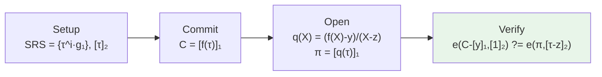

# KZG 多项式承诺：原理、具体构造与研究进展

在[zk-SNARK 原理详解](zkSNARK.md)一文里我们看到，zk-SNARK 的核心直觉是"把计算正确性翻译成多项式的整除关系"；而[现代密码学发展](ModernCryptography.md)也把多项式承诺列为可验证计算的底座原语。本文单独把这一层底座——**KZG 多项式承诺**——拿出来，讲清它的 Setup / Commit / Open / Verify 四个算法、配对验证式的来龙去脉，以及它在 PLONK 与 Ethereum EIP-4844 中的位置。

需要提前明确一点：**KZG 是多项式承诺方案（PCS），不是完整的零知识证明协议**；零知识需要额外的盲化与更高层的协议设计。

## 摘要

多项式承诺是现代零知识证明系统中的重要基础原语。它允许证明者对一个高次多项式生成短承诺，并在不公开完整多项式的情况下，证明该多项式在指定点上的取值。KZG 多项式承诺利用双线性配对和结构化参考字符串，将多项式求值关系转化为椭圆曲线群上的配对等式，从而实现常数大小的承诺、常数大小的单点打开证明和高效验证。

本文依次介绍多项式承诺的基本概念、KZG 的符号体系、Setup、Commit、Open 和 Verify 算法，解释商多项式和因式定理在其中的作用，并进一步讨论批量打开、可信设置、零知识边界、Ethereum EIP-4844 以及透明和后量子多项式承诺等研究方向。需要强调的是，KZG 是多项式承诺方案，而不是一个完整的零知识证明协议；它可以作为 PLONK 等 zk-SNARK 系统的基础组件。

## 一、问题背景：为什么需要多项式承诺

在 zk-SNARK、Rollup 和数据可用性证明中，经常需要处理一个很大的多项式：

\[
f(X)=a_0+a_1X+a_2X^2+\cdots+a_dX^d
\]

如果证明者直接把全部系数发送给验证者，通信量可能很大；如果验证者重新计算整个多项式，又会失去简洁证明的优势。

多项式承诺 Polynomial Commitment Scheme，PCS，提供了一种折中方案：

1. 证明者先对多项式生成一个短承诺；
2. 证明者之后可以证明多项式在某个点的值；
3. 验证者不需要看到整个多项式，就能检查这个值是否正确。

为了形成直观理解，可以将其类比为“具有代数结构的哈希承诺”：

> 承诺阶段锁定一个多项式，打开阶段证明某个局部信息确实来自该多项式。

但需要注意：多项式承诺不是完整的零知识证明。它只是 zk-SNARK 中用于承诺多项式和验证多项式关系的基础密码学组件。

---

## 二、多项式承诺需要满足的性质

### 1. 绑定性 Binding

同一个承诺不能被打开成两个不同的多项式，或者在同一个点打开成两个不同的值。

例如，证明者不能让同一个承诺同时支持：

\[
f(z)=y_1
\]

和：

\[
f(z)=y_2,
\quad y_1\neq y_2
\]

### 2. 可打开性 Opening

证明者能够针对指定点 \(z\) 生成证明，说明：

\[
f(z)=y
\]

### 3. 简洁性 Succinctness

承诺和证明的大小尽量不随多项式次数线性增长。

### 4. 隐藏性 Hiding

在需要隐私时，承诺或打开证明不能泄露多项式的秘密系数。

普通 KZG 承诺本身主要提供绑定性，不自动提供零知识。零知识通常需要额外的随机盲化。

### 5. 批量验证 Batching

能够一次验证：

- 一个多项式在多个点上的取值；
- 多个多项式在同一个点上的取值；
- 多项式之间的加法、乘法或线性关系。

---

## 三、KZG 的核心思想

KZG 多项式承诺由 Kate、Zaverucha 和 Goldberg 提出。它的核心思想是：

> 选择一个秘密参数 \(\tau\)，把多项式在 \(\tau\) 处的求值编码到椭圆曲线群元素中，但不公开 \(\tau\)。

设：

- \(\mathbb F_p\) 是有限域；
- \(G_1,G_2\) 是椭圆曲线群；
- \(G_T\) 是目标群；
- \(e:G_1\times G_2\rightarrow G_T\) 是双线性配对；
- \(g_1\in G_1\)、\(g_2\in G_2\) 是生成元；
- \(\tau\in\mathbb F_p\) 是秘密参数。

双线性配对满足：

\[
e(aP,bQ)=e(P,Q)^{ab}
\]

Setup 阶段会公开：

\[
g_1,\tau g_1,\tau^2g_1,\ldots,\tau^dg_1
\]

以及：

\[
g_2,\tau g_2
\]

但是任何人都不能知道 \(\tau\) 本身。

为了书写简洁，下面使用记号：

\[
[a]_1=ag_1,\qquad [a]_2=ag_2
\]

于是 \([\tau^i]_1\) 表示 \(\tau^ig_1\)。

### 3.1 方括号和下标到底表示什么

\([a]_1\) 不是数组，也不是区间，而是“把有限域中的数字 \(a\) 编码到群 \(G_1\) 中”：

\[
[a]_1=a g_1
\]

同理：

\[
[a]_2=a g_2
\]

下标表示群的类型：

- \([a]_1\) 属于 \(G_1\)；
- \([a]_2\) 属于 \(G_2\)；
- 两者不能直接相加，但可以输入双线性配对 \(e\)。

例如：

\[
[5]_1=5g_1,\qquad [5]_2=5g_2
\]

它们都编码数字 5，但属于不同的群。

还要注意，下标 2 不是平方：

\[
[\tau]_2=\tau g_2
\]

而：

\[
[\tau^2]_2=\tau^2g_2
\]

两者完全不同。

在有些资料中，群使用乘法记号：

\[
[a]_1\quad\text{也可能写成}\quad g_1^a
\]

两种写法表达的是同一类对象。本文采用加法记号，因为它更容易看出标量乘法。

群中的运算和配对要区分：

\[
[a]_1+[b]_1=[a+b]_1
\]

而双线性配对满足：

\[
e([a]_1,[b]_2)=e(g_1,g_2)^{ab}
\]

前者使指数相加，后者使两个指数相乘。

---

## 四、KZG 的具体构造

四个算法串起来是一条直线，先看流程图再逐个展开：



设多项式为：

\[
f(X)=a_0+a_1X+a_2X^2+\cdots+a_dX^d
\]

其次数不超过 \(d\)。

### 1. Setup：生成结构化参考字符串

Setup 生成：

\[
\text{SRS}=
\left(
\{[\tau^i]_1\}_{i=0}^{d},[1]_2,[\tau]_2
\right)
\]

其中：

\[
[\tau^i]_1=\tau^ig_1
\]

\[
[\tau]_2=\tau g_2
\]

这里的 \(i=0\) 对应：

\[
[\tau^0]_1=[1]_1=g_1
\]

SRS 的作用是让证明者能够计算 \([f(\tau)]_1\)，但不能恢复 \(\tau\)。例如：

\[
f(X)=a_0+a_1X+a_2X^2
\]

则：

\[
[f(\tau)]_1
=a_0[1]_1+a_1[\tau]_1+a_2[\tau^2]_1
\]

证明者可以利用 SRS 完成右侧的群运算，却不需要知道 \(\tau\) 的明文数值。

验证者还可以利用：

\[
[\tau-z]_2=[\tau]_2-z[1]_2
\]

计算出验证公式中需要的群元素。这里同样不需要知道 \(\tau\)。

#### 可信设置问题

如果有人知道 \(\tau\)，就可能破坏承诺的绑定性。因此 KZG 通常需要 Powers of Tau 多方计算仪式。

安全性依赖于：

> 至少有一名参与者诚实地销毁自己掌握的秘密随机数。

### 2. Commit：生成多项式承诺

承诺定义为：

\[
C=[f(\tau)]_1
\]

由于：

\[
f(\tau)=a_0+a_1\tau+a_2\tau^2+\cdots+a_d\tau^d
\]

因此：

\[
C=
a_0[1]_1+a_1[\tau]_1+a_2[\tau^2]_1+\cdots+a_d[\tau^d]_1
\]

注意，证明者并不知道 \(\tau\)，但可以利用 SRS 中已经公开的群元素完成这个线性组合。

承诺 \(C\) 通常只包含一个椭圆曲线群元素，所以大小是常数级的。

### 3. Open：生成单点打开证明

证明者要证明：

\[
f(z)=y
\]

其中 \(z\) 是验证点，\(y\) 是声称的结果。

构造商多项式：

\[
q(X)=\frac{f(X)-y}{X-z}
\]

为什么这个商多项式一定存在？关键是因式定理：

\[
P(z)=0
\quad\Longleftrightarrow\quad
X-z\mid P(X)
\]

令：

\[
P(X)=f(X)-y
\]

如果证明者声称 \(f(z)=y\)，那么：

\[
P(z)=f(z)-y=0
\]

因此 \(z\) 是 \(P(X)\) 的根，\(X-z\) 必然是 \(P(X)\) 的因式，于是存在多项式 \(q(X)\)，满足：

\[
f(X)-y=q(X)(X-z)
\]

这说明：

\[
q(X)=\frac{f(X)-y}{X-z}
\]

确实是一个合法多项式。

反过来，如果 \(y\neq f(z)\)，则除法会留下非零余数：

\[
f(X)-y=q(X)(X-z)+r
\]

其中：

\[
r=f(z)-y\neq0
\]

所以不能写成完全整除的形式。

然后生成打开证明：

\[
\pi=[q(\tau)]_1
\]

### 4. Verify：验证打开证明

验证者检查：

\[
e(C-[y]_1,[1]_2)
\stackrel{?}{=}
e(\pi,[\tau-z]_2)
\]

其中：

\[
[\tau-z]_2=[\tau]_2-z[1]_2
\]

#### 正确性推导

由：

\[
f(X)-y=q(X)(X-z)
\]

令 \(X=\tau\)，得到：

\[
f(\tau)-y=q(\tau)(\tau-z)
\]

由于承诺和证明分别是：

\[
C=[f(\tau)]_1=f(\tau)g_1
\]

\[
\pi=[q(\tau)]_1=q(\tau)g_1
\]

所以：

\[
C-[y]_1=[f(\tau)-y]_1
\]

左侧配对为：

\[
e(C-[y]_1,[1]_2)
=e([f(\tau)-y]_1,[1]_2)
=e(g_1,g_2)^{f(\tau)-y}
\]

右侧配对为：

\[
e(\pi,[\tau-z]_2)
=e([q(\tau)]_1,[\tau-z]_2)
=e(g_1,g_2)^{q(\tau)(\tau-z)}
\]

因为：

\[
f(\tau)-y=q(\tau)(\tau-z)
\]

所以两边相等：

\[
e(C-[y]_1,[1]_2)
=e(\pi,[\tau-z]_2)
\]

验证者并没有直接计算 \(f(z)\)，而是在验证：

\[
f(\tau)-y
\stackrel{?}{=}
q(\tau)(\tau-z)
\]

如果证明者声称了错误的 \(y\)，就会产生非零余数，配对等式无法成立。

所以验证等式成立。

---

## 五、一个简单例子

设：

\[
f(X)=X^2+3X+2
\]

证明者要证明：

\[
f(5)=42
\]

因为：

\[
f(5)=25+15+2=42
\]

于是：

\[
f(X)-42=X^2+3X-40
\]

因式分解：

\[
X^2+3X-40=(X-5)(X+8)
\]

因此商多项式为：

\[
q(X)=X+8
\]

证明者提交：

\[
\pi=[q(\tau)]_1=[\tau+8]_1
\]

验证者不需要知道完整的 \(f(X)\)，只需要通过配对等式检查这个商多项式证明即可。

---

## 六、多点打开与批量验证

如果需要证明：

\[
f(z_1)=y_1,\quad f(z_2)=y_2,\quad\ldots,\quad f(z_n)=y_n
\]

可以构造插值多项式 \(I(X)\)，使得：

\[
I(z_i)=y_i
\]

再构造消失多项式：

\[
Z(X)=\prod_{i=1}^{n}(X-z_i)
\]

因为 \(f(X)-I(X)\) 在每个 \(z_i\) 处都为零，所以：

\[
f(X)-I(X)=q(X)Z(X)
\]

证明者提交：

\[
\pi=[q(\tau)]_1
\]

验证者通过批量配对检查所有点。

这类技术可以减少多点证明的通信量和验证次数，是 KZG 用于 PLONK、查表证明和数据可用性证明的基础。

常见优化包括：

- 随机线性组合多个打开关系；
- FFT 域上的多点打开；
- FK20 一类的快速批量证明算法；
- 多标量乘法 MSM 优化；
- GPU、并行 FFT 和内存布局优化。

---

## 七、KZG 的安全性与限制

### 1. 绑定性

攻击者不能找到两个不同的多项式，使它们产生同一个承诺。

这依赖椭圆曲线群上的离散对数类假设，以及具体安全模型中的 q-SDH、AGM 等假设。

### 2. 可信设置

KZG 需要隐藏的参数 \(\tau\)。如果攻击者知道 \(\tau\)，就可能构造恶意打开证明。

因此需要：

- Powers of Tau 多方仪式；
- 可信设置参与者至少有一人诚实；
- 安全保存和销毁中间秘密；
- 对 SRS 的适用次数和最大多项式次数进行明确限制。

### 3. 普通 KZG 不是零知识

普通承诺：

\[
C=[f(\tau)]_1
\]

主要提供绑定性，并不自动隐藏多项式内容。

若需要零知识，通常使用随机盲化，例如：

\[
f'(X)=f(X)+r(X)Z(X)
\]

其中 \(Z(X)\) 在需要打开的点上为零，因此不会改变指定点的取值，但可以隐藏原多项式的结构。

### 4. 不具备后量子安全性

KZG 依赖椭圆曲线和双线性配对。未来如果大规模量子计算机能够运行 Shor 算法，相关离散对数假设会受到威胁。

---

## 八、KZG 与 zk-SNARK 的关系

一个典型的 zk-SNARK 流程可以概括为：

1. 将程序转化为 R1CS、PLONKish 等约束系统；
2. 将约束系统编码为一个或多个多项式；
3. 将“约束成立”转化为多项式恒等式；
4. 使用 KZG 承诺这些多项式；
5. 使用打开证明验证指定点的关系；
6. 通过随机挑战、盲化和 Fiat-Shamir 变换获得简洁、非交互和零知识证明。

因此：

```text
约束系统 -> 多项式关系 -> 多项式承诺 -> 打开证明 -> zk-SNARK
```

KZG 解决的是其中的“多项式承诺和打开”问题，并不是整个 zk-SNARK 协议。

---

## 九、KZG 与其他多项式承诺的比较

| 方案 | 基础技术 | 可信设置 | 证明大小 | 主要优点 | 主要问题 |
|---|---|---:|---:|---|---|
| KZG | 双线性配对 | 需要 | 常数级 | 证明短、验证快、工程成熟 | 可信设置、非后量子 |
| IPA | 内积论证 | 不需要 | 通常为对数级 | 透明、适合 Halo 类递归 | 证明和验证通常更大 |
| FRI | Reed-Solomon 码 + Merkle tree | 不需要 | 较大 | 透明、适合 STARK | 证明通信量较大 |
| DARK | 未知阶群 | 通常透明 | 较小或对数级 | 不依赖配对 | 工程复杂度较高 |
| 格基 PCS | 格密码 | 不需要 | 通常较大 | 具有后量子潜力 | 当前效率和证明大小仍是问题 |

核心权衡是：

```text
KZG：短证明和高性能，但需要可信设置
FRI/IPA：透明，但证明或验证开销通常更大
格基方案：后量子，但目前工程代价较高
```

---

## 十、容易混淆的几个概念

### 1. 多项式承诺不等于零知识证明

多项式承诺只是承诺和打开多项式。零知识需要额外随机化和协议设计。

### 2. KZG 不等于 zk-SNARK

KZG 可以作为 zk-SNARK 的承诺组件，但一个完整 zk-SNARK 还包括：

- 电路或约束系统；
- Prove 算法；
- Verify 算法；
- Fiat-Shamir；
- 零知识盲化；
- 安全参数和密钥生成。

### 3. FRI 不只是“KZG 的另一种实现”

KZG 通过椭圆曲线配对和代数承诺工作；FRI 通过低次多项式测试、随机抽查和 Merkle commitment 工作。二者的密码学基础、证明大小和安全假设都不同。

### 4. 承诺短不代表证明者计算便宜

KZG 的承诺和证明短，但证明者仍可能承担较重的：

- 多项式运算；
- FFT；
- MSM；
- 批量打开；
- 内存和并行计算开销。

---

## 十一、结论

多项式承诺的目标，是让证明者在不公开完整多项式的情况下，对其进行绑定，并证明指定点上的求值。KZG 通过双线性配对和结构化参考字符串实现这一目标。

设：

\[
f(X)=a_0+a_1X+\cdots+a_dX^d
\]

KZG 在 Setup 阶段选择秘密参数 \(\tau\)，并公开其幂的群编码。证明者据此生成：

\[
C=[f(\tau)]_1
\]

若要证明 \(f(z)=y\)，证明者构造商多项式：

\[
q(X)=\frac{f(X)-y}{X-z}
\]

并提交：

\[
\pi=[q(\tau)]_1
\]

验证者通过以下配对等式进行检查：

\[
e(C-[y]_1,[1]_2)
\stackrel{?}{=}
 e(\pi,[\tau-z]_2)
\]

其数学依据是：

\[
f(z)=y
\quad\Longleftrightarrow\quad
X-z\mid f(X)-y
\]

因此，KZG 的本质是把“多项式在指定点上的求值正确”转化为“商多项式关系正确”，再利用双线性配对在不知道秘密参数 \(\tau\) 的情况下验证该关系。

KZG 的主要优势是承诺和单点打开证明具有常数大小，验证效率较高，因而适用于 PLONK、Rollup 和 Ethereum EIP-4844 等场景。其主要限制是对结构化参考字符串和可信设置的依赖，以及当前椭圆曲线密码学在大规模量子计算模型下不具备后量子安全性。需要注意的是，KZG 本身不是完整的零知识证明协议；零知识属性需要通过盲化和更高层的证明系统设计实现。

总体而言，KZG 在“证明大小、验证效率和工程成熟度”之间取得了较好的平衡，是当前零知识证明和区块链扩展系统中最重要的多项式承诺方案之一。透明承诺、后量子承诺和高效批量打开，则是其后续研究与替代方案的主要方向。

---

## 十二、研究进展与发展方向

截至 2026 年 9 月，KZG 相关工作主要集中在以下几个方向。这里的“进展”既包括已经进入实际系统的工程应用，也包括仍处于研究阶段的替代方案；二者不应混同。

### 1. 工程应用：Ethereum EIP-4844

Ethereum EIP-4844 将 KZG 用于 Blob 数据的承诺和点求值验证。该应用表明，KZG 已从理论密码学构造进入区块链基础设施，并成为 Rollup 数据发布和数据可用性设计的重要组成部分。

其代表性特点包括：

- Blob 数据被表示为有限域元素；
- 每个 Blob 对应一个 KZG commitment；
- 可以生成并验证 KZG point-evaluation proof；
- 支持多个 Blob 证明的批量验证；
- KZG 负责验证“数据与承诺是否匹配”，而不是单独承担完整的交易执行证明。

### 2. 批量打开与证明生成优化

KZG 的单点打开证明较为简洁，但在实际系统中经常需要同时打开多个点、多个多项式或整个 FFT 域。因此研究重点包括：

- 多点打开和多多项式打开；
- 随机线性组合；
- FFT 域上的快速计算；
- FK20 等批量证明方法；
- 多标量乘法、GPU 和并行内存访问优化；
- 降低证明者的时间和内存开销。

这类优化主要改善证明生成端的性能，不改变 KZG 的基本验证方程。

### 3. 安全模型与知识可靠性

随着 KZG 被用于 PLONK 等通用证明系统，研究者开始更加系统地分析：

- 批量打开协议的可靠性；
- 随机线性组合和 Fiat-Shamir 变换的安全性；
- AGM、ROM 等模型下的知识可靠性；
- 具体证明系统中 KZG 承诺与知识提取之间的关系。

这一方向的重点，是将“工程中实际使用的批量协议”与“论文中的理想化承诺接口”区分开来，并给出更严格的安全证明。

### 4. 透明多项式承诺

KZG 需要可信设置，因此研究者也在发展不依赖秘密结构化参数的方案，主要包括：

- IPA 类内积论证；
- FRI 类低次测试与 Merkle 承诺；
- DARK 类未知阶群方案；
- 其他基于哈希或未知阶群的透明 PCS。

这些方案通常牺牲部分证明大小、验证时间或证明者效率，以换取透明 Setup。选择哪一种方案，需要结合应用对通信量、验证速度、可信设置和硬件环境的要求。

### 5. 后量子多项式承诺

KZG 依赖椭圆曲线离散对数和双线性配对，因此不属于后量子安全方案。格基多项式承诺尝试提供：

- 透明 Setup；
- 后量子安全性；
- 批量打开；
- 递归证明兼容性；
- 可接受的证明大小与验证效率。

当前格基方案在后量子安全方面具有潜力，但通常仍面临证明较大、计算和存储开销较高等问题。因此，KZG 与格基 PCS 目前更适合被理解为不同应用约束下的技术选择，而不是简单的“新旧替代关系”。

### 6. 发展趋势的总体判断

KZG 的短证明和高验证效率使其在高性能证明系统和区块链数据可用性场景中仍具有明显优势；透明和后量子 PCS 则代表了长期安全和去可信设置的发展方向。未来较长时间内，实际系统很可能根据场景在以下目标之间进行权衡：

```text
证明大小、验证速度、证明者开销、是否需要可信设置、后量子安全性
```

---

## 十三、参考文献与资料

以下资料分别对应 KZG 的原始构造、工程应用、直观解释和相关证明系统：

1. Kate, A., Zaverucha, G. M., and Goldberg, I. *Constant-Size Commitments to Polynomials and Their Applications*. ASIACRYPT 2010。KZG 多项式承诺的原始论文。
2. Ethereum Improvement Proposal 4844, *Shard Blob Transactions*。KZG 在 Ethereum Blob 和数据可用性场景中的工程规范。
3. Ethereum Foundation, *KZG Ceremony Wrap-Up*。Ethereum KZG 多方可信设置仪式的总结材料。
4. Dankrad Feist, *KZG Polynomial Commitments*。适合入门理解 KZG 的代数结构和验证关系。
5. Gabizon, A., Williamson, Z. J., and Ciobotaru, O. *PLONK: Permutations over Lagrange-bases for Oecumenical Noninteractive arguments of Knowledge*。理解 KZG 如何嵌入通用 zk-SNARK。
6. FRI 和 STARK 相关论文。用于比较透明、哈希型低次测试与 KZG 的差异。
7. FK20 相关工作。用于理解 KZG 多点打开和批量证明的优化方法。

### 参考链接

- KZG 原始论文：<https://cacr.uwaterloo.ca/techreports/2010/cacr2010-10.pdf>
- EIP-4844：<https://eips.ethereum.org/EIPS/eip-4844>
- Ethereum KZG Ceremony 总结：<https://blog.ethereum.org/2024/01/23/kzg-wrap>
- Dankrad Feist 的 KZG 介绍：<https://dankradfeist.de/ethereum/2020/06/16/kate-polynomial-commitments.html>

---

## 十四、后续学习建议

为了进一步掌握 KZG 并理解其在零知识证明系统中的位置，建议按照以下顺序学习：

1. 有限域、椭圆曲线群和离散对数问题；
2. 双线性配对及其基本性质；
3. 多项式插值、因式定理、商多项式和消失多项式；
4. KZG 的 Setup、Commit、Open、Verify 四个算法；
5. R1CS、QAP 与 PLONKish 约束系统；
6. 多点打开、随机线性组合和批量验证；
7. IPA、FRI、DARK 与其他透明多项式承诺；
8. 后量子 PCS、递归证明和实际系统中的性能权衡。

在应用层面，应区分不同密码学组件的职责：

| 技术组件 | 主要作用 |
|---|---|
| 哈希和数字签名 | 证明数据完整性、来源认证或消息未被篡改 |
| Merkle tree 和透明日志 | 组织数据、记录历史并支持成员证明 |
| TEE 或安全硬件 | 提供受保护执行环境和额外的设备信任依据 |
| ZKP/KZG | 证明隐藏输入满足预先定义的数学关系 |

因此，ZKP 能够证明的是“某个编码后的关系成立”，而不是自动证明现实世界中的传感器输入真实、设备未被攻陷或外部事件一定发生。实际系统通常需要将数据认证、执行环境、日志记录和零知识证明组合使用。

### 结语

KZG 的学习重点不在于机械记忆所有群元素，而在于理解下面这条逻辑链：

\[
\text{点值正确}
\Longleftrightarrow
X-z\mid f(X)-y
\Longleftrightarrow
f(X)-y=q(X)(X-z)
\Longrightarrow
\text{配对等式成立}
\]

掌握这条逻辑链后，再学习 PLONK、Groth16 或其他 zk-SNARK 协议时，就能更清楚地区分：哪些部分属于约束系统，哪些部分属于多项式承诺，哪些部分负责零知识，哪些部分负责最终的配对验证。

---

## 延伸阅读（本系列）

- [zk-SNARK 原理详解：从直觉到可运行实现](zkSNARK.md) — KZG 所服务的证明系统：R1CS/QAP、Groth16 配对验证式
- [现代密码学发展](ModernCryptography.md) — 零知识证明、后量子 PCS 与透明承诺的整体图景
- [比特币体系：从零开始理解加密货币](Bitcoin.md) — 区块链为何需要可验证计算与数据可用性
- [密码协议与应用](ProtocolAndApplication.md) — Fiat–Shamir 变换、承诺方案在真实协议中的角色
- [数论基础](Numbertheory.md) — 有限域、多项式与因式定理的数学底子

**本文作者：** [<span class="author-avatar-wrapper"><span class="author-name-popover">王科文</span></span>](https://github.com/Wcowin)
