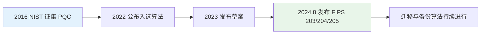

# 现代密码学发展

现代密码学在经典对称/非对称密码与消息认证的基础上，正经历后量子安全、隐私计算与新型应用三大方向的深刻变化。本文基于公开资料与标准化进展，概述后量子密码（PQC）、同态加密、零知识证明及轻量级密码等方向的发展现状与趋势。

## 为什么需要“后量子”密码

当前广泛使用的公钥密码（如 RSA、椭圆曲线 ECDH/ECDSA）基于大整数分解或离散对数等数学难题，在经典计算机下被认为是安全的。**量子计算机**利用 Shor 算法可在理论上多项式时间内破解这些问题，一旦实用型量子计算机出现，现有公钥体系将面临系统性风险。

业界普遍认为：非对称加密将在 **2029 年前后**首次面临量子计算的实质性威胁，到 **2034 年**主流密码技术可能全面暴露于量子攻击。鉴于算法迁移与系统改造通常需要 **10–15 年**，提前启动后量子密码迁移已刻不容缓。（参见《后量子密码安全能力构建技术指南（2025版）》等报告。）

## 后量子密码（PQC）与标准化

**后量子密码（Post-Quantum Cryptography, PQC）** 指在经典与量子计算机下均被认为难以攻破的密码算法，主要技术路线包括：

| 路线       | 代表算法/思想     | 特点                         |
|------------|--------------------|------------------------------|
| 格密码     | ML-KEM、ML-DSA     | 效率高、密钥较小、标准化领先 |
| 哈希基签名 | SLH-DSA (Sphincs+) | 结构简单、作为格算法备选     |
| 编码基     | McEliece 等        | 抗量子历史长、密钥较大       |
| 多变量     | 多变量二次方程     | 可用于签名与加密             |
| 同源曲线   | SIKE 等             | 密钥小；SIKE 已于 2022 年被攻破，NIST 不再推荐 |

### NIST 后量子标准（2024）

美国国家标准与技术研究院（NIST）于 **2016 年** 发起全球后量子密码算法征集，经多轮评估，于 **2022 年** 公布首批入选算法，**2024 年 8 月** 正式发布首批三项联邦信息处理标准（FIPS），标志着 PQC 从评估阶段进入可部署阶段。

| 标准     | 算法原名        | 标准化名称 | 用途           |
|----------|-----------------|------------|----------------|
| FIPS 203 | CRYSTALS-Kyber  | ML-KEM     | 密钥封装（通用加密/密钥协商） |
| FIPS 204 | CRYSTALS-Dilithium | ML-DSA  | 数字签名       |
| FIPS 205 | Sphincs+        | SLH-DSA    | 数字签名（哈希基备选） |

- **ML-KEM**：基于模格学习与误差（MLWE）问题，密钥小、速度快，适合资源受限环境；提供 ML-KEM-512/768/1024 三档安全级别。
- **ML-DSA**：基于格的数字签名，采用 Fiat–Shamir with Aborts 范式，为当前主推的 PQC 签名方案。
- **SLH-DSA**：无状态、基于哈希的签名，不依赖格难题，作为与 ML-DSA 不同数学假设的备份方案。

NIST 鼓励系统管理员**尽快**将新标准纳入产品与系统，并继续推进更多算法作为备份（如基于 FALCON 的 FN-DSA 等）。详见 [NIST 后量子密码标准化项目](https://csrc.nist.gov/projects/post-quantum-cryptography) 与 [NIST 新闻稿（2024年8月）](https://www.nist.gov/news-events/news/2024/08/nist-releases-first-3-finalized-post-quantum-encryption-standards)。

### 中国在后量子密码方面的进展

- **算法征集**：2025 年 2 月，中国商用密码标准研究院发布《关于开展新一代商用密码算法征集活动的公告》，面向全球征集后量子密码先进算法。
- **应用路线**：运营商等推进“**QKD（量子密钥分发）+ PQC**”融合，实现“量子经典深度融合”，将量子安全能力融入云、网、端、管等层面。
- **市场预期**：据行业分析，全球后量子密码技术市场规模预计在 **2030 年** 超过 **100 亿美元**，中国约占 **20%**。

当前国内在 PQC 基础理论、核心算法创新与工程化方面仍存在差距，需加强顶层设计与资源配置。

## 同态加密与隐私计算

**同态加密（Homomorphic Encryption）** 允许在**不解密**的前提下对密文进行运算，结果解密后与对明文做相同运算一致，是实现“**可算不可见**”的隐私计算核心技术之一。

### 分类与代表方案

| 类型       | 支持运算     | 代表方案           | 应用场景           |
|------------|--------------|--------------------|--------------------|
| 半同态     | 仅加法或仅乘法 | Paillier（加法）、RSA/ElGamal（乘法） | 安全求和、简单统计 |
| 全同态 FHE | 加法和乘法   | BGV、BFV、CKKS、Gentry 系列 | 通用密态计算       |

- **半同态**：实现简单、性能较好，在联邦学习、安全多方计算中已广泛应用。
- **全同态（FHE）**：表达能力强，可对密文做任意电路计算，但存在**效率低、密钥与密文膨胀**等问题，目前多用于对性能要求不极端的场景；CKKS 等方案在近似运算、机器学习推理中受到关注。

同态加密在**联邦学习、隐私外包计算、安全投票**等场景中与差分隐私、安全多方计算结合使用。ISO 已发布同态加密标准（如 ISO/IEC 18033-6:2019），HomomorphicEncryption.org 等组织在推进 FHE 标准化白皮书。

## 零知识证明（ZKP）

**零知识证明（Zero-Knowledge Proof, ZKP）** 使证明方能够向验证方证明“某命题成立”，而不泄露除“命题成立”之外的任何信息，在隐私保护与可验证计算中扮演核心角色。

### 特点与应用

- **隐私**：证明身份、资质或数据满足某条件，而不暴露具体数据（如匿名凭证、范围证明）。
- **可验证性**：验证方无需重算即可相信计算结果正确（如 zk-SNARKs、zk-STARKs）。
- **区块链**：用于扩容（Rollup）、隐私交易、跨链互操作等；zk-SNARKs、zkVMs、专用 DSL 等已成为链上可验证计算的重要基础设施。

零知识证明在**投票、认证、时间锁、机器学习**等非区块链场景的应用也在扩展。近年来，更高效的证明系统（如基于 Folding 的论证系统）在链上验证成本与资源受限环境方面取得进展。

## 轻量级密码与物联网

**轻量级密码**面向资源受限设备（如传感器、嵌入式 MCU、物联网终端），在保证一定安全强度的前提下，优化**面积、功耗、延迟与代码体积**。

- **应用场景**：物联网（IoT）数据加密、设备认证、安全通信（如 TLS 中的轻量级套件）。
- **典型方向**：轻量级分组密码（如 PRESENT、SIMON/SPECK、**ASCON**）、轻量级哈希与认证码、以及结合 PQC 的轻量级 KEM/签名（如 ML-KEM 在嵌入式场景的优化实现）。NIST 于 **2023 年**选定 ASCON 作为轻量级密码标准（SP 800-232），涵盖认证加密、哈希与可扩展输出函数等。

轻量级密码与后量子算法的结合，是未来物联网与边缘安全的重要研究方向。

## 发展时间线概览

| 年份   | 事件概要 |
|--------|----------|
| 2016   | NIST 启动后量子密码标准化征集 |
| 2022   | NIST 公布 CRYSTALS-Kyber/Dilithium、Sphincs+、FALCON 等入选算法 |
| 2023   | NIST 发布 ML-KEM、ML-DSA、SLH-DSA 草案 |
| 2024.8 | NIST 正式发布 FIPS 203、204、205（ML-KEM、ML-DSA、SLH-DSA） |
| 2025   | 中国商用密码标准研究院征集新一代商用密码（含后量子）算法 |

## 小结

现代密码学发展围绕**抗量子、可算不可见、可证明不泄露**三条主线展开：后量子密码（PQC）已进入标准化与初步部署阶段；同态加密与零知识证明支撑隐私计算与区块链等应用；轻量级密码满足物联网与边缘安全需求。建议结合本系列的[密码协议与应用](ProtocolAndApplication.md)、[消息认证与哈希函数](HashAndMAC.md)与[比特币体系](Bitcoin.md)进一步理解这些技术在协议与系统中的应用。轻量级密码部分可对照[分组密码](Groupcipher.md)中的“发展现状”与 NIST ASCON 相关内容。

---

## 参考资料

- [NIST: Post-Quantum Cryptography Standardization](https://csrc.nist.gov/projects/post-quantum-cryptography)
- [NIST: First 3 Finalized Post-Quantum Encryption Standards (Aug 2024)](https://www.nist.gov/news-events/news/2024/08/nist-releases-first-3-finalized-post-quantum-encryption-standards)
- [NIST FIPS 203: ML-KEM](https://csrc.nist.gov/pubs/fips/203/final)、[FIPS 204: ML-DSA](https://csrc.nist.gov/pubs/fips/204/final)、[FIPS 205: SLH-DSA](https://csrc.nist.gov/pubs/fips/205/final)
- 《后量子密码安全能力构建技术指南（2025版）》等行业报告
- 全同态加密研究进展与标准化（如 ISO/IEC、HomomorphicEncryption.org）
- ACM 等关于零知识证明与区块链的综述

**本文作者：** 
