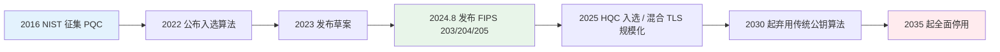

# 现代密码学发展

现代密码学在经典对称/非对称密码与消息认证的基础上，正经历后量子安全、隐私计算、人工智能安全与新型应用四大方向的深刻变化。本文基于公开资料与标准化进展，概述后量子密码（PQC）、同态加密、零知识证明、人工智能与密码学交叉，以及轻量级密码等方向的发展现状与趋势。

**注：**

本文最后更新于 **2026 年 9 月**，反映的标准与部署现状以 NIST、IETF 等公开资料为准。

## 为什么需要“后量子”密码

当前广泛使用的公钥密码（如 RSA、椭圆曲线 ECDH/ECDSA）基于大整数分解或离散对数等数学难题，在经典计算机下被认为是安全的。**量子计算机**利用 Shor 算法可在理论上多项式时间内破解这些问题，一旦实用型量子计算机出现，现有公钥体系将面临系统性风险。

业界普遍认为：非对称加密将在 **2029 年前后**首次面临量子计算的实质性威胁，到 **2034 年**主流密码技术可能全面暴露于量子攻击。鉴于算法迁移与系统改造通常需要 **10–15 年**，提前启动后量子密码迁移已刻不容缓。（参见《后量子密码安全能力构建技术指南（2025版）》等报告。）

更现实的压力来自 **“现在收割，以后解密”（Harvest Now, Decrypt Later, HNDL）**：攻击者可以今天就把加密流量与敏感数据批量存下来，等未来拿到足够强的量子计算机再解密。对需要保密十年以上的医疗、政务、金融数据而言，这意味着风险**已经开始计时**，而不是等到量子计算机落地才开始。

**NIST 的官方时间表（NIST IR 8547）**

- **2030 年**起：逐步弃用（deprecate）现有的量子脆弱公钥算法。
- **2035 年**起：不再允许（disallow）在标准批准的场景中使用这些算法。

也就是说，留给密码资产盘点、改造与验证的窗口，正好落在当下这几年。

## 后量子密码（PQC）与标准化

**后量子密码（Post-Quantum Cryptography, PQC）** 指在经典与量子计算机下均被认为难以攻破的密码算法，主要技术路线包括：

| 路线       | 代表算法/思想     | 特点                         |
|------------|--------------------|------------------------------|
| 格密码     | ML-KEM、ML-DSA     | 效率高、密钥较小、标准化领先 |
| 哈希基签名 | SLH-DSA (Sphincs+) | 结构简单、作为格算法备选     |
| 编码基     | HQC、McEliece 等   | 抗量子历史长；HQC 已于 2025 年被选为 ML-KEM 的备份 |
| 多变量     | 多变量二次方程     | 可用于签名与加密             |
| 同源曲线   | SIKE 等             | 密钥小；SIKE 已于 2022 年被攻破，NIST 不再推荐 |

### NIST 后量子标准（2024 起）

美国国家标准与技术研究院（NIST）于 **2016 年** 发起全球后量子密码算法征集，经多轮评估，于 **2022 年** 公布首批入选算法，**2024 年 8 月** 正式发布首批三项联邦信息处理标准（FIPS），标志着 PQC 从评估阶段进入可部署阶段。

| 标准     | 算法原名        | 标准化名称 | 用途           |
|----------|-----------------|------------|----------------|
| FIPS 203 | CRYSTALS-Kyber  | ML-KEM     | 密钥封装（通用加密/密钥协商） |
| FIPS 204 | CRYSTALS-Dilithium | ML-DSA  | 数字签名       |
| FIPS 205 | Sphincs+        | SLH-DSA    | 数字签名（哈希基备选） |

- **ML-KEM**：基于模格学习与误差（MLWE）问题，密钥小、速度快，适合资源受限环境；提供 ML-KEM-512/768/1024 三档安全级别。
- **ML-DSA**：基于格的数字签名，采用 Fiat–Shamir with Aborts 范式，为当前主推的 PQC 签名方案。
- **SLH-DSA**：无状态、基于哈希的签名，不依赖格难题，作为与 ML-DSA 不同数学假设的备份方案。

**后续进展：**

- **2025 年 3 月**：NIST 选定 **HQC** 作为第五个算法（第四轮唯一入选者），作为 ML-KEM 的**备份 KEM**。它基于纠错码而非格，数学假设与 ML-KEM 完全不同，代价是计算与带宽开销更大；NIST 计划先发布草案（FIPS 草案征求意见），**2027 年**完成标准化。详见 [NIST 新闻稿（2025年3月）](https://www.nist.gov/news-events/news/2025/03/nist-selects-hqc-fifth-algorithm-post-quantum-encryption) 与 [NIST IR 8545](https://csrc.nist.gov/pubs/ir/8545/final)。
- **FN-DSA（FIPS 206）**：基于 FALCON 的格签名，签名与公钥更短，适合带宽敏感场景；截至 2026 年仍在草案/评审阶段，尚未正式发布。
- **配套指南**：NIST 于 **2025 年 9 月**发布 [SP 800-227《Recommendations for Key-Encapsulation Mechanisms》](https://csrc.nist.gov/pubs/sp/800/227/final)，规范 KEM 的定义、使用与混合构造，是工程落地的重要参考。

NIST 的立场很明确：**先迁到 2024 年的三个标准，再等备份算法成熟**，不要因为“还会有新算法”而停下迁移。详见 [NIST 后量子密码标准化项目](https://csrc.nist.gov/projects/post-quantum-cryptography) 与 [NIST 新闻稿（2024年8月）](https://www.nist.gov/news-events/news/2024/08/nist-releases-first-3-finalized-post-quantum-encryption-standards)。

### 从标准到落地：混合密钥交换已成主流

比起“某一天突然替换”，真实世界的做法几乎都是**混合（hybrid）**：把传统 ECDHE 与 PQC KEM 同时使用，只要其中一个仍然安全，会话密钥就安全。这既防止 PQC 算法被攻破，也对现有合规与互操作性友好。

- **IETF 已标准化**：[RFC 10024](https://www.rfc-editor.org/info/rfc10024) 定义了 TLS 1.3 的三个 PQ/T 混合密钥协商组——`X25519MLKEM768`、`SecP256r1MLKEM768`、`SecP384r1MLKEM1024`；配套的 [RFC 9954](https://www.rfc-editor.org/info/rfc9954) 给出混合密钥交换框架，[RFC 9794](https://www.rfc-editor.org/info/rfc9794) 统一了 PQ/T 术语。
- **生态支持**：`X25519MLKEM768` 已在主流浏览器（Chrome/Edge 131+、Firefox 132+ 桌面、Safari 26+ 等）与主流密码库（OpenSSL 3.5+、Go 1.24+ 等）中默认启用，Cloudflare、AWS CloudFront、Akamai、Fastly 等 CDN 也已提供。

**实测现状（2026 年互联网测量研究）**

一项覆盖 3.2 万个域名的测量研究显示：约 **49.3%** 的域名已完成混合后量子密钥交换的协商，仍有 **50.7%** 使用传统密钥交换；而**后量子证书的采用率接近 0%**，证书签名几乎仍是 RSA（约 57%）与 ECDSA（约 43%）。

**核心洞察：**

密钥交换这一半已经“过半”，**身份认证（证书/签名）这一半几乎还没开始**——而后者恰恰是量子攻击者伪造证书、实施中间人攻击的入口。混合密钥交换保护的是“机密性”，并不等于端到端的抗量子。

### 中国在后量子密码方面的进展

- **算法征集**：2025 年 2 月，中国商用密码标准研究院发布《关于开展新一代商用密码算法征集活动的公告》，面向全球征集后量子密码先进算法；随后持续发布 x86、ARM、FPGA 等平台的实现自评估要求，推动算法工程化验证。
- **标准节奏**：2026 年全国两会期间，中国科学院院士、清华大学王小云教授公开表示，中国有望在**未来三年内**建成完整的后量子密码国家标准体系，并优先针对**金融、政务**制定迁移路线图。
- **技术路线**：在跟随 NIST 格密码主流的同时，国内重点布局“**无结构格**”路线（如王小云团队提出的 **S-Cloud+**）。相比 ML-KEM 这类基于代数结构的格算法，无结构格理论上更少受到结构攻击导致的安全降级，代价是参数与性能开销更大，需要硬件加速配合。
- **应用路线**：运营商等推进“**QKD（量子密钥分发）+ PQC**”融合，实现“量子经典深度融合”，将量子安全能力融入云、网、端、管等层面；金融侧普遍采用“传统 + PQC”混合过渡以保证业务连续性。
- **市场预期**：据行业分析，全球后量子密码技术市场规模预计在 **2030 年** 超过 **100 亿美元**，中国约占 **20%**。

**迁移节奏（公开报道整理的常见提法）**

- 2026–2027 年：密码资产盘点、规划与标准草案。
- 2028–2029 年：试点验证与标准发布。
- 2030 年后：金融、政务等关键场景规模化部署。

当前国内在 PQC 基础理论、核心算法创新与工程化方面仍需补强，尤其是芯片/网关等硬件实现与国密体系的融合改造。

## 同态加密与隐私计算

**同态加密（Homomorphic Encryption）** 允许在**不解密**的前提下对密文进行运算，结果解密后与对明文做相同运算一致，是实现“**可算不可见**”的隐私计算核心技术之一。

### 分类与代表方案

| 类型       | 支持运算     | 代表方案           | 应用场景           |
|------------|--------------|--------------------|--------------------|
| 半同态     | 仅加法或仅乘法 | Paillier（加法）、RSA/ElGamal（乘法） | 安全求和、简单统计 |
| 全同态 FHE | 加法和乘法   | BGV、BFV、CKKS、Gentry 系列 | 通用密态计算       |

- **半同态**：实现简单、性能较好，在联邦学习、安全多方计算中已广泛应用。
- **全同态（FHE）**：表达能力强，可对密文做任意电路计算，但存在**效率低、密钥与密文膨胀**等问题，目前多用于对性能要求不极端的场景；CKKS 等方案在近似运算、机器学习推理中受到关注。

同态加密在**联邦学习、隐私外包计算、安全投票**等场景中与差分隐私、安全多方计算结合使用。ISO 已发布同态加密标准（如 ISO/IEC 18033-6:2019），HomomorphicEncryption.org 等组织在推进 FHE 标准化白皮书。

**最新趋势：**

- **工程栈成熟**：OpenFHE、Microsoft SEAL、Lattigo、Zama TFHE-rs 等开源库已覆盖 BGV/BFV/CKKS 与 FHEW/TFHE 两条技术路线，开发者不再需要从论文复现。
- **走向产品化**：云厂商与创业公司把 FHE 打包成“加密数据库”“隐私推理”服务，典型场景是医疗、金融的密文检索与密态模型推理。
- **硬件加速成为分水岭**：GPU/FPGA/ASIC 加速（如开源的 FHE 硬件处理单元方案）正在把 FHE 从“慢 1000 倍”拉向“可商用”，这是当前最活跃的工程方向。

## 零知识证明（ZKP）

**零知识证明（Zero-Knowledge Proof, ZKP）** 使证明方能够向验证方证明“某命题成立”，而不泄露除“命题成立”之外的任何信息，在隐私保护与可验证计算中扮演核心角色。

### 特点与应用

- **隐私**：证明身份、资质或数据满足某条件，而不暴露具体数据（如匿名凭证、范围证明）。
- **可验证性**：验证方无需重算即可相信计算结果正确（如 zk-SNARKs、zk-STARKs）。
- **区块链**：用于扩容（Rollup）、隐私交易、跨链互操作等；zk-SNARKs、zkVMs、专用 DSL 等已成为链上可验证计算的重要基础设施。

零知识证明在**投票、认证、时间锁、机器学习**等非区块链场景的应用也在扩展。近年来，更高效的证明系统（如基于 Folding 的论证系统）在链上验证成本与资源受限环境方面取得进展。

**最新趋势：**

- **从“手写电路”到 zkVM**：开发者不再手写约束电路，而是把普通程序跑进 zkVM/DSL 中自动生成证明，工程门槛大幅下降。
- **递归与折叠（Folding）**：把大量证明递归压缩成一个，显著降低链上验证成本，是 Rollup 与可验证计算规模化的关键。
- **证明即服务**：证明生成被外包给专业算力网络，验证仍保持轻量，形成“重生成、轻验证”的分工。
- **与 AI 结合**：模型推理结果的可验证性（zkML）成为热点，用来回答“这个输出是不是这个模型算出来的”。

**注：**

ZKP 主打的是**可验证性**而非机密性，天然不抗量子（多数 SNARK 依赖离散对数或配对）；抗量子的 ZKP 方向（如基于哈希/格的证明系统）仍以 STARK 类方案与研究性构造为主。

## 人工智能安全与密码学的交叉

AI / 大模型安全是 2025–2026 网络安全圈热度最高的新变量，而密码学在其中扮演"可证明保障"的底座角色——它回答的不是"模型聪不聪明"，而是"数据有没有泄露、结果能不能被相信、来源是否可信"。可归纳为三条主线：**隐私保护机器学习（PPML）**、**可验证机器学习（zkML）**、以及**对抗与投毒安全**。

### 隐私保护机器学习（PPML）

目标是在不暴露原始数据 / 模型权重的前提下完成训练或推理，主力技术是差分隐私（DP）、同态加密（HE）与安全多方计算（MPC）。

**差分隐私（DP）** 提供可量化的隐私保障。对任意相邻数据集 $D, D'$（仅差一条记录）与任意输出集合 $S$：

$$
\Pr\!\big[M(D)\in S\big] \;\le\; e^{\varepsilon}\,\Pr\!\big[M(D')\in S\big] + \delta
$$

其中 $\varepsilon$ 控制隐私损失、$\delta$ 允许极小概率失效。工程中常用**高斯机制**：先对梯度做 $L_2$ 裁剪（敏感度 $\le C$），再加 $\mathcal{N}(0, \sigma^2)$ 噪声，使发布的梯度满足 $(\varepsilon,\delta)$-DP。

**同态加密推理** 多用 CKKS 方案在密文上做定点 / 近似算术，直接对加密输入跑神经网络；**联邦学习 + 安全聚合（SecAgg）** 则让服务器只见聚合后的梯度、不见任一方的本地数据。

### 可验证机器学习（zkML）

用零知识证明回答"这个输出到底是不是这个模型、在这份输入上算出来的"，而不暴露模型权重或用户数据：

$$
\text{关系 } R:\quad \exists\,(w, x)\ \text{s.t.}\ y = f_w(x)\ \land\ \text{公开 } y
$$

证明者把前向推理电路化，给出 $\pi = \mathsf{Prove}(pk, x, w, y)$，验证者用一次配对校验 $\pi$ 即可相信 $y$ 的正确性。难点在于神经网络的非线性（ReLU / softmax / 归一化）在有限域上昂贵，催生了**量化 + 查找表（lookup）**、**Sumcheck / GKR** 等专项优化；当前 zkML 多用于"小模型推理的可验证性"而非训练。

### 对抗与投毒安全

对抗样本、数据投毒、后门攻击更多属于机器学习鲁棒性范畴；密码学在此的贡献集中在"**数据来源可信**"——用数字签名、TEE、可验证数据管线保证训练数据与推理请求未被篡改。

下面两段可直接运行：第一段演示 $(\varepsilon,\delta)$-DP 的梯度加噪；第二段演示安全聚合（SecAgg）的核心原语——加法秘密共享下的**安全求和**，服务器与客户端各自只看到份额、无法还原个体值。

```python
# 片段一: (ε,δ)-差分隐私的梯度发布 (高斯机制 + L2 裁剪)
import random, math

def gaussian_noise(sigma):
    u1, u2 = random.random(), random.random()
    z = math.sqrt(-2 * math.log(u1)) * math.cos(2 * math.pi * u2)
    return sigma * z

def clip_grad(g, C):
    norm = math.sqrt(sum(v * v for v in g))
    return [v * (C / norm) for v in g] if norm > C else list(g)

def dp_release(grad, C, sigma):
    g = clip_grad(grad, C)                      # 裁剪后敏感度 ≤ C
    return [v + gaussian_noise(sigma) for v in g]

# 相邻数据集 D, D' 仅差一条记录; 加噪后满足 Pr[M(D)∈S] ≤ e^ε Pr[M(D')∈S] + δ
grad = [0.9, -0.3, 1.2]
print("加噪后梯度:", [round(v, 3) for v in dp_release(grad, C=1.0, sigma=0.5)])
```

```python
# 片段二: 安全聚合 (SecAgg) 原语 —— 两方加法秘密共享下的安全求和
import random
P = 2**31 - 1

def split(v):
    a = random.randrange(P)
    return a, (v - a) % P          # 份额 (a, b) 满足 a + b = v (mod P)

vals = [42, 17, 8]                # 三个客户端各自的私有本地统计量
shares = [split(v) for v in vals]
client_side = [s[0] for s in shares]   # 客户端各自保留第 1 份额
server_side = [s[1] for s in shares]   # 服务器收集第 2 份额

# 双方只公开"各自汇总的份额", 重建总和, 但任何一方的个体值都未泄露
total = (sum(client_side) + sum(server_side)) % P
print("安全求和结果 (= 42+17+8):", total, "| 个体值未被任何单方还原")
```

**最新趋势：** PPML 走向"产品化"（加密数据库、隐私推理 API）；zkML 与链上可验证推理结合，用于 AI 代理（agentic AI）的可审计执行；同时，用 AI 反制 AI（AI 驱动威胁检测）成为防御侧主流。详见 [IBM 2026 安全趋势](https://www.ibm.com/think/insights/more-2026-cyberthreat-trends) 与 [ethicalhacking.ai 2026 趋势](https://ethicalhacking.ai/blog/cybersecurity-trends-2026)。

## 轻量级密码与物联网

**轻量级密码**面向资源受限设备（如传感器、嵌入式 MCU、物联网终端），在保证一定安全强度的前提下，优化**面积、功耗、延迟与代码体积**。

- **应用场景**：物联网（IoT）数据加密、设备认证、安全通信（如 TLS 中的轻量级套件）。
- **典型方向**：轻量级分组密码（如 PRESENT、SIMON/SPECK、**ASCON**）、轻量级哈希与认证码、以及结合 PQC 的轻量级 KEM/签名（如 ML-KEM 在嵌入式场景的优化实现）。NIST 于 **2023 年**选定 ASCON 作为轻量级密码标准，并于 **2025 年 8 月**正式发布 [SP 800-232](https://csrc.nist.gov/pubs/sp/800/232/final)，涵盖认证加密、哈希与可扩展输出函数等。

轻量级密码与后量子算法的结合，是未来物联网与边缘安全的重要研究方向。

## 发展时间线概览


```mermaid
flowchart LR
    A["2016 NIST 征集 PQC"] --> B["2022 公布入选算法"]
    B --> C["2023 发布草案"]
    C --> D["2024.8 发布 FIPS 203/204/205"]
    D --> E["2025 HQC 入选 / 混合 TLS 规模化"]
    E --> F["2030 起弃用传统公钥算法"]
    F --> G["2035 起全面停用"]
    style A fill:#e3f2fd
    style D fill:#e8f5e9
    style G fill:#ffebee
```

| 年份   | 事件概要 |
|--------|----------|
| 2016   | NIST 启动后量子密码标准化征集 |
| 2022   | NIST 公布 CRYSTALS-Kyber/Dilithium、Sphincs+、FALCON 等入选算法 |
| 2023   | NIST 发布 ML-KEM、ML-DSA、SLH-DSA 草案；NIST 选定 ASCON 作为轻量级密码标准 |
| 2024.8 | NIST 正式发布 FIPS 203、204、205（ML-KEM、ML-DSA、SLH-DSA） |
| 2025.2 | 中国商用密码标准研究院面向全球征集新一代商用密码（含后量子）算法 |
| 2025.3 | NIST 选定 HQC 作为第五个算法（ML-KEM 的编码基备份） |
| 2025.8 | NIST 正式发布 SP 800-232（ASCON 轻量级密码标准） |
| 2026   | IETF 发布 RFC 10024，混合 PQ/T 密钥交换成为 TLS 1.3 标准配置；浏览器与 CDN 大规模默认启用 |
| 2030   | 按 NIST IR 8547，开始弃用传统量子脆弱公钥算法 |
| 2035   | 按 NIST IR 8547，标准批准场景中不再允许使用传统量子脆弱公钥算法 |

## 小结

现代密码学发展围绕**抗量子、可算不可见、可证明不泄露、可信任 AI**四条主线展开：后量子密码（PQC）已经从"标准发布"走到"混合部署过半、证书侧几乎未动"的深水区；同态加密与零知识证明支撑隐私计算与区块链等应用，正快速工程化；人工智能与密码学的交叉（PPML / zkML / 联邦学习安全）成为 2025–2026 增长最快的新边疆；轻量级密码满足物联网与边缘安全需求。

如果要给当下的实践一句结论，那就是：**先做密码资产清单，再在传输层打开混合密钥交换，同时为证书与签名的后量子化留出排期**——因为最容易被忽略、也最难改的，恰恰是签名与 PKI；而在 AI 落地时，则用差分隐私、同态加密与零知识证明为"数据不泄露、结果可相信"提供可证明保障。

建议结合本系列的[密码协议与应用](ProtocolAndApplication.md)、[消息认证与哈希函数](HashAndMAC.md)与[比特币体系](Bitcoin.md)进一步理解这些技术在协议与系统中的应用。轻量级密码部分可对照[分组密码](Groupcipher.md)中的“发展现状”与 NIST ASCON 相关内容。

---

## 参考资料

- [NIST: Post-Quantum Cryptography Standardization](https://csrc.nist.gov/projects/post-quantum-cryptography)
- [NIST: First 3 Finalized Post-Quantum Encryption Standards (Aug 2024)](https://www.nist.gov/news-events/news/2024/08/nist-releases-first-3-finalized-post-quantum-encryption-standards)
- [NIST: Selects HQC as Fifth Algorithm (Mar 2025)](https://www.nist.gov/news-events/news/2025/03/nist-selects-hqc-fifth-algorithm-post-quantum-encryption) 与 [NIST IR 8545](https://csrc.nist.gov/pubs/ir/8545/final)
- [NIST FIPS 203: ML-KEM](https://csrc.nist.gov/pubs/fips/203/final)、[FIPS 204: ML-DSA](https://csrc.nist.gov/pubs/fips/204/final)、[FIPS 205: SLH-DSA](https://csrc.nist.gov/pubs/fips/205/final)
- [NIST SP 800-227: Recommendations for Key-Encapsulation Mechanisms](https://csrc.nist.gov/pubs/sp/800/227/final)
- [NIST SP 800-232: Ascon-Based Lightweight Cryptography Standards](https://csrc.nist.gov/pubs/sp/800/232/final)
- [NIST IR 8547: Transition to Post-Quantum Cryptography Standards](https://csrc.nist.gov/pubs/ir/8547/ipd)（2030 弃用 / 2035 停用时间表）
- [IETF RFC 10024: PQ/T Hybrid Key Agreement for TLS 1.3](https://www.rfc-editor.org/info/rfc10024)、[RFC 9954 混合密钥交换框架](https://www.rfc-editor.org/info/rfc9954)、[RFC 9794 PQ/T 术语](https://www.rfc-editor.org/info/rfc9794)
- [商用密码标准研究院：关于开展新一代商用密码算法征集活动的公告](https://www.niccs.org.cn/symmbzyjy/tzgg/pc/content/1937422988373135360/content_1937422988373135360.html)
- [Measurement Study of Post-Quantum Readiness of Internet: 2026（arXiv:2606.16473）](https://arxiv.org/html/2606.16473)
- 《后量子密码安全能力构建技术指南（2025版）》等行业报告
- 全同态加密研究进展与标准化（如 ISO/IEC 18033-6、HomomorphicEncryption.org、OpenFHE）
- ACM 等关于零知识证明与区块链的综述
- [IBM: 2026 Cybersecurity Threat Trends](https://www.ibm.com/think/insights/more-2026-cyberthreat-trends)
- [ethicalhacking.ai: Top 10 Cybersecurity Trends 2026 (AI Agents, PQC, Deepfakes)](https://ethicalhacking.ai/blog/cybersecurity-trends-2026)
- 隐私保护机器学习（PPML / zkML / SecAgg）综述与 OpenFHE、Microsoft SEAL、TFHE-rs 等工程实现

**本文作者：** [<span class="author-avatar-wrapper"><span class="author-name-popover">王科文</span></span>](https://github.com/Wcowin)
