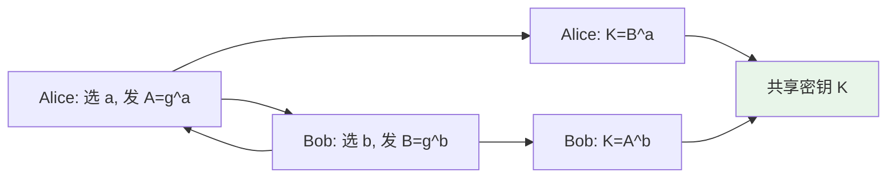
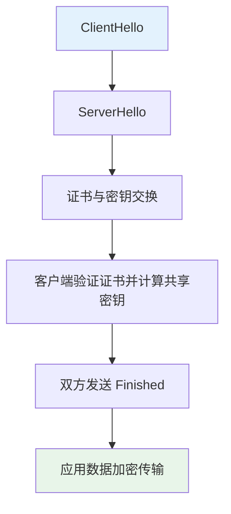

# 密码协议与应用

密码协议（Cryptographic Protocol）是在多方之间、按照预定步骤使用密码学原语完成某一安全目标的交互规则。本章在前期对称密码、非对称密码与消息认证的基础上，介绍典型协议（如密钥交换、认证与安全通信）及其在现实中的应用（如 TLS、SSH、VPN）。

## 什么是密码协议

### 定义与目标

**密码协议**通常具备以下特征：

- **多方参与**：两个或多个参与方（人、设备或服务）按顺序执行步骤
- **使用密码学原语**：加密、签名、哈希、MAC、随机数等
- **明确的安全目标**：如保密性、完整性、认证、不可否认性、公平性等

常见协议目标包括：

| 目标         | 含义                                   |
|--------------|----------------------------------------|
| 密钥建立     | 在不安全信道上协商出仅参与方可知的密钥 |
| 实体认证     | 一方或双方向对方证明自己的身份         |
| 消息认证     | 验证消息来自声称的发送方且未被篡改     |
| 不可否认性   | 防止发送方事后否认已发送的消息         |
| 匿名与隐私   | 在不暴露身份的前提下完成交易或通信     |

### 协议与算法的区别

- **密码算法**：如 AES、RSA、SHA-256，定义“如何对数据做一次运算”（加密、签名、哈希等）。
- **密码协议**：定义“谁在何时向谁发送什么、如何用算法处理”，是多轮消息交换与算法组合的规则。

协议若设计不当（如缺少认证、重放防护、随机数复用），即使所用算法安全，整体仍可能被攻击。

## 典型密码协议

### 密钥交换与协商

在不安全信道上，双方需要协商出一个只有他们知道的**共享密钥**，用于后续对称加密或 MAC。

**Diffie-Hellman 密钥交换（DH）**

- 双方公开约定大素数 $p$ 和生成元 $g$。
- Alice 选私钥 $a$，计算 $A = g^a \bmod p$ 发给 Bob；Bob 选私钥 $b$，计算 $B = g^b \bmod p$ 发给 Alice。
- Alice 计算 $K = B^a \bmod p$，Bob 计算 $K = A^b \bmod p$，得到相同的 $K = g^{ab} \bmod p$，作为共享密钥材料。
- 窃听者只有 $g, p, A, B$，在离散对数困难假设下无法算出 $K$。

**注意**：原始 DH 不提供身份认证，易受中间人攻击，实际中应与认证结合（如 TLS 中的 DHE/ECDHE + 证书）。下图中箭头表示双方交换公钥 $A$、$B$ 后各自计算共享密钥 $K$。

### 认证与密钥建立

在建立密钥的同时验证对方身份，可结合：

- **公钥证书**：由 CA 签名的“身份–公钥”绑定，用于 TLS、S/MIME 等。
- **预共享密钥（PSK）**：双方事先共享密钥或口令，用于 WiFi WPA2、部分 TLS 模式等。
- **密钥分发中心（KDC）**：如 Kerberos，由可信第三方为双方生成会话密钥。

### 安全通信协议概览

| 协议/应用   | 主要用途           | 常用密码学组件                     |
|-------------|--------------------|------------------------------------|
| TLS/HTTPS   |  Web 安全、API     | 对称加密、DH/ECDH、证书、HMAC      |
| SSH         | 远程登录与文件传输 | 密钥交换、主机与用户认证、对称加密 |
| IPsec/VPN   | 网络层加密与隧道   | IKE 密钥交换、ESP 加密与认证       |
| PGP/S/MIME  | 邮件加密与签名     | 公钥加密、数字签名、证书           |
| Signal/OTR   | 即时通信端到端加密 | 双棘轮、前向保密                   |

## TLS：Web 安全基石

TLS（Transport Layer Security）是 HTTPS、邮件、即时通讯等应用层协议常用的安全传输层协议，提供机密性、完整性与对服务器（及可选客户端）的认证。

### TLS 握手简析

典型流程（简化）：

1. **ClientHello**：客户端发送支持的 TLS 版本、 cipher suite、随机数等。
2. **ServerHello**：服务端选择版本与 cipher suite，并发送自己的随机数。
3. **证书与密钥交换**：服务端发送证书（含公钥），并可能发送 DH 参数或公钥；客户端验证证书并完成密钥交换。
4. **Finished**：双方用协商出的密钥派生会话密钥，并交换 Finished 消息以确认握手未被篡改。

### 重要概念

- **前向保密（Forward Secrecy）**：使用 DHE 或 ECDHE 时，会话密钥不依赖服务器长期私钥，即使日后私钥泄露，过去的会话仍不可解密。
- **证书链与 CA**：浏览器信任的根 CA 签发中间 CA，中间 CA 再签发站点证书；客户端逐级验证直至信任的根。
- **HSTS**：通过 HTTP 头强制浏览器仅用 HTTPS 访问，降低协议降级与中间人劫持风险。

**TLS 与后量子**：TLS 1.3 已支持与后量子密钥封装（如 NIST 标准 ML-KEM）结合使用（混合模式：传统 ECDH + PQC KEM），部分浏览器与密码库正在逐步支持；未来将向“纯 PQC”或“PQC 优先”演进。详见[现代密码学发展](ModernCryptography.md)。

## SSH：安全远程访问

SSH（Secure Shell）用于远程登录、文件传输（SCP/SFTP）和隧道，默认基于 TCP 22 端口。

### 工作流程概览

1. **版本协商**：客户端与服务器交换 SSH 协议版本。
2. **密钥交换**：使用 DH 或类似算法协商会话密钥，并验证主机密钥（防止首次连接时的中间人）。
3. **用户认证**：支持口令认证或公钥认证（推荐公钥，可配合口令保护私钥）。
4. **会话**：后续流量使用协商出的对称密钥加密与 MAC 保护。

### 公钥认证

- 用户本地生成密钥对，将公钥放入服务器 `~/.ssh/authorized_keys`。
- 登录时服务器用该公钥挑战，用户用私钥应答，证明身份而不暴露私钥。

## 协议设计中的常见陷阱

- **缺少认证**：仅做密钥交换而不验证身份，易遭中间人攻击。
- **重放攻击**：旧消息被再次注入；应对措施包括时间戳、nonce、序列号等。
- **随机数质量**：弱随机数会导致密钥或 nonce 可预测，进而破坏协议安全。
- **降级攻击**：攻击者迫使双方使用弱算法；应对措施包括禁止弱套件、使用 TLS 1.2+ 等。

## 小结

密码协议把对称/非对称密码与消息认证组合成多步交互，实现密钥建立、认证与安全通信。TLS 与 SSH 是日常中最常见的两类协议；理解其大致流程与“认证 + 密钥交换 + 加密/MAC”的结构，有助于在应用中正确配置与排查问题。后续可结合[比特币体系](Bitcoin.md)与[消息认证与哈希函数](HashAndMAC.md)进一步理解协议在区块链与完整性校验中的用法；TLS/SSH 与后量子算法的结合正在推进，参见[现代密码学发展](ModernCryptography.md)。

---

## 参考资料

- [RFC 8446 - TLS 1.3](https://www.rfc-editor.org/rfc/rfc8446)
- [RFC 4251 - SSH 架构](https://www.rfc-editor.org/rfc/rfc4251)
- [Wikipedia: Diffie–Hellman key exchange](https://en.wikipedia.org/wiki/Diffie%E2%80%93Hellman_key_exchange)

**本文作者：** 
