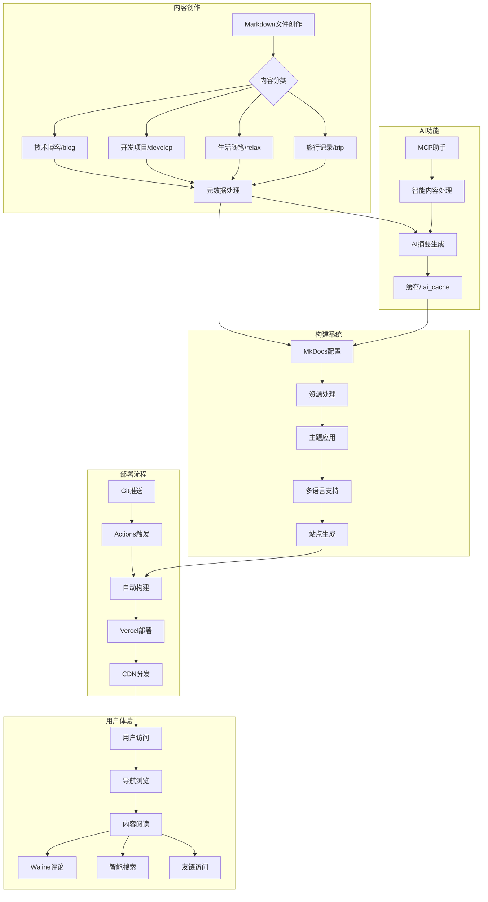

# 0.Mkdocs教程前言

## 文档教程

<div class="grid cards" markdown>

-   :material-notebook-edit-outline:{ .lg .middle } __文档资料__

    ---
    - 入门 MKdocs 请看[Mkdocs 官方教程](https://www.mkdocs.org/user-guide/writing-your-docs/){target=“_blank”}
    - [Material for MkDocs（只看这个也可以）](https://squidfunk.github.io/mkdocs-material/){target=“_blank”}教程
    - [令人惊叹的MkDocs项目和插件列表](https://github.com/mkdocs/catalog#-theming){target=“_blank”}
    ---
    我写的中文教程（同步在其他平台）：

    - [x] [Mkdocs中文教程(语雀)](https://www.yuque.com/wcowin/mkdocs-wcowin?# 《Mkdocs-Wcowin中文教程》){target=“_blank”}(推荐，展示效果好)
    - [x] [Mkdocs中文教程](https://blog.csdn.net/m0_63203517/category_12472184.html?spm=1001.2014.3001.5482){target=“_blank”} (CSDN | 观感更纯净)
    - [x] [MKdocs博客中文系列教程](https://www.zhihu.com/column/c_1754218140098387968){target=“_blank”}(知乎专栏)

</div>



<!-- 入门 MKdocs 请看官方教程:
[Mkdocs 官方教程](https://www.mkdocs.org/user-guide/writing-your-docs/){target=“_blank”}

Mkdocs Materials 教程:
[Mkdocs Materials](https://squidfunk.github.io/mkdocs-material/){target=“_blank”}

我写的中文教程（同步在其他平台）：
[Mkdocs中文教程](https://blog.csdn.net/m0_63203517/category_12472184.html?spm=1001.2014.3001.5482){target=“_blank”} (CSDN | 观感更纯净)
[MKdocs博客中文系列教程](https://www.zhihu.com/column/c_1754218140098387968){target=“_blank”}(知乎专栏)   -->

## 快速开始

<div class="grid cards" markdown>

-   :material-notebook-edit-outline:{ .lg .middle } __三部曲__

    ---
    - [部署静态网页至GitHub pages](mkdocs1.md)
    - [Mkdocs部署配置说明(mkdocs.yml)](mkdocs2.md)
    - [网站添加Mkdocs博客](mkdocsblog.md)

</div>

## 视频教程


已经发布


<div class="grid cards" markdown>

-   :material-notebook-edit-outline:{ .lg .middle } __视频资料__

    ---

    - [Mkdocs中文教程视频](https://space.bilibili.com/1407028951/lists/4566631?type=series){target=“_blank”}

</div>


<!-- <style>
/* 隐藏导航栏和目录 */
.md-sidebar--primary, .md-nav--secondary {
    display: none;
}

/* 调整中间内容的宽度 */
.md-main {
    width: 130%;
    margin: 0 auto;
    padding: 0 20px;
}
</style> -->
---

## 一点请求

<font  color= #518FC1 size=6 class="ml3">如果您参考了本教程，如果可以的话，烦请在您的网站注明教程来源！感谢！</font>
<script src="https://cdnjs.cloudflare.com/ajax/libs/animejs/2.0.2/anime.min.js"></script>

示例：
<div class="grid cards" markdown>

-   :material-notebook-edit-outline:{ .lg .middle } __参考资料__

    ---

    - 在构建网站的过程中参考了[Wcowin同学的Mkdocs教程](https://wcowin.work/Mkdocs-Wcowin/)

</div>

```
<div class="grid cards" markdown>

-   :material-notebook-edit-outline:{ .lg .middle } __参考资料__

    ---

    - 在构建本网站的过程中参考了[Wcowin同学的Mkdocs教程](https://wcowin.work/Mkdocs-Wcowin/)

</div>
```

## 加入友链

[友链申请 :palms_up_together_tone1:](../../link.md){.md-button}


<!-- <head>
<script async src="https://pagead2.googlesyndication.com/pagead/js/adsbygoogle.js?client=ca-pub-2327435979273742"
     crossorigin="anonymous"></script>
</head> -->

<!-- <script async custom-element="amp-auto-ads"
        src="https://cdn.ampproject.org/v0/amp-auto-ads-0.1.js">
</script>
<amp-auto-ads type="adsense"
        data-ad-client="ca-pub-2327435979273742">
</amp-auto-ads> -->

<!-- <body>
<script async src="https://pagead2.googlesyndication.com/pagead/js/adsbygoogle.js?client=ca-pub-2327435979273742"
     crossorigin="anonymous"></script>
<ins class="adsbygoogle"
     style="display:block"
     data-ad-client="ca-pub-2327435979273742"
     data-ad-slot="3702206121"
     data-ad-format="auto"
     data-full-width-responsive="true"></ins>
<script>
     (adsbygoogle = window.adsbygoogle || []).push({});
</script>
</body> -->