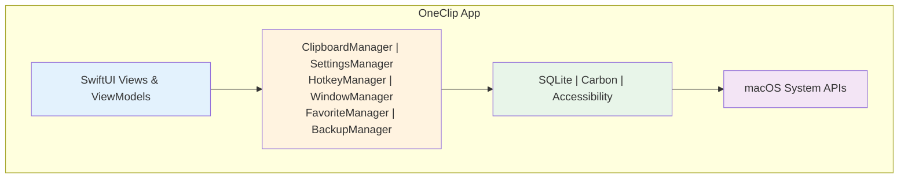

# OneClip

<!-- OneClip 公告栏 -->
<div class="oneclip-announcement">
  <div class="oneclip-announcement-content">
    🎉 <a href="https://oneclip.cloud/" target="_blank">OneClip</a> —— macOS剪贴板管理工具   <a href="https://oneclip.cloud/" target="_blank" class="oneclip-cta">了解更多 →</a><br>  
  </div>
</div>

点击链接加入群聊[OneClip交流群](https://qm.qq.com/q/xiImGHVMcM)

<div align="center">
  
  <h1>OneClip</h1>
  <p><strong>一个简单专业的 macOS 剪贴板管理工具</strong></p>
  <p>🚀 高效 · 🎨 现代 · ⚡️ 流畅 · 🔒 安全</p>
</div>

<p align="center">
  <a href="https://github.com/Wcowin/OneClip/releases"></a>
  <a href="https://github.com/Wcowin/OneClip/releases"></a>
  
  
  
  
  <a href="https://github.com/Wcowin/OneClip/blob/main/LICENSE"></a>
</p>


---

## 概览

OneClip 是一款专为 macOS 打造的**专业级剪贴板管理工具**。采用 **100% SwiftUI** 原生技术，实现更顺滑的动画、更自然的系统融合与更低的资源占用。

> 💡 **为什么选择 OneClip？**
> 
> - ✅ **纯原生开发**：100% SwiftUI，无第三方框架依赖，性能卓越
> - ✅ **独特创新**：栈粘贴板、拖拽容器、脚本系统、AI 集成等创新功能，提升工作效率
> - ✅ **隐私安全**：数据完全本地存储，无任何网络上传
> - ✅ **持续更新**：社群积极维护，快速响应用户反馈
> - ✅ **免费功能足够强大**：提供完整功能，无任何限制，无任何广告，无任何隐私收集

### 核心功能

- **智能记录**：自动保存剪贴板历史，支持文本、图片、文件等格式
- **全格式支持**：图片/视频/音频/文档等，完整保留元数据
- **文本/图片编辑**：支持文本/图片编辑，删除可撤销；支持置顶、收藏、删除等管理操作
- **栈粘贴板**：`⌘+⇧+C` 呼出栈粘贴板，方便批量管理；`⌘+V` 依次粘贴栈内容，`⌘+⇧+S` 按行拆分捕获内容
- **快速粘贴面板**：`⌘+；` 呼出快速粘贴面板，快速粘贴最近内容
- **拖拽容器**：`⌘+⇧+D` 呼出拖拽容器，暂存并拖出文件/图片到其他应用
- **极速搜索**：`⌘+F`随打随搜，多维筛选与搜索高亮，快速定位历史内容
- **菜单栏集成**：菜单栏快速访问、分类搜索、悬停预览与一键复制粘贴(左键复制，右键粘贴一气呵成)
- **全局快捷键**：`⌘+⇧+V` 呼出主界面（支持自定义组合）
- **快捷回复**：`⌘+⇧+R` 呼出快捷回复界面，支持文本/图片/文件模板及导入导出
- **OCR 识别**：主动识别屏幕或图片文本，支持 OCR 翻译与快速提取
- **脚本功能**：支持 JS 脚本编写，实现自动化操作
- **AI 集成**：支持本地 AI（Ollama/LMStudio）与在线 AI 服务，智能总结与翻译
- **云同步**：支持 iCloud/Dropbox 等自定义同步方案与数据备份/导入导出
- **自定义存储位置**：支持自定义数据存储位置，便于管理
- **灵活控制**：Dock 图标、后台模式、主题适配等配置；支持列表/卡片视图切换
- **现代界面**：遵循 macOS 设计规范，毛玻璃与暗黑模式适配
- **便捷安装**：支持 Homebrew 一键安装（也支持Sparkle 自动更新）
- **访达增强**：支持访达 ⌘+X 剪切文件，然后 ⌘+V 在其他位置移动文件（别处单独付费的功能，**OneClip 免费开放给大家**）


<!--  -->

  


<!-- ### ✨ 独特优势

| 特性 | OneClip | 其他剪贴板工具 |
|------|---------|---------------|
| **技术栈** | 100% SwiftUI 原生 | 多为 Electron/Web |
| **内存占用** | ~120MB | 通常 >300MB |
| **启动速度** | < 1 秒 | 2-5 秒 |
| **栈粘贴板** | ✅  | ❌ |
| **拖拽容器** | ✅  | ❌ |
| **AI 集成** | ✅ 本地+云端 | 部分支持 |
| **数据安全** | 完全本地存储 | 部分需云端 |
| **自动更新** | Sparkle | 不统一 | -->

## ⬇️ 下载与安装

### 系统要求

- macOS 12.0 及以上
- Apple Silicon+intel支持

### 📦 安装

**方式一：GitHub Releases（推荐）**

1. 前往 [Releases 页面](https://github.com/Wcowin/OneClip/releases) 下载最新版本
2. 将 `OneClip.app` 拖入 `Applications`（应用程序）文件夹
3. 首次打开若提示"来自未知开发者"，请按以下步骤处理：

**方式二：网盘下载**

- [123网盘下载](https://www.123912.com/s/bXcDVv-HauG3)

**方式三：Homebrew 安装**

使用 Homebrew 安装 OneClip：

```bash
brew install --cask Wcowin/oneclip/oneclip
```

如遇到报错请先卸载再重新安装：

```bash
brew uninstall --cask oneclip
```

---

#### 🔓 首次打开若提示"来自未知开发者/已被隔离"如何解决

  

**方法一：终端命令（推荐）**

```bash
sudo xattr -rd com.apple.quarantine /Applications/OneClip.app
```  


**方法二：系统设置**

1. 打开 `系统设置` → `隐私与安全性`
2. 找到 OneClip 相关提示
3. 点击"仍然打开"


**方法三：一键工具**

- 使用 [macOS 小助手](https://pan.quark.cn/s/f2302b6789b0) 一键处理

> 💡 **仍有问题？**
> - 详细教程：https://mp.weixin.qq.com/s/qjSx09tqNq1KfVug2WtQFg
> - 联系作者：vip@oneclip.cloud


## 🎬 功能演示

> 📹 **视频教程**
> - B 站：https://space.bilibili.com/1407028951/lists/5012369?type=series

### 核心功能展示

#### 1️⃣ 主窗口 - 快速访问历史

- 按 `⌘+⇧+V` 呼出主窗口
- 支持列表/卡片双模式切换
- 实时搜索、分类筛选
- 点击即可粘贴到当前应用

#### 2️⃣ 栈粘贴板 - 批量复制粘贴

- `⌘+⇧+C` 呼出栈面板
- 将多个项目加入栈中
- `⌘+V` 依次粘贴（默认行为）
- 适合表单填写、批量编辑场景

#### 3️⃣ 快捷回复 - 常用文本模板

- `⌘+⇧+R` 呼出快捷回复
- 支持文本、图片、文件模板
- 可设置独立快捷键
- 支持导入/导出配置

#### 4️⃣ 拖拽容器 - 文件临时存储

- `⌘+⇧+D` 呼出拖拽容器
- 暂存文件、图片等内容
- 支持拖出到其他应用
- 适合文件整理、批量上传

#### 5️⃣ 菜单栏 - 极简快捷访问

- 点击菜单栏图标查看最近项目
- 悬停预览内容详情
- 支持拖拽操作
- 快速粘贴常用内容

#### 6️⃣ 快速粘贴面板 - 快速粘贴最近内容

- `⌘+；`呼出快速粘贴面板
- 粘贴方便快捷，支持快速粘贴最近内容

## 🏗️ 技术与架构

### 核心技术栈

- Swift 5.9+
- SwiftUI (100% 原生)
- SQLite + WAL (数据持久化)
- Carbon Framework (全局热键)
- Accessibility API (权限管理)
- Sparkle (自动更新)
- Xcode 15+

### 架构设计



### 核心组件

| 组件 | 职责 | 
|------|------|
| **ClipboardManager** | 剪贴板监控和数据管理 | 
| **SettingsManager** | 用户偏好设置管理 | 
| **WindowManager** | 窗口状态和显示控制 | 
| **HotkeyManager** | 全局快捷键处理 | 
| **ClipboardStore** | SQLite 数据持久化 | 
| **AIService** | AI 功能集成 | 
| **SyncthingManager** | 云同步管理 |

### 性能优化策略

- **批量更新机制**：减少频繁的视图重绘
- **搜索防抖**：延迟触发更新，避免每个字符都重新搜索
- **索引预计算**：按类型分组，快速筛选
- **智能监控**：根据活动状态自适应调整监控频率
- **懒加载缓存**：按需加载图片和文件内容
- **内存压力管理**：自动释放不必要的缓存

### 权限配置

首次启动时，OneClip 需要以下系统权限：

1. **辅助功能权限**（必需）
   - 系统偏好设置 → 安全性与隐私 → 隐私 → 辅助功能
   - 添加 OneClip 并启用

2. **磁盘访问权限**（可选，用于文件操作）
   - 系统偏好设置 → 安全性与隐私 → 隐私 → 完全磁盘访问
   - 添加 OneClip 并启用

## 🚀 使用指南

### 基础操作

1. **启动应用**
   - 双击 `OneClip.app` 启动
   - 应用将在状态栏显示图标

2. **快速访问**
   - 按 `⌘+⇧+V` 打开主界面
   - 点击状态栏图标快速粘贴

3. **快捷回复**
   - 按 `⌘+⇧+R` 打开快捷回复界面
   - 点击快捷回复即可粘贴

4. **内容管理**
   - 复制任何内容，自动保存到历史
   - 在主界面搜索和浏览历史记录
   - 点击任意项目即可粘贴

### 🎓 高级功能（逐步完善）

#### 📁 智能分类系统

- **系统分类**：文本、图片、文件、链接、代码等自动识别
- **自定义分类**：支持创建自定义分类规则
- **颜色标记**：不同分类使用不同颜色区分

#### 🔍 强大搜索功能

- **实时搜索**：随打随搜，即时显示结果
- **搜索高亮**：匹配内容自动高亮显示
- **历史记录**：保存搜索历史，快速复用（TODO）

#### ⚙️ 丰富配置选项

- **外观设置**：列表/卡片视图、暗黑模式、字体大小
- **存储策略**：历史数量限制、自动清理、大文件处理
- **隐私保护**：排除特定应用、敏感内容过滤
- **快捷键自定义**：支持所有功能的快捷键配置

#### 🔄 数据备份与同步

- **本地备份**：自动/手动备份到本地
- **云同步**：自定义同步方案
- **导入导出**：支持配置和数据的导入导出

<!-- ## ⚙️ 配置选项

### ⌨️ 快捷键速查表

| 功能 | 默认快捷键 | 可自定义 | 说明 |
|------|-----------|----------|------|
| **主窗口呼出** | `⌘+⇧+V` | ✅ | 打开/关闭主界面 |
| **快捷回复** | `⌘+⇧+R` | ✅ | 呼出快捷回复窗口 |
| **栈面板呼出** | `⌘+⇧+C` | ✅ | 打开栈粘贴板面板 |
| **依次粘贴** | `⌘+⇧+V` | ✅ | 从栈中依次粘贴 |
| **拖拽容器** | `⌘+⇧+D` | ✅ | 打开拖拽容器 |
| **复制** | `⌘+C` | ❌ | 系统默认复制 |
| **粘贴** | `⌘+V` | ❌ | 系统默认粘贴 |
| **菜单显示** | 左键复制，右键粘贴 | ✅ | 快速查看最近项目/复制/粘贴|


### 界面设置

- **Dock 图标**: 自动显示/隐藏
- **启动模式**: 开机自启动选项
- **主题适配**: 自动跟随系统主题
- **快捷回复**: 设置快捷回复快捷键
- **丰富模式/极简模式**: 切换界面模式

### 存储设置

- **历史时长**: 可设置最大保存时长（如7天、30天等）
- **数据清理**: 定期清理过期内容
- **文件处理**: 大文件存储策略 -->

## 🛠️ 源码构建（早期版本）

我们开源了早期版本的源码，你可以自行下载构建：

### 快速开始

```bash
# 克隆仓库
git clone https://github.com/Wcowin/OneClip.git
cd OneClip/src

# 构建
chmod +x build.sh
./build.sh

# 运行
open dist/OneClip.app
```

### 系统要求

- macOS 12.0+
- Xcode 15.0+

详细构建说明请查看 [src/README.md](src/README.md)

> ⚠️ **注意**：开源的是早期版本（基于文件系统），采用 MIT 协议。当前正式版已采用数据库存储，功能更完善，为商业软件。

## 🐛 常见问题（FAQ）

<details>
<summary><b>❓ 快捷键不工作？</b></summary>

**原因**：未授予辅助功能权限

**解决方案**：
1. 打开 `系统设置` → `隐私与安全性` → `辅助功能`
2. 找到 OneClip 并勾选启用
3. 重启 OneClip 应用

如果仍然无效，请尝试：
- 移除 OneClip 后重新添加
- 检查是否与其他应用快捷键冲突
- 在设置中重新设置快捷键

</details>

<details>
<summary><b>📁 无法复制文件？</b></summary>

**原因**：未授予完全磁盘访问权限

**解决方案**：
1. 打开 `系统设置` → `隐私与安全性` → `完全磁盘访问`
2. 添加 OneClip 并启用
3. 重启应用

</details>

<details>
<summary><b>🚫 应用无法启动或提示已损坏？</b></summary>

**解决方案**：
1. 检查系统版本是否为 macOS 12.0+
2. 执行解除隔离命令：
   ```bash
   sudo xattr -rd com.apple.quarantine /Applications/OneClip.app
   ```
3. 如果仍有问题，查看 [详细教程](https://mp.weixin.qq.com/s/qjSx09tqNq1KfVug2WtQFg)
4. 使用 [macOS 小助手](https://pan.quark.cn/s/f2302b6789b0) 一键处理

</details>

<details>
<summary><b>🔍 状态栏图标消失？</b></summary>

**可能原因**：
- 系统状态栏图标过多被隐藏
- 应用崩溃或未正常启动

**解决方案**：
1. 重启 OneClip 应用
2. 检查活动监视器中是否有 OneClip 进程
3. 调整系统状态栏图标数量（减少其他图标）
4. 在设置中重新启用状态栏图标显示

</details>

<details>
<summary><b>💾 内存占用过高？</b></summary>

**优化建议**：
1. 在设置中调整历史记录数量限制（推荐 500-1000 条）
2. 启用自动清理功能，定期清理过期内容
3. 减少监控频率（在设置中调整检测间隔）
4. 排除不需要监控的应用程序
5. 定期手动清理不必要的历史记录

</details>

<details>
<summary><b>🤖 如何使用 AI 功能？</b></summary>

**本地 AI（Ollama）**：
1. 安装 [Ollama](https://ollama.ai/)
2. 下载所需模型（如 `ollama pull llama2`）
3. 在 OneClip 设置中配置 Ollama 连接

**在线 AI 服务**：
1. 在设置中选择 AI 服务提供商
2. 输入 API Key
3. 配置模型参数

</details>

<details>
<summary><b>💰 如何获取许可证？</b></summary>

**购买方式**：
- 官网购买：https://oneclip.cloud/purchase/lifetime
- 使用优惠码：`OneClip2025`（10¥减免）

**激活方式**：
1. 打开 OneClip 设置 → 激活
2. 输入许可证密钥
3. 点击激活

**试用政策**：
- 免费7天试用完整功能
- 试用期结束后仍可使用基础功能

</details>


## 开发路线图

### ✅ 已完成

- [x] 基础剪贴板管理功能
- [x] 全局快捷键支持
- [x] 多格式内容支持（文本/图片/文件）
- [x] 栈粘贴板功能
- [x] 快捷回复系统
- [x] 拖拽容器
- [x] AI 功能集成
- [x] Sparkle 自动更新
- [x] 更多 AI 服务商集成
- [x] 自定义同步方案
- [x] 快速粘贴面板
- [x] 云同步功能
- [x] UI/UX 改进
- [x] 脚本系统 
- [x] 密码保护

### 🚧 进行中

- [ ] 性能/功能持续优化
- [ ] 多语言支持完善

### 📋 计划中

- [ ] 插件系统
- [ ] 团队协作功能
- [ ] iOS/iPadOS/Windows客户端

💡 有功能建议？欢迎在 [GitHub Discussions](https://github.com/Wcowin/OneClip/discussions) 提出！

## 关于作者

<div align="center">
  
  <h3>Wcowin</h3>
  <p>
    <a href="https://wcowin.work/blog/Mac/sunhuai/"> 博客</a> |
    <a href="https://github.com/Wcowin"> GitHub</a> |
    <a href="mailto:vip@oneclip.cloud"> 邮箱</a>
  </p>
</div>

## 🤝 反馈与支持

如果您在使用过程中遇到问题或有改进建议，欢迎通过以下方式联系：

### 📮 联系方式

| 方式 | 链接 | 说明 |
|------|------|------|
| 📧 **邮件** | [vip@oneclip.cloud](mailto:vip@oneclip.cloud) | 任何问题都欢迎发邮件 |
| 👥 **QQ 群** | [1060157293](https://qm.qq.com/q/xiImGHVMcM) | 用户交流群 |

<!-- | 🐛 **问题反馈** | [GitHub Issues](https://github.com/Wcowin/OneClip/issues) | Bug 报告和问题追踪 |
| 💡 **功能建议** | [GitHub Discussions](https://github.com/Wcowin/OneClip/discussions) | 功能建议和讨论 | -->


### ⭐ 支持项目

如果 OneClip 对你有帮助，请考虑：

- 🌟 在 GitHub 上给个 Star
- 🔄 分享给你的朋友
- 📝 写使用体验或评测
- 💰 购买许可证支持开发
- 🐛 报告 Bug 或提出改进建议


## 🙏 致谢

感谢以下开源项目和服务：

- SwiftUI - Apple 的现代化 UI 框架
- [Sparkle](https://sparkle-project.org/) - macOS 自动更新框架
- [Syncthing](https://syncthing.net/) - 开源文件同步工具
- [Ollama](https://ollama.ai/) - 本地 AI 模型运行环境

感谢所有用户的支持和反馈！🎉
  
## Star History

[](https://www.star-history.com/#Wcowin/OneClip&type=date&legend=top-left)  

---

<div align="center">
  <p><strong>OneClip —— 简单专业的 macOS 剪贴板管理工具</strong></p>
  <p>让复杂的事情变简单，让简单的事情变优雅</p>
  <p>Made with ❤️ by <a href="https://github.com/Wcowin">Wcowin</a></p>
  <p>© 2026 Wcowin. All rights reserved.</p>
</div>
