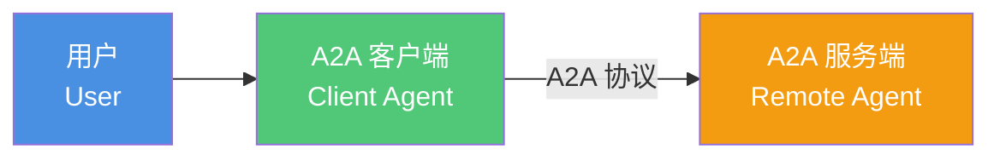
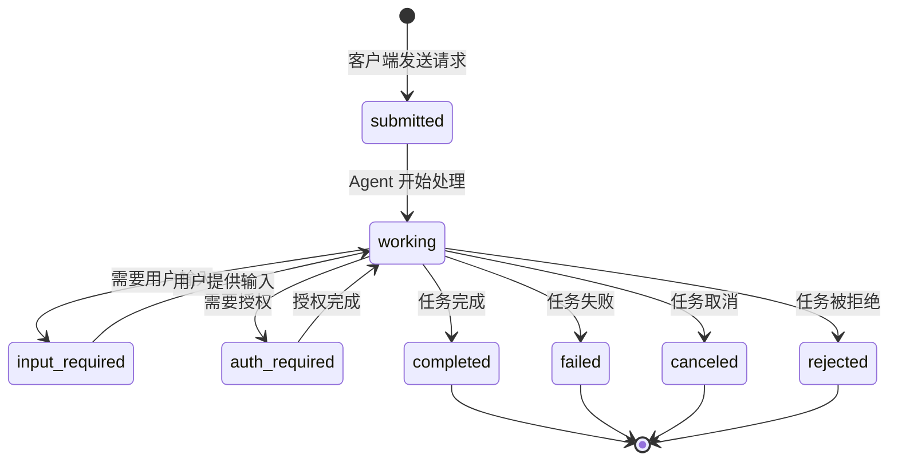
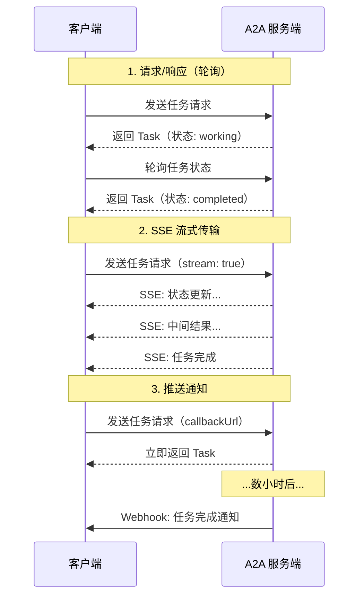
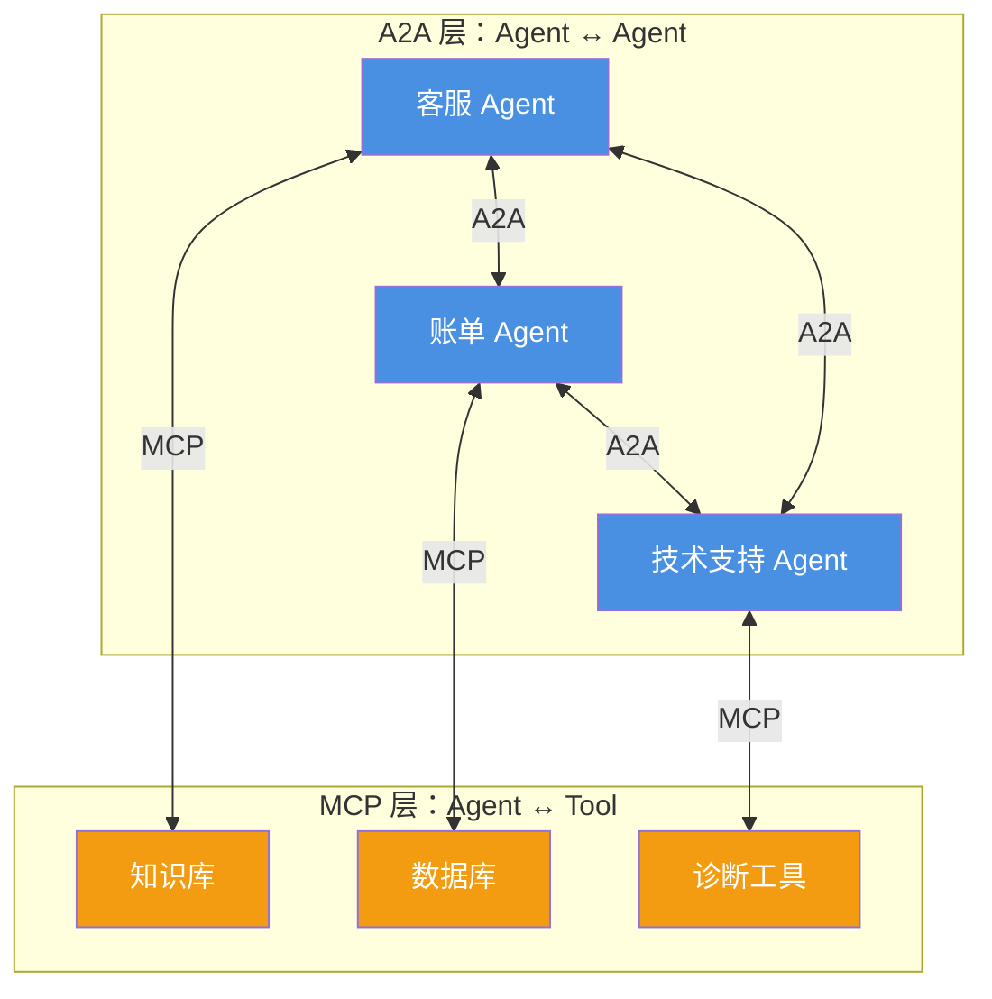
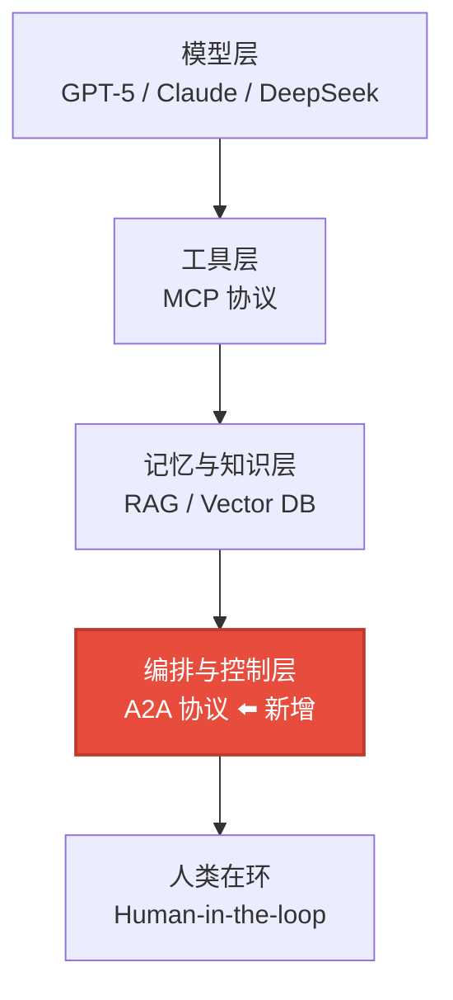

# A2A 协议（Agent-to-Agent）

## A2A 简介

Agent-to-Agent（A2A）协议是由 Google Cloud 发起、现已捐赠给 Linux 基金会的开放协议，旨在让不同框架、不同供应商构建的 AI Agent 之间实现标准化通信与协作。

> 在 A2A 出现之前，Agent 之间的通信面临三大难题：
> **孤岛效应**：不同框架（LangGraph、CrewAI、Semantic Kernel 等）构建的 Agent 无法直接对话，需要大量定制适配。
> **缺乏标准**：没有统一的任务发现、状态管理和消息格式规范，每个系统各自实现一套。
> **安全与信任缺失**：Agent 之间没有标准化的身份认证和授权机制，难以在企业环境中安全部署。

A2A 协议通过定义一套通用的通信标准，让 Agent 像互联网上的服务一样互相发现、协商和协作——因此它被称为 **Agent 时代的"TCP/IP"**。

A2A 协议的发布得到了超过 50 家技术合作伙伴（Atlassian、Box、Cohere、LangChain、MongoDB、PayPal、Salesforce、SAP、ServiceNow 等）以及领先服务提供商（Accenture、Deloitte、Infosys、KPMG、PwC 等）的支持。

## A2A 的设计原则

A2A 协议遵循以下关键设计原则：

| 原则 | 说明 |
|------|------|
| **拥抱 Agent 能力** | 允许 Agent 以非结构化的自然模式协作，无需共享内存、工具或内部上下文 |
| **基于现有标准** | 构建在 HTTP、SSE、JSON-RPC 2.0 等广泛接受的标准之上，便于与企业 IT 堆栈集成 |
| **默认安全** | 支持企业级身份验证和授权（OAuth、API Key 等），确保只有授权系统可以访问 |
| **支持长时间运行的任务** | 从秒级快速响应到数小时甚至数天（含人工介入）的复杂任务，均能支持 |
| **模态无关** | 支持文本、音频、视频流、表单、iframe 等多种交互形式 |

## 核心架构

### 三个参与者

A2A 协议定义了三个核心参与者：



- **用户（User）**：发起请求的人类或自动化服务
- **A2A 客户端（Client）**：代表用户向远程 Agent 发送请求的应用、服务或另一个 Agent
- **A2A 服务端（Server）**：实现 A2A 协议端点的远程 Agent。从客户端视角看，它是**不透明的（黑盒）**——内部记忆、工具和逻辑不对外暴露

> **与 MCP 的区别**：MCP 协议中有明确的 "Host" 参与者概念，而 A2A 更侧重于开放的对等协作，通过 AgentCard 和标准协议来处理发现和安全问题。

### 五大核心概念

| 概念 | 说明 | 类比 |
|------|------|------|
| **AgentCard** | 描述 Agent 能力的 JSON 元数据文件 | Agent 的"数字名片" |
| **Task（任务）** | 有状态的工作单元，拥有唯一 ID 和完整生命周期 | 一个工单 |
| **Message（消息）** | 客户端与 Agent 之间的单轮通信，包含角色和内容 | 一条对话消息 |
| **Part（片段）** | 消息或工件中的原子内容单元（文本/文件/结构化数据） | 消息中的一段内容 |
| **Artifact（工件）** | Agent 生成的不可变输出（文档、图片、数据等） | 任务的最终交付物 |

## AgentCard：Agent 的数字名片

AgentCard 是 A2A 协议中最关键的概念之一，它是一个 JSON 格式的元数据文件，通常托管在 `/.well-known/agent-card.json` 路径下，让客户端能够自动发现和了解 Agent。

```json
{
  "name": "Code Review Agent",
  "description": "自动化代码审查 Agent，支持多语言静态分析和最佳实践检查",
  "url": "https://agent.example.com/a2a",
  "version": "1.0.0",
  "skills": [
    {
      "id": "code-review",
      "name": "代码审查",
      "description": "对提交的代码进行安全性和质量审查",
      "tags": ["code", "review", "security"]
    }
  ],
  "authentication": {
    "schemes": [
      {
        "type": "oauth2",
        "flow": "authorizationCode",
        "authorizationUrl": "https://auth.example.com/authorize"
      }
    ]
  },
  "capabilities": {
    "streaming": true,
    "pushNotifications": true
  }
}
```

**AgentCard 包含的关键信息**：

- **身份信息**：名称、描述、版本、服务端点 URL
- **能力声明**：支持的技能列表、是否支持流式传输、是否支持推送通知
- **认证需求**：OAuth2、API Key 等安全认证方式
- **模态支持**：Agent 能处理的内容类型（文本、文件、表单等）

## 任务生命周期

A2A 中的 Task 是有状态的，拥有完整的生命周期：



### Agent 的两种响应模式

当 Agent 收到客户端消息时，可以选择两种响应方式：

| 模式 | 适用场景 | 特点 |
|------|----------|------|
| **Message（无状态）** | 简单问答、即时响应、能力协商 | 无需状态管理，类似普通 API 调用 |
| **Task（有状态）** | 复杂任务、长时间运行、需要多轮交互 | 有完整生命周期，支持进度追踪和中断恢复 |

### 三种 Agent 类型

根据响应模式的不同，Agent 可以分为三类：

- **纯消息型 Agent**：始终返回 Message，适合简单的 LLM 包装器
- **纯任务型 Agent**：始终返回 Task（即使简单交互也创建已完成的 Task），简化了决策逻辑
- **混合型 Agent**：先用 Message 协商任务范围，再用 Task 追踪执行——**最灵活也最推荐**

### 任务不可变性

一旦 Task 到达终态（completed、canceled、rejected、failed），就**不可重启**。任何后续修改或跟进都必须在同一个 `contextId` 下创建新的 Task。这个设计保证了：

- 客户端可以可靠地引用 Task 及其关联的状态和工件
- 每个请求都有清晰的输入-输出映射，便于追踪和审计
- 消除了"重启还是新建"的歧义

## 通信机制

A2A 支持三种通信模式，适应不同场景的需求：



| 模式 | 适用场景 | 特点 |
|------|----------|------|
| **请求/响应（轮询）** | 短任务、简单场景 | 客户端主动查询，实现最简单 |
| **SSE 流式传输** | 需要实时反馈的场景 | 服务端主动推送，用户体验好 |
| **推送通知（Webhook）** | 超长任务、断连场景 | 异步通知，适合需要人工介入的流程 |

## A2A 与 MCP：互补而非竞争

A2A 和 MCP 是两个互补的协议，分别解决 Agent 系统中两个不同层面的问题：



| 维度 | MCP | A2A |
|------|-----|-----|
| **解决什么** | Agent 如何连接工具和资源 | Agent 如何与其他 Agent 协作 |
| **交互对象** | 工具/API/数据源（有结构化输入输出） | 其他 Agent（自主系统，多轮对话） |
| **通信特征** | 无状态调用，类似函数调用 | 有状态协作，支持长时间运行 |
| **类比** | Agent 的"手和眼" | Agent 之间的"社交网络" |
| **协议格式** | JSON-RPC 2.0（stdio/SSE/HTTP） | JSON-RPC 2.0（HTTP/SSE） |

### 实战场景：汽车修理店

官方文档用一个"汽车修理店"的比喻很好地解释了两者的分工：

- **用户 → 修理店经理**（A2A）：顾客说"我的车有异响"，经理 Agent 接单
- **经理 → 维修工**（A2A）：经理 Agent 将任务分配给维修工 Agent，多轮对话诊断
- **维修工 → 诊断工具**（MCP）：维修工 Agent 通过 MCP 调用诊断扫描仪、维修手册数据库
- **维修工 → 配件供应商**（A2A）：维修工 Agent 通过 A2A 联系供应商 Agent 订购配件

> **一句话总结**：A2A 负责 Agent 之间的"对话和协作"，MCP 负责 Agent 与工具之间的"调用和执行"。一个完整的 Agentic 系统通常同时使用两者。

## 快速上手

### 安装 SDK

A2A 提供了多语言官方 SDK：

```bash
# Python
pip install a2a-sdk

# JavaScript / TypeScript
npm install @a2a-project/sdk

# 其他语言
# Java: https://github.com/a2aproject/a2a-java
# C#/.NET: https://github.com/a2aproject/a2a-dotnet
# Go: https://github.com/a2aproject/a2a-go
```

### 最小示例：A2A 服务端

以下是一个最简单的 A2A 服务端实现：

```python
# server.py
from a2a.server import A2AServer, AgentCard
from a2a.types import Task, Message, Part, TextPart

# 定义 AgentCard
card = AgentCard(
    name="Hello Agent",
    description="一个简单的问候 Agent",
    version="1.0.0",
    url="http://localhost:8000",
    skills=[{"id": "greet", "name": "问候", "description": "用友好语气回复问候"}]
)

# 创建 A2A 服务端
app = A2AServer(agent_card=card)

@app.on_message()
async def handle_message(message: Message) -> Task:
    """处理收到的消息"""
    # 提取用户文本
    user_text = ""
    for part in message.parts:
        if isinstance(part, TextPart):
            user_text = part.text

    # 生成回复
    reply = f"你好！你说了：'{user_text}'。我是 Hello Agent，很高兴为你服务！"

    return Task(
        status={"state": "completed"},
        artifacts=[{
            "name": "reply",
            "parts": [Part(text=reply)]
        }]
    )

if __name__ == "__main__":
    app.run(host="0.0.0.0", port=8000)
```

### 最小示例：A2A 客户端

```python
# client.py
import asyncio
from a2a.client import A2AClient

async def main():
    # 发现 Agent
    client = A2AClient("http://localhost:8000")
    card = await client.get_agent_card()
    print(f"发现 Agent: {card.name}")
    print(f"技能: {[s['name'] for s in card.skills]}")

    # 发送消息
    task = await client.send_message(
        parts=[{"text": "你好，请介绍一下你自己"}]
    )
    print(f"任务状态: {task.status['state']}")

    # 获取结果
    if task.artifacts:
        for artifact in task.artifacts:
            for part in artifact.get("parts", []):
                print(f"Agent 回复: {part.get('text', '')}")

asyncio.run(main())
```

### 运行

```bash
# 终端 1：启动服务端
python server.py

# 终端 2：启动客户端
python client.py
```

输出示例：
```
发现 Agent: Hello Agent
技能: ['问候']
任务状态: completed
Agent 回复: 你好！你说了：'你好，请介绍一下你自己'。我是 Hello Agent，很高兴为你服务！
```

## 生态与工具链

### 主流框架集成

A2A 已被主流 Agent 框架和平台广泛采用：

| 框架/平台 | 集成方式 | 说明 |
|-----------|----------|------|
| **Google ADK** | 原生支持 | Google 官方 Agent 开发工具包，内置 A2A |
| **LangGraph** | 社区集成 | 通过 LangChain 生态支持 A2A |
| **CrewAI** | 社区集成 | 角色化 Agent 团队框架 |
| **Semantic Kernel** | 微软支持 | 企业级 AI 编排框架 |
| **Cisco agntcy** | 深度集成 | 提供发现、群组通信、身份和可观测性组件 |

### IBM ACP 的并入

值得一提的是，IBM 的 Agent Communication Protocol（ACP）已正式并入 A2A 协议。这意味着 A2A 成为了 Agent 间通信的**统一标准**，避免了协议碎片化。

### 官方资源

| 资源 | 链接 |
|------|------|
| 官方文档 | [a2a-protocol.org](https://a2a-protocol.org) |
| GitHub 仓库 | [github.com/a2aproject/a2a-protocol](https://github.com/a2aproject/a2a-protocol) |
| Python SDK | [github.com/a2aproject/a2a-python](https://github.com/a2aproject/a2a-python) |
| JavaScript SDK | [github.com/a2aproject/a2a-js](https://github.com/a2aproject/a2a-js) |
| DeepLearning.AI 课程 | [Introduction to A2A](https://deeplearning.ai/) |
| 代码示例 | [github.com/a2aproject/a2a-samples](https://github.com/a2aproject/a2a-samples) |

## A2A 在多智能体架构中的位置

回顾我们系列文章中的 Agentic AI 五层架构，A2A 的定位非常清晰：



- **MCP** 解决的是第 2 层（工具层）的标准化
- **A2A** 解决的是第 4 层（编排与控制层）中 Agent 间协作的标准化
- 两者互补，共同构成 Agentic 系统的通信基础设施

## 适用场景与局限性

### 适合使用 A2A 的场景

- **多 Agent 协作**：客服系统（路由 Agent + 专业 Agent）、研发流水线（代码 Agent + 测试 Agent + 部署 Agent）
- **跨组织集成**：企业与供应商的 Agent 互联（如修理店与配件供应商）
- **复杂工作流**：需要多轮对话、长时间运行、人工介入的任务
- **异构系统互操作**：不同框架构建的 Agent 需要互相通信

### 当前局限性

- **协议仍在快速演进**：虽然已发布 v1.0，但生态工具和最佳实践仍在完善中
- **调试复杂度**：多 Agent 系统的调试和问题排查比单 Agent 系统复杂得多
- **安全模型需完善**：Agent 间的信任建立、权限细粒度控制仍在发展中
- **性能开销**：JSON-RPC over HTTP 相比进程内调用有额外的序列化和网络开销

## 总结

| 维度 | 要点 |
|------|------|
| **是什么** | Agent 间通信的开放标准协议，已捐赠 Linux 基金会 |
| **解决什么** | 不同框架/供应商构建的 Agent 之间的互操作性问题 |
| **核心概念** | AgentCard（发现）、Task（有状态任务）、Message（无状态消息）、Artifact（输出工件） |
| **与 MCP 的关系** | 互补：MCP 管 Agent ↔ 工具，A2A 管 Agent ↔ Agent |
| **通信方式** | HTTP + JSON-RPC 2.0，支持轮询/SSE 流式/Webhook 推送 |
| **生态** | 50+ 技术合作伙伴，Python/JS/Java/C#/Go SDK，主流框架已集成 |

> **一句话理解 A2A**：如果说 MCP 让 Agent 有了"手"（能调用工具），那么 A2A 让 Agent 有了"社交能力"（能与其他 Agent 协作）。两者结合，才是完整的 Agentic 系统通信方案。

---

**相关文章**：

- [What is MCP](/develop/AI/mcp/) — MCP 协议详解，A2A 的互补协议
- [多智能体协作入门](/develop/AI/multi-agent/) — 多 Agent 协作的概念与模式
- [Agentic AI](/develop/AI/agentic-ai/) — 从 Chatbot 到可行动的智能体
- [AI Agent 入门](/develop/AI/agent/) — Agent 的基础概念与组成

**本文作者：** [<span class="author-avatar-wrapper"><span class="author-name-popover">王科文</span></span>](https://github.com/Wcowin)