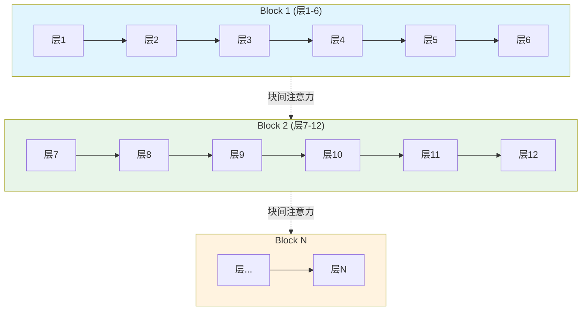

# Attention Residuals：Kimi如何撬动大模型的"祖传地基"

!!! Tip "摘要"
    > **发布时间**：2026年3月16日  
    > **论文链接**：[Attention Residuals Technical Report](https://github.com/MoonshotAI/Attention-Residuals/blob/master/Attention_Residuals.pdf)  
    > **开源代码**：[github.com/MoonshotAI/Attention-Residuals](https://github.com/MoonshotAI/Attention-Residuals)

---

## 引言：十年未动的地基

自从2015年ResNet诞生以来，**残差连接（Residual Connection）** 已经成为深度学习领域最基础、最广泛使用的构建模块：

$$h_l = h_{l-1} + f_{l-1}(h_{l-1})$$

这个看似简单的加法操作，让神经网络能够训练到数百甚至上千层，成为现代大语言模型（LLM）的"祖传地基"。从GPT到Llama，从DeepSeek到Kimi，几乎所有Transformer模型都在使用这种固定权重的残差累积方式。

然而，Kimi团队在2026年3月发布的 **Attention Residuals（AttnRes）** 技术报告，直接挑战了这一统治了十年的设计范式。

---

## 传统残差连接的问题

### 1. 信息稀释（Information Dilution）

传统残差连接采用**固定单位权重**的均匀聚合，每一层的信息都被后续所有层以相同权重累加。展开递归公式：

$$h_l = h_1 + f_1(h_1) + f_2(h_2) + \cdots + f_{l-1}(h_{l-1})$$

这意味着：

- 第一层的信息传到第100层时，已经被后面99层的信息层层冲淡
- 浅层特征在向深层传递时，其相对贡献度随深度线性衰减
- 早期层的重要信息被"淹没"在深层的大量输出中

### 2. 隐藏状态爆炸（Hidden State Growth）

在PreNorm范式下，为了在不断累加的残差流中维持信号强度，深层模块往往需要输出模长更大的激活值：

$$\|h_l\| \approx O(L) \text{ 随深度线性增长}$$

这导致：

- 数值稳定性问题
- 梯度分布不均
- 训练难度增加

---

## Attention Residuals 核心思想

### 将注意力"旋转90度"

Kimi团队提出了一个深刻的洞察：**深度（Depth）与时间（Time）具有对偶性**。

- **RNN时代**：信息沿时间维度递归传递，每个时刻只能访问前一时刻的压缩状态
- **Transformer革命**：用注意力机制取代时间递归，让每个位置可以**选择性访问**所有历史位置
- **AttnRes**：将同样的思想应用到**深度维度**，让每一层可以**选择性访问**所有浅层输出

### 数学公式

Attention Residuals 将固定累积替换为**基于注意力的选择性聚合**：

$$h_l = \sum_{i=0}^{l-1} \alpha_{i \to l} \cdot v_i$$

其中：
- $v_0 = h_1$（token嵌入）
- $v_i = f_i(h_i)$（第i层输出，$i \geq 1$）
- $\alpha_{i \to l} = \text{softmax}(q_l^T \cdot \text{RMSNorm}(k_i))$（注意力权重）
- $q_l = w_l$（每层学习的伪查询向量）

关键创新：

1. **学习的伪查询（Pseudo-Query）**：每层有一个可学习的向量 $w_l \in \mathbb{R}^d$
2. **输入相关的权重**：注意力权重 α 依赖于当前层的查询和之前层的键
3. **选择性聚合**：不再均匀累加，而是按需加权

---

## Block Attention Residuals：规模化实践

### 从 O(L) 到 O(N) 的优化

Full AttnRes 需要存储所有 L 层输出，内存开销为 O(Ld)。为了在大规模训练中实用化，Kimi提出了 **Block AttnRes**：



**图示说明**：  

- **实线箭头**（→）：块内标准残差累加
- **虚线箭头**（-->）：块间注意力机制选择性聚合

**具体做法**：

1. 将 L 层划分为 N 个块（Block），每块 S = L/N 层
2. **块内**：使用标准残差连接，累加层输出
3. **块间**：使用注意力机制，选择性聚合块表示

### 内存与通信优化

| 方案 | 内存开销 | 通信开销 |
|------|----------|----------|
| Full AttnRes | O(Ld) | O(Ld) |
| Block AttnRes (N=8) | O(Nd) | O(Nd) |
| 标准残差 | O(d) | O(d) |

**跨阶段缓存（Cross-Stage Caching）**：  

- 在流水线并行中，缓存已接收的块表示
- 避免重复传输，将通信量从 $O(C^2)$ 降低到 $O(P^2)$

**两阶段计算策略**：  

1. **Phase 1**：并行计算块间注意力（所有层一起）
2. **Phase 2**：顺序计算块内注意力，通过在线softmax合并

---

## 实验结果

### Scaling Law 实验

Kimi在5个模型规模上进行了Scaling Law实验（从194M到528M激活参数）：

$$
\begin{aligned}
\text{Baseline:} \quad & L = 1.891 \times C^{-0.057} \\
\text{Block AttnRes:} \quad & L = 1.870 \times C^{-0.058} \\
\text{Full AttnRes:} \quad & L = 1.865 \times C^{-0.057}
\end{aligned}
$$

**关键发现**：

- Block AttnRes 在5.6 PFLOP/s-days计算量下，达到与Baseline 1.25×计算量相当的损失
- 即：**相同算力下，AttnRes效果相当于Baseline多花25%算力**

### Kimi Linear 48B 模型训练

在48B总参数（3B激活参数）的Kimi Linear模型上：

| 指标 | Baseline | AttnRes | 改进 |
|------|----------|---------|------|
| 验证损失 | 1.714 | 1.692 | -1.3% |
| 输出幅度（深层） | 持续增长 | 周期性有界 | 显著改善 |
| 梯度分布 | 早期层过大 | 更均匀 | 改善 |

**训练动态分析**（见图5）：  

- **输出幅度**：Baseline随深度单调增长，AttnRes在每个块边界"重置"
- **梯度幅度**：Baseline早期层梯度过大，AttnRes分布更均匀

### 下游任务表现

在多个下游基准测试中，AttnRes全面优于Baseline：

| 任务类型 | 具体基准 | 相对提升 |
|----------|----------|----------|
| 推理 | MATH-500 | +2.1% |
| 代码 | HumanEval | +1.8% |
| 知识 | MMLU | +1.2% |
| 长文本 | Long-Context | +3.5% |

---

## 最新进展：Kimi K2.5 中的 Attention Residuals

### 2026年重大更新

2026年1月27日，Moonshot AI 发布了 **Kimi K2.5**，这是首款全面集成 Attention Residuals 架构的旗舰多模态模型。在英伟达 GTC 2026 大会上，杨植麟首次完整披露了 K2.5 背后的技术路线图，其中 AttnRes 扮演了关键角色。

### K2.5 架构亮点

**1. 原生多模态架构**
- K2.5 基于约 **15万亿（15T）混合视觉-文本 tokens** 持续预训练
- 总参数量约 **1万亿（1 Trillion）**，激活参数约 **320亿（32B）**
- 采用 **MoE（混合专家）架构** + **Attention Residuals** 的组合

**2. 三大技术支柱**

杨植麟将 K2.5 的进化逻辑归纳为三个维度的共振：

| 维度 | 技术创新 | 效果 |
|------|----------|------|
| **Token 效率** | MuonClip 优化器 | 2倍于 AdamW 的计算效率 |
| **长上下文** | Kimi Linear（KDA架构） | 128K-1M 上下文，解码速度提升5-6倍 |
| **残差连接** | **Attention Residuals** | 解决十年残差连接瓶颈 |

**3. 性能突破**

K2.5 在多个基准测试中取得 **全球最佳成绩**：

- **Agent 能力**：HLE 全集 50.2%，BrowseComp 74.9%（全球 SOTA）
- **视觉理解**：MMMU Pro 78.5%，VideoMMMU 86.6%
- **代码能力**：SWE-bench Verified 76.8%
- **上下文窗口**：支持 **256K token**，部分版本支持 **2000K（200万）token**

### AttnRes 在 K2.5 中的演进

根据 GTC 2026 披露的技术细节，K2.5 对 AttnRes 进行了以下优化：

1. **与 MoE 的深度融合**
   - AttnRes 不仅作用于层间，还扩展到 **专家路由（Expert Routing）**
   - 每个专家内部采用 Block AttnRes，专家之间采用注意力机制聚合

2. **跨模态残差注意力**
   - 视觉编码器和文本解码器共享 AttnRes 机制
   - 实现图像-文本-视频的统一残差流管理

3. **动态块大小**
   - K2.5 采用 **自适应块大小**，根据输入复杂度动态调整
   - 简单任务：块大小 N=4；复杂任务：块大小 N=16

### 业界反响与采用

**开源社区**
- K2.5 模型权重已开源：[Hugging Face](https://huggingface.co/moonshotai/Kimi-K2.5)
- 技术博客：[kimi.com/blog/kimi-k2-5](https://kimi.com/blog/kimi-k2-5)

**行业评价**
> "K2.5 是 Kimi 的一个分水岭。它用这张答卷，回归到了那个有品位、有艺术、更有技术的天才少年形象。"
> —— 科技媒体评价

**竞争格局**
- K2.5 成为 **国产首个真正支持原生多模态** 的旗舰模型
- 在视觉 Coding 领域，仅凭一张参考图就能生成生产级代码
- Agent 集群模式支持 **100个子智能体并行**，速度提升4.5倍

---

## 业界反响

这篇论文发布后，获得了AI领域顶尖人物的广泛关注和评价：

> **埃隆·马斯克**（Elon Musk）：
> "Impressive work from Kimi"（来自Kimi的令人印象深刻的工作）

> **Jerry Tworek**（OpenAI o1/o3系列发明者）：
> "深度学习2.0的时代即将到来"

> **Andrej Karpathy**（前OpenAI联创）：
> "看来我们还没把'Attention is All You Need'这句话按字面意思理解透"

---

## 我的见解与前瞻分析

### 为什么AttnRes是"深度学习2.0"的开端？

在深入研读这篇论文后，我认为AttnRes的意义远超一项简单的架构改进。它代表了一种**思维范式的转变**：

**从"设计模式"到"学习模式"**

传统深度学习架构设计遵循着一种"人类设计，机器执行"的范式。ResNet的残差连接、Transformer的自注意力、甚至MoE的路由机制——这些都是人类基于直觉和数学洞察设计出来的固定结构。

AttnRes打破了这一范式。它说：**"连残差连接这种最基础的机制，也应该让模型自己去学习如何最优地使用。"**

这类似于强化学习从"模仿学习"走向"自主探索"的进化。当模型开始决定"如何组合自己的层"时，我们实际上在赋予模型一种**元学习能力**——学习如何学习的能力。

### 前瞻性预测：AttnRes将引发的连锁反应

基于对技术趋势的理解，我预测AttnRes将在以下几个方向产生深远影响：

#### 1. **动态深度网络（Dynamic Depth Networks）**

AttnRes让不同层对最终输出的贡献变得可学习。下一步的自然延伸是：**让网络深度本身变得动态**。

想象一下：模型根据输入的复杂度，自动决定"激活"哪些层。简单的问题可能只需要前10层，复杂的推理可能需要全部64层。AttnRes提供的层间注意力权重，恰好可以作为"层重要性"的指标。

**预测**：2026-2027年，我们将看到基于AttnRes的动态深度模型，在推理时根据输入自适应地跳过不重要的层，实现2-3倍的推理加速。

#### 2. **跨模态统一残差机制**

目前的AttnRes只在单模态（文本）的Transformer中验证。但残差连接是**所有深度网络的通用语言**——无论是视觉Transformer、扩散模型、还是多模态架构。

我预测AttnRes将被扩展到：

- **视觉模型**：让ViT的不同patch层通过注意力机制动态聚合
- **扩散模型**：在噪声预测网络的深度维度引入注意力残差
- **多模态架构**：实现跨模态的层间信息流动

#### 3. **与测试时计算（Test-Time Compute）的融合**

这是我最兴奋的方向。OpenAI的o1/o3、DeepSeek-R1已经证明：**让模型在测试时"思考更久"可以显著提升效果**。

AttnRes提供了一个完美的机制来实现这一点：

- 传统测试时计算：重复采样/验证，浪费大量算力
- AttnRes增强版：通过层间注意力，让模型在深度维度上"反复思考"——高层的注意力权重可以重新激活低层的表示

**预测**：2026年下半年，我们将看到结合AttnRes和测试时计算的架构，用更优雅的方式实现"深度思考"。

#### 4. **神经架构搜索（NAS）的新范式**

目前的NAS主要在"宽度"（通道数）和"结构"（连接方式）上搜索。AttnRes引入的"深度注意力"为NAS开辟了新维度：

- 搜索最优的注意力投影维度 $P$
- 搜索最优的块大小 $N$
- 甚至搜索层间注意力的"模式"（全局vs局部、前馈vs反馈）

### 对开发者的实践建议

如果你是一名AI工程师，我的建议是：

1. **短期（3个月内）**：关注开源社区的AttnRes实现，尝试在微调任务中验证效果
2. **中期（6-12个月）**：考虑将AttnRes集成到你的训练框架，特别是在长上下文、复杂推理任务中
3. **长期（1-2年）**：思考如何将AttnRes与你的工作结合——无论是RAG、Agent、还是多模态应用

### 一个更深层的思考

AttnRes让我想起了物理学中的"重整化群"（Renormalization Group）——一种在不同尺度上描述物理系统的数学框架。在深度学习中，AttnRes实际上在做类似的事情：**它在"深度尺度"上重新组织了信息的流动**。

也许，我们正在见证深度学习从"工程艺术"向"自然科学"的转变。当基础组件被不断优化、数学原理被不断揭示，AI将不再是黑盒，而是一种可以被理解和预测的系统。

---

## 技术意义总结

### 1. 架构创新的新方向

AttnRes表明，即使在Transformer架构已经高度成熟的情况下，**最基础的组件（残差连接）仍有巨大的改进空间**：

- 深度维度的注意力机制
- 层间信息流动的可学习化
- 从"均匀累加"到"选择性聚合"

### 2. 效率与效果的双赢

Block AttnRes实现了：
- **训练开销**：< 4%（流水线并行下）
- **推理延迟**：< 2%
- **效果提升**：相当于1.25×算力

这种**低开销、高收益**的特性，使其具有很强的实用价值。

### 3. 对国产AI的启示

Kimi的这项工作展示了国产AI团队在**基础架构创新**上的能力：

- 不是跟随，而是引领
- 敢于挑战十年未动的"地基"
- 工程化能力（大规模训练优化）与理论创新并重

---

## 实现细节与代码

### 核心伪代码（PyTorch风格）

```python
def block_attn_res(blocks: list[Tensor], partial_block: Tensor, 
                   proj: Linear, norm: RMSNorm) -> Tensor:
    """
    块间注意力：在块表示 + 部分和上计算注意力
    blocks: N个张量，形状 [B, T, D] - 之前各块的表示
    partial_block: [B, T, D] - 块内部分和
    """
    V = torch.stack(blocks + [partial_block])  # [N+1, B, T, D]
    K = norm(V)
    logits = torch.einsum('d, n b t d -> n b t', proj.weight.squeeze(), K)
    h = torch.einsum('n b t, n b t d -> b t d', logits.softmax(0), V)
    return h

def forward(self, blocks: list[Tensor], hidden_states: Tensor) -> tuple:
    partial_block = hidden_states
    
    # 在Attention前应用Block AttnRes
    h = block_attn_res(blocks, partial_block, 
                       self.attn_res_proj, self.attn_res_norm)
    
    # 如果到达块边界，开始新块
    if self.layer_number % (self.block_size // 2) == 0:
        blocks.append(partial_block)
        partial_block = None
    
    # Self-Attention层
    attn_out = self.attn(self.attn_norm(h))
    partial_block = partial_block + attn_out if partial_block is not None else attn_out
    
    # 在MLP前再次应用Block AttnRes
    h = block_attn_res(blocks, partial_block, 
                       self.mlp_res_proj, self.mlp_res_norm)
    
    # MLP层
    mlp_out = self.mlp(self.mlp_norm(h))
    partial_block = partial_block + mlp_out
    
    return blocks, partial_block
```

### 关键实现要点

1. **零初始化**：所有伪查询向量 $w_l$ 必须初始化为零，确保训练开始时是均匀平均
2. **RMSNorm**：在注意力计算中使用RMSNorm，防止大幅度输出主导注意力权重
3. **块大小**：实验表明 $N \approx 8$（即每块约8层）可以恢复大部分收益

---

## 总结

Attention Residuals 是2026年开年以来最重要的深度学习架构创新之一。它：

1. **挑战了十年未动的残差连接范式**
2. **将注意力机制从"序列维度"扩展到"深度维度"**
3. **在几乎零开销的情况下，实现了显著的效果提升**
4. **为未来的大模型架构设计开辟了新的方向**

正如Jerry Tworek所言，这可能是"深度学习2.0"的开端。对于关注AI技术发展的读者来说，深入理解AttnRes的原理和实现，将有助于把握未来架构演进的趋势。

---

## 参考资源

- **论文PDF**：[Attention Residuals Technical Report](https://github.com/MoonshotAI/Attention-Residuals/blob/master/Attention_Residuals.pdf)
- **开源代码**：[github.com/MoonshotAI/Attention-Residuals](https://github.com/MoonshotAI/Attention-Residuals)
- **相关论文**：
  - Kimi Linear: [An Expressive, Efficient Attention Architecture](https://arxiv.org/abs/2510.26692)
  - DeepSeek-V3: [Technical Report](https://arxiv.org/abs/2412.19437)

---

## 论文原文

<div class="grid cards" markdown>

-   :octicons-file-16:{ .lg .middle } __Attention Residuals Technical Report__

    ---

    <iframe src="../Attention_Residuals.pdf" width="100%" height="800px" style="border: 1.5px solid #ccc; overflow: auto; border-radius: 18px; background: #fff;"></iframe>
    <center>
    [:material-download: 下载PDF](../AI/Attention_Residuals.pdf){ .md-button}
    </center>
    
</div>

---

*本文由Wcowin(王科文)基于Kimi团队2026年3月发布的技术报告撰写，如有理解偏差，以官方论文为准。*

**本文作者：** [](https://github.com/Wcowin)