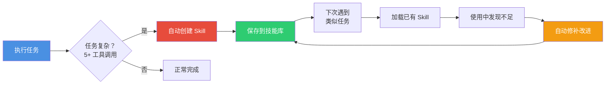
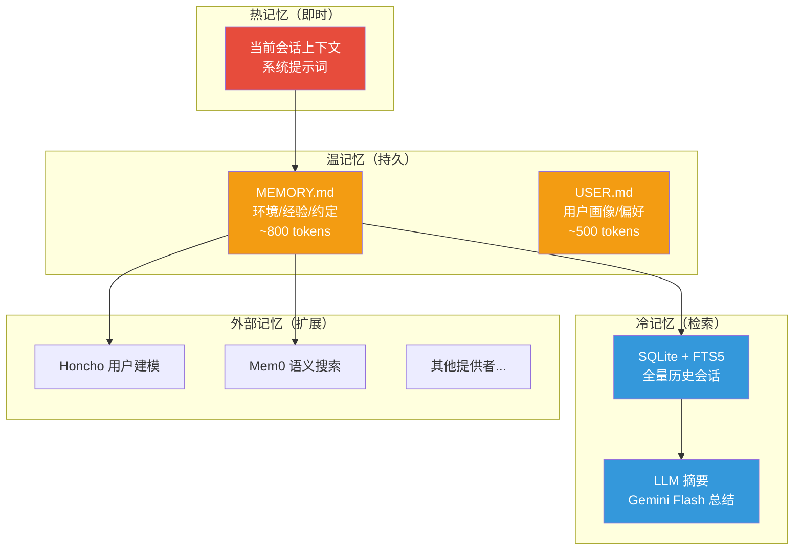
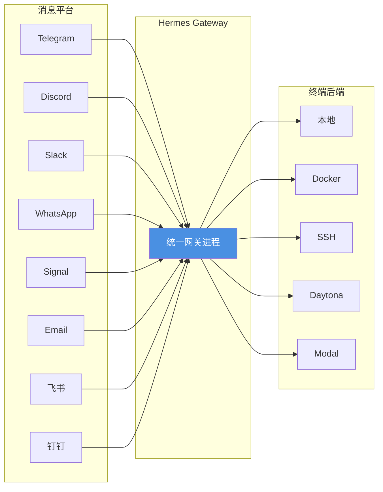
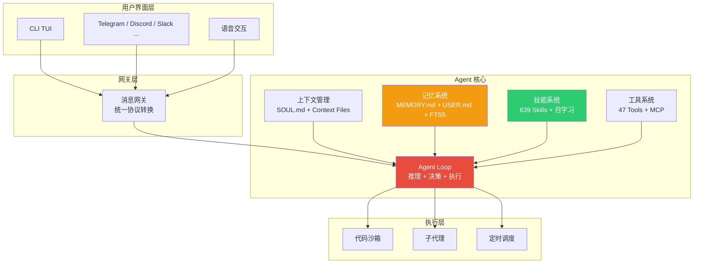

# Hermes Agent：自进化的 AI Agent

## 什么是 Hermes Agent

**[Hermes Agent](https://github.com/NousResearch/hermes-agent)** 是由 **Nous Research** 开发的开源 AI Agent。Nous Research 是业界知名的 AI 实验室，旗下拥有 Hermes、Nomos、Psyche 等系列开源模型。Hermes Agent 的核心差异化在于：**它是目前唯一一个内置自学习闭环的 Agent**——能从经验中创建技能、在使用中自我改进、跨会话持续积累记忆。

> 与 OpenClaw（无持久记忆）、nanobot（轻量但功能有限）不同，Hermes Agent 设计了一个完整的"经验 → 技能 → 改进"闭环，让 Agent 越用越强。

它不是一个绑定在 IDE 里的编程助手，也不是套壳 API 的聊天机器人。它是一个**自主运行的 Agent**，可以部署在 $5 的 VPS 上、GPU 集群上、或 Daytona/Modal 等无服务器基础设施上（空闲时几乎零成本）。你可以通过 Telegram 和它对话，而它在云端 VM 上工作——不需要 SSH。

截至 2026 年 4 月，Hermes Agent 最新版本为 **v0.8.0**，采用 MIT 开源协议。

## 核心特性一览

| 特性 | 说明 |
|------|------|
| **自学习闭环** | 完成复杂任务后自动创建 Skill，使用中自我改进，跨会话积累经验 |
| **持久记忆** | MEMORY.md + USER.md + FTS5 全文搜索 + LLM 摘要 + 8 种外部记忆提供者 |
| **639 个技能** | 74 内置 + 44 官方可选 + 521 社区，兼容 agentskills.io 开放标准 |
| **15+ 平台** | Telegram、Discord、Slack、WhatsApp、Signal、飞书、钉钉、邮件等 |
| **47 个内置工具** | 文件操作、代码执行、Web 搜索、浏览器、图像生成、TTS 等 |
| **随处运行** | 本地、Docker、SSH、Daytona、Singularity、Modal 六种终端后端 |
| **子代理并行** | 生成隔离的子代理并行处理任务流 |
| **MCP 支持** | 连接任何 MCP 服务器扩展工具能力 |
| **定时任务** | 内置 cron 调度器，定时推送结果到任意平台 |
| **语音交互** | CLI、Telegram、Discord、Discord VC 中的实时语音 |
| **多模型兼容** | Nous Portal、OpenRouter（200+ 模型）、OpenAI、Kimi、MiniMax 或自定义端点 |
| **OpenClaw 迁移** | 一键导入设置、记忆、技能和 API Key |

## 自学习闭环：Hermes 的核心差异

Hermes Agent 与其他 Agent 平台最大的区别在于它的**自学习闭环**（Closed Learning Loop）。其他 Agent 每次会话都是"从零开始"，而 Hermes 会越用越强。



### 学习循环的四个阶段

| 阶段 | 说明 | 示例 |
|------|------|------|
| **1. 执行** | 使用 47+ 内置工具完成任务 | 部署 K8s 应用、分析日志、生成报告 |
| **2. 评估** | 通过显式反馈和隐式接受信号学习 | 用户纠正："函数名用 snake_case" |
| **3. 创建** | 复杂任务（5+ 工具调用）后自动创建 Skill | 保存"部署 K8s"完整流程为可复用技能 |
| **4. 改进** | 使用 Skill 时发现问题，自动修补 | 修复 Skill 中的过时命令或错误参数 |

### Skill 自动创建的触发条件

Agent 在以下情况会自动创建 Skill：

- 完成了复杂任务（5 次以上工具调用）并成功
- 在执行过程中遇到错误或死胡同，最终找到了可行路径
- 用户纠正了它的做法
- 发现了非显而易见的工作流程

### Skill 自我改进机制

```
场景：Agent 之前创建了一个"部署到 K8s"的 Skill

1. 几周后再次使用该 Skill
2. 发现 kubectl apply 命令报错（API 版本已更新）
3. Agent 自动用 patch 操作修复 Skill 中的命令
4. 下次使用时不再报错

关键：这一切不需要用户干预，Agent 自主完成
```

## 记忆系统：分层持久化

Hermes 的记忆系统分为三层，解决了传统 Agent "会话结束就失忆"的痛点：



### MEMORY.md 与 USER.md

| 文件 | 用途 | 容量限制 | 典型条目数 |
|------|------|----------|------------|
| **MEMORY.md** | Agent 的个人笔记——环境信息、约定、经验教训 | 2,200 字符（~800 tokens） | 8-15 条 |
| **USER.md** | 用户画像——偏好、沟通风格、期望 | 1,375 字符（~500 tokens） | 5-10 条 |

两个文件存储在 `~/.hermes/memories/`，在每次会话启动时注入系统提示词。Agent 通过 `memory` 工具自主管理记忆（add / replace / remove），不需要用户干预。

**记忆注入示例**：

```
══════════════════════════════════════════════

MEMORY (your personal notes) [67% — 1,474/2,200 chars]

══════════════════════════════════════════════

User's project is a Rust web service at ~/code/myapi using Axum + SQLx

§

This machine runs Ubuntu 22.04, has Docker and Podman installed

§

User prefers concise responses, dislikes verbose explanations
```

### 会话搜索（Session Search）

除了持久记忆，Hermes 还能搜索所有历史会话：

- 所有 CLI 和消息平台的会话存储在 SQLite（`~/.hermes/state.db`）中，支持 FTS5 全文搜索
- 搜索结果通过 Gemini Flash 进行 LLM 摘要
- Agent 可以找到几周前讨论的内容，即使不在活跃记忆中

| 维度 | 持久记忆 | 会话搜索 |
|------|----------|----------|
| 容量 | ~1,300 tokens | 无限制（所有会话） |
| 速度 | 即时（在系统提示词中） | 需要搜索 + LLM 摘要 |
| 适用场景 | 关键事实始终在手 | "我们上周讨论过 X 吗？" |

### 外部记忆提供者

Hermes 内置 8 种外部记忆提供者插件，与内置记忆**并行运行**（不替代）：

| 提供者 | 能力 |
|--------|------|
| **Honcho** | 辩证式用户建模，深度理解用户意图 |
| **Mem0** | 语义搜索，自动事实提取 |
| **OpenViking** | 知识图谱 |
| **Hindsight** | 回顾性分析 |
| **Holographic** | 全息记忆 |
| **RetainDB** | 持久化存储 |
| **ByteRover** | 字节级检索 |
| **Supermemory** | 增强记忆 |

```bash
hermes memory setup   # 选择并配置提供者
hermes memory status  # 查看当前状态
```

## 技能系统：639 个技能的生态

Hermes 的技能系统兼容 [agentskills.io](https://agentskills.io/) 开放标准（我们在 [Skill 使用介绍](/develop/AI/skill/) 中详细介绍过该标准），并在此基础上增加了自学习和社区生态。

### 技能来源

| 来源 | 数量 | 说明 |
|------|------|------|
| **内置技能** | 74 | 随安装附带，开箱即用 |
| **官方可选技能** | 44 | 官方维护，按需安装 |
| **社区技能** | 521 | 来自 Skills Hub、skills.sh、GitHub 等 |

### 技能分类（精选）

| 分类 | 代表技能 |
|------|----------|
| **MLOps** | axolotl（微调）、vLLM（推理服务）、Unsloth（快速训练）、PEFT、GGUF 量化 |
| **GitHub** | PR 工作流、代码审查、Issue 管理、仓库管理、认证 |
| **生产力** | Google Workspace、Notion、Linear、PDF 编辑、OCR |
| **创意** | ASCII 艺术、Excalidraw、音乐生成（HeartMuLa）、PPT 制作 |
| **研究** | arXiv 论文搜索、博客监控、预测市场、论文写作 |
| **Apple** | Apple Notes、Reminders、FindMy、iMessage |
| **AI Agent** | Claude Code、Codex、OpenCode 委托 |
| **社交** | X/Twitter 交互 |

### 渐进式加载

技能使用三级渐进式加载，最小化 Token 消耗：

```
Level 0: skills_list()  → [{name, description, category}]  (~3k tokens)
Level 1: skill_view(name) → 完整内容 + 元数据
Level 2: skill_view(name, path) → 特定参考文件
```

Agent 只在真正需要时才加载完整技能内容。

### Skills Hub

Hermes 内置技能市场，支持多来源安装：

```bash
hermes skills browse                    # 浏览所有技能
hermes skills search kubernetes         # 搜索技能
hermes skills inspect openai/skills/k8s # 安装前预览
hermes skills install openai/skills/k8s # 安装（含安全扫描）
hermes skills check                    # 检查更新
hermes skills audit                     # 安全审计
```

**支持的技能来源**：

| 来源 | 说明 |
|------|------|
| `official` | Hermes 官方可选技能 |
| `skills-sh` | Vercel 的 skills.sh 公共目录 |
| `well-known` | 网站 `/.well-known/skills/` 发现 |
| `github` | 直接从 GitHub 仓库安装 |
| `clawhub` | 第三方技能市场 |
| `lobehub` | LobeHub 公共目录 |
| `claude-marketplace` | Claude 兼容的市场 |

所有 Hub 安装的技能都经过**安全扫描**，检查数据外泄、Prompt 注入、破坏性命令等威胁。

## 工具系统：47 个内置工具

Hermes 内置 47 个工具，涵盖文件操作、代码执行、Web 交互等：

| 工具类别 | 代表工具 |
|----------|----------|
| **文件系统** | 读取、写入、编辑、搜索文件 |
| **代码执行** | Python/Shell 脚本执行（沙箱隔离） |
| **Web** | 搜索、网页提取、浏览器控制、视觉 |
| **终端** | 命令执行（需审批） |
| **记忆** | 记忆管理、会话搜索 |
| **技能** | 技能创建、查看、修补、删除 |
| **代理** | 生成子代理、并行任务 |
| **媒体** | 图像生成、TTS、音频处理 |

### MCP 集成

Hermes 支持连接任何 MCP 服务器，扩展工具能力：

```yaml
# ~/.hermes/config.yaml
mcp:
  servers:
    filesystem:
      command: npx
      args: ["-y", "@modelcontextprotocol/server-filesystem", "/data/docs"]
    database:
      command: npx
      args: ["-y", "@modelcontextprotocol/server-postgres", "postgresql://..."]
```

> **相关文章**：关于 MCP 协议的详细介绍，请参阅我们的 [MCP 文章](/develop/AI/mcp/)。

## 多平台消息网关

Hermes 的消息网关支持 15+ 平台，从一个进程统一管理：



### 平台特性

| 特性 | 说明 |
|------|------|
| **跨平台会话连续性** | 在 Telegram 开始的对话，可以在 Discord 继续 |
| **语音消息** | Telegram/Discord 语音自动转文字 |
| **斜杠命令** | 所有平台共享相同的命令体系 |
| **DM 配对** | 安全的私聊配对机制 |

## 快速上手

### 安装

```bash
# 一键安装（Linux、macOS、WSL2）
curl -fsSL https://raw.githubusercontent.com/NousResearch/hermes-agent/main/scripts/install.sh | bash

# 重载 Shell
source ~/.bashrc  # 或 source ~/.zshrc

# 启动
hermes
```

> **Windows 用户**：需安装 WSL2 后在 WSL 中运行。

### 初始配置

```bash
hermes setup      # 交互式配置向导（模型、API Key、平台等）
hermes model      # 选择 LLM 提供商和模型
hermes tools      # 配置启用的工具
hermes gateway    # 启动消息网关
```

### 常用命令

| 命令 | 说明 |
|------|------|
| `hermes` | 启动交互式 CLI |
| `hermes model` | 切换模型 |
| `hermes tools` | 管理工具 |
| `hermes gateway setup` | 配置消息网关 |
| `hermes gateway start` | 启动网关 |
| `/new` / `/reset` | 开始新对话 |
| `/skills` | 浏览技能 |
| `/compress` | 压缩上下文 |
| `/model provider:model` | 动态切换模型 |
| `hermes claw migrate` | 从 OpenClaw 迁移 |
| `hermes doctor` | 诊断问题 |
| `hermes update` | 更新到最新版 |

### 从 OpenClaw 迁移

如果你之前使用 OpenClaw，Hermes 支持一键迁移：

```bash
hermes claw migrate          # 交互式迁移
hermes claw migrate --dry-run # 预览迁移内容
```

**迁移内容**：

| 项目 | 说明 |
|------|------|
| SOUL.md | 人格文件 |
| 记忆 | MEMORY.md 和 USER.md |
| 技能 | 用户创建的技能 |
| 命令白名单 | 审批模式 |
| 消息平台配置 | 平台设置、允许用户 |
| API Key | Telegram、OpenRouter、OpenAI、Anthropic 等 |

## 安全机制

Hermes 在安全方面做了多层防护：

| 安全维度 | 机制 |
|----------|------|
| **命令审批** | 危险命令需用户确认后才执行 |
| **DM 配对** | 消息平台私聊需配对认证 |
| **容器隔离** | 代码执行在沙箱中运行 |
| **记忆安全扫描** | 记忆条目在注入系统提示词前进行注入/外泄模式扫描 |
| **技能安全审计** | Hub 安装的技能经过安全扫描（数据外泄、Prompt 注入、破坏性命令） |
| **环境变量隔离** | 敏感配置通过 `.env` 管理，不在聊天中暴露 |
| **MCP 安全** | 支持 OAuth 认证和工具白名单 |

```yaml
# 安全配置示例
security:
  command_approval: true        # 启用命令审批
  dm_pairing: true              # 启用 DM 配对
  container_isolation: true     # 启用容器隔离
```

## 与其他 Agent 平台对比

| 维度 | Hermes Agent | OpenClaw | nanobot |
|------|-------------|----------|---------|
| **开发者** | Nous Research | 社区（前 Peter Steinberger） | 香港大学 HKUDS |
| **代码量** | 中大型 | ~43 万行 | ~4,000 行 |
| **自学习** | ✅ 自动创建/改进 Skill | ❌ | ❌ |
| **持久记忆** | ✅ 三层 + 8 种外部提供者 | ✅ 文件即真相 + 向量检索 | ✅ MEMORY.md + 每日笔记 |
| **技能生态** | 639 个（Hub + 社区） | ClawHub 社区技能 | 无独立技能系统 |
| **MCP 支持** | ✅ | ✅ | ✅ |
| **平台支持** | 15+ | 13+ | 9 |
| **终端后端** | 6 种（本地/Docker/SSH/Daytona/Singularity/Modal） | 本地/Docker | 本地 |
| **子代理** | ✅ 隔离子代理并行 | ✅ sessions_* 工具 | ❌ |
| **定时任务** | ✅ 内置 cron | ✅ 内置 cron | ✅ 内置 cron |
| **语音交互** | ✅ CLI + 多平台 | ❌ | ❌ |
| **模型兼容** | Nous/OpenRouter/OpenAI/Kimi/MiniMax/自定义 | 多家 | 11 家 |
| **OpenClaw 迁移** | ✅ 一键迁移 | — | — |
| **适合场景** | 全功能、自进化、多平台部署 | 本地优先、全系统权限 | 学习研究、轻量部署 |

### 如何选择

- **选 Hermes**：需要自学习能力、多平台部署、丰富的技能生态、或从 OpenClaw 迁移
- **选 OpenClaw**：需要完整的系统权限控制、本地优先的深度集成
- **选 nanobot**：学习 Agent 架构、极简部署、研究实验

## 架构概览



### 关键设计决策

| 决策 | 说明 |
|------|------|
| **冻结快照模式** | 记忆在会话启动时一次性注入系统提示词，会话中不更新（保护前缀缓存性能） |
| **有界记忆** | 严格的字符限制（MEMORY 2,200 / USER 1,375），防止系统提示词膨胀 |
| **安全扫描** | 记忆条目和 Hub 技能都经过安全扫描后才注入 |
| **渐进式加载** | 技能三级加载（列表 → 内容 → 参考文件），最小化 Token 消耗 |
| **外部目录只读** | 外部技能目录只扫描不写入，本地版本优先 |

## 适用场景

### 推荐使用

- **个人 AI 助手**：部署在 VPS 上，通过 Telegram/Discord 随时交互
- **开发自动化**：代码审查、PR 管理、Issue 处理、CI/CD
- **研究助手**：arXiv 论文搜索、实验管理、论文写作
- **运维自动化**：K8s 管理、日志分析、定时巡检
- **内容创作**：博客监控、社交媒体管理、多媒体生成
- **MLOps**：模型微调、评估、部署全流程

### 当前局限

- **不支持原生 Windows**：需通过 WSL2 运行
- **资源消耗**：完整功能需要一定的内存和存储
- **学习曲线**：功能丰富意味着配置选项多
- **自学习的边界**：自动创建的 Skill 质量取决于任务复杂度和模型能力
- **外部记忆提供者**：部分提供者需要额外配置和 API Key

## 总结

| 维度 | 要点 |
|------|------|
| **是什么** | Nous Research 开发的自进化开源 AI Agent |
| **核心差异** | 唯一内置自学习闭环——自动创建/改进 Skill，越用越强 |
| **记忆系统** | 三层架构（热/温/冷）+ 8 种外部提供者，跨会话持续积累 |
| **技能生态** | 639 个技能，兼容 agentskills.io，内置 Skills Hub 市场 |
| **部署灵活** | 6 种终端后端，15+ 消息平台，$5 VPS 即可运行 |
| **安全防护** | 命令审批、容器隔离、记忆安全扫描、技能审计 |
| **迁移友好** | 一键从 OpenClaw 迁移全部数据 |

> **一句话理解 Hermes**：如果说 OpenClaw 是"给你一把瑞士军刀"，nanobot 是"一把精致的小刀"，那 Hermes 就是"一个会自己学新技能的工匠"——它不仅工具多，而且越用越熟练。

---

**相关文章**：

- [Skill 使用介绍](/develop/AI/skill/) — Agent Skills 开放标准，Hermes 技能系统的基础
- [What is MCP](/develop/AI/mcp/) — MCP 协议详解，Hermes 的工具扩展机制
- [OpenClaw](/develop/AI/openclaw/) — Hermes 的主要对比对象，支持一键迁移
- [nanobot](/develop/AI/nanobot/) — 超轻量 Agent，适合对比学习
- [Agentic AI](/develop/AI/agentic-ai/) — Agentic AI 五层架构，Hermes 的设计理论基础
- [AI 安全与对抗](/develop/AI/ai-security/) — Agent 安全防护，Hermes 的安全机制参考


**本文作者：** [<span class="author-avatar-wrapper"><span class="author-name-popover">王科文</span></span>](https://github.com/Wcowin)