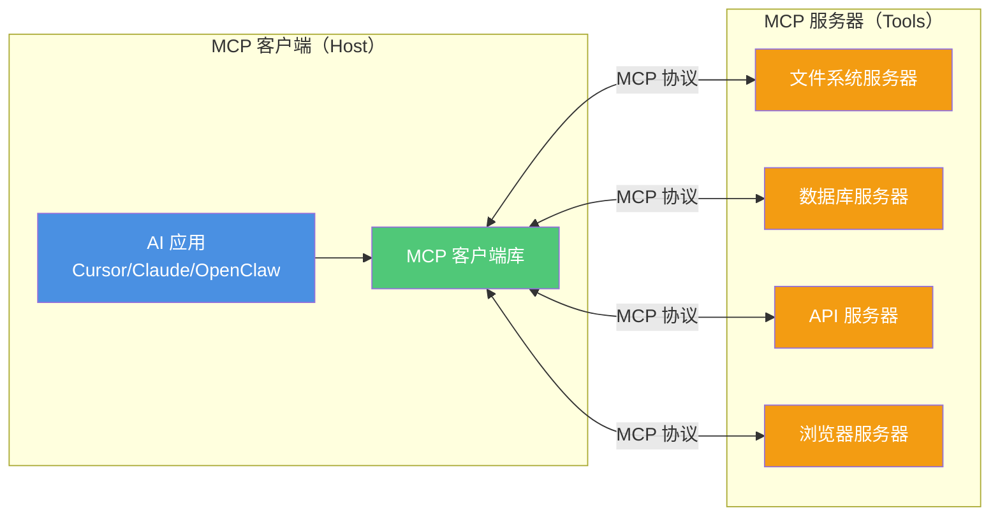
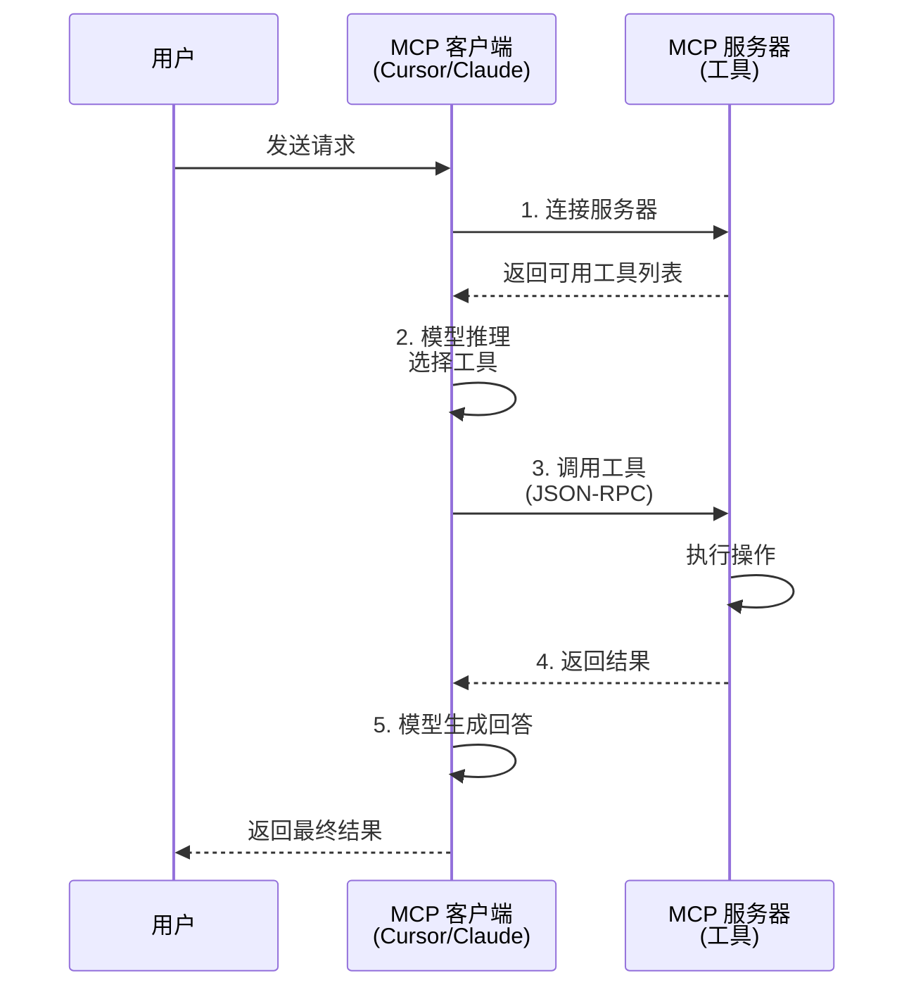

# What is MCP

## 模型上下文协议（MCP）简介

模型上下文协议（Model Context Protocol，简称 MCP）是一种标准化的开放协议，旨在实现 AI 应用与外部工具、资源、提示模板之间的无缝交互。通过定义统一的数据交换格式和通信机制，MCP 能够打破数据孤岛，促进不同系统之间的互操作性，从而提升 AI 应用的灵活性和扩展性。

> 在MCP出现之前，AI应用与外部工具的交互依赖于手动API连接、插件接口和Agent框架等方法。然而，这些传统方法存在诸多问题：
> **复杂性高**：开发者需要针对每个外部工具单独编写适配代码，增加了开发和维护的难度。
> **可扩展性差**：当外部工具或资源发生变化时，原有的集成方式可能失效，导致系统难以适应动态变化的需求。
> **缺乏标准化**：不同工具和框架之间的接口设计差异较大，缺乏统一的标准，使得跨平台协作变得困难。

MCP通过引入一种通用的协议层，解决了上述问题。它不仅简化了AI模型与外部工具的集成过程，还为未来的扩展提供了良好的基础。


## MCP 核心架构

### 客户端-服务器模型



**核心概念**：

- **MCP Host（客户端）**：AI 应用（如 Cursor、Claude Desktop、ChatGPT 等），负责调用 MCP 服务器
- **MCP Server（服务器）**：提供工具和数据源的独立进程，通过 MCP 协议暴露能力
- **MCP 协议**：基于 JSON-RPC 2.0 的通信协议，定义了请求/响应格式

### MCP 的核心特性


| 特性 | 说明 | 优势 |
|------|------|------|
| **标准化接口** | 统一的协议规范，无需额外适配 | 一次开发，到处运行 |
| **动态发现** | 客户端自动发现服务器提供的工具 | 无需硬编码工具列表 |
| **双向通信** | 支持服务器主动推送（如进度更新） | 实时反馈，更好的用户体验 |
| **多语言支持** | TypeScript、Python、Go 等 SDK | 适用于不同技术栈 |
| **安全隔离** | 服务器独立进程，权限可控 | 降低安全风险 |
| **可组合性** | 多个服务器可同时运行 | 灵活组合能力 |

## MCP 工作原理

### 通信流程



### MCP 协议要素

MCP 基于 JSON-RPC 2.0。对服务器侧来说，最常见的三类核心能力是：

| 能力类型 | 说明 | 示例 |
|---------|------|------|
| **Resources** | 数据源（只读） | 文件内容、数据库记录、API 响应 |
| **Tools** | 可执行操作 | 文件写入、命令执行、API 调用 |
| **Prompts** | 预定义提示模板 | 代码审查模板、文档生成模板 |

除此之外，最新版架构文档还强调了客户端能力，例如 **Sampling**（向宿主模型请求补全）、**Elicitation**（向用户追问/确认）和 **Logging**。

## 快速上手：配置 MCP 服务器

### 在 Cursor 中配置

Cursor 通过 `.cursor/mcp.json` 或 `~/.cursor/mcp.json` 配置 MCP 服务器：

```json
{
  "mcpServers": {
    "filesystem": {
      "command": "npx",
      "args": ["-y", "@modelcontextprotocol/server-filesystem", "/path/to/allowed/directory"]
    },
    "github": {
      "command": "npx",
      "args": ["-y", "@modelcontextprotocol/server-github"],
      "env": {
        "GITHUB_TOKEN": "your_token_here"
      }
    }
  }
}
```

### 在 Claude Desktop 中配置

编辑 `~/Library/Application Support/Claude/claude_desktop_config.json`（macOS）：

```json
{
  "mcpServers": {
    "sqlite": {
      "command": "uvx",
      "args": ["mcp-server-sqlite", "--db-path", "/path/to/database.db"]
    }
  }
}
```

### 在 OpenClaw 中配置

编辑 `~/.openclaw/openclaw.json`：

```json
{
  "tools": {
    "mcp": {
      "enabled": true,
      "servers": {
        "filesystem": {
          "command": "npx",
          "args": ["-y", "@modelcontextprotocol/server-filesystem", "~/Documents"]
        }
      }
    }
  }
}
```

## 常用 MCP 服务器

### 官方服务器

| 服务器 | 功能 | 安装命令 |
|--------|------|---------|
| **filesystem** | 文件系统访问 | `npx -y @modelcontextprotocol/server-filesystem` |
| **github** | GitHub 操作 | `npx -y @modelcontextprotocol/server-github` |
| **gitlab** | GitLab 操作 | `npx -y @modelcontextprotocol/server-gitlab` |
| **postgres** | PostgreSQL 数据库 | `npx -y @modelcontextprotocol/server-postgres` |
| **sqlite** | SQLite 数据库 | `uvx mcp-server-sqlite` |
| **puppeteer** | 浏览器自动化 | `npx -y @modelcontextprotocol/server-puppeteer` |
| **brave-search** | Brave 搜索 | `npx -y @modelcontextprotocol/server-brave-search` |
| **google-maps** | Google 地图 | `npx -y @modelcontextprotocol/server-google-maps` |

### 社区服务器

- **AWS 文档**：`uvx awslabs.aws-documentation-mcp-server@latest`
- **Slack**：`npx -y @modelcontextprotocol/server-slack`
- **Notion**：社区开发的 Notion 集成
- **Obsidian**：笔记管理集成

完整列表见：[MCP Servers Directory](https://github.com/modelcontextprotocol/servers)

## 开发自定义 MCP 服务器

### 最小示例（TypeScript）

```typescript
import { Server } from "@modelcontextprotocol/sdk/server/index.js";
import { StdioServerTransport } from "@modelcontextprotocol/sdk/server/stdio.js";

const server = new Server(
  {
    name: "my-custom-server",
    version: "1.0.0",
  },
  {
    capabilities: {
      tools: {},
    },
  }
);

// 注册工具
server.setRequestHandler("tools/list", async () => {
  return {
    tools: [
      {
        name: "get_weather",
        description: "获取指定城市的天气",
        inputSchema: {
          type: "object",
          properties: {
            city: {
              type: "string",
              description: "城市名称",
            },
          },
          required: ["city"],
        },
      },
    ],
  };
});

// 处理工具调用
server.setRequestHandler("tools/call", async (request) => {
  if (request.params.name === "get_weather") {
    const city = request.params.arguments.city;
    // 实际实现中调用天气 API
    return {
      content: [
        {
          type: "text",
          text: `${city}的天气：晴，25°C`,
        },
      ],
    };
  }
  throw new Error("Unknown tool");
});

// 启动服务器
const transport = new StdioServerTransport();
await server.connect(transport);
```

### Python 示例

```python
from mcp.server import Server
from mcp.server.stdio import stdio_server

app = Server("my-python-server")

@app.list_tools()
async def list_tools():
    return [
        {
            "name": "calculate",
            "description": "执行数学计算",
            "inputSchema": {
                "type": "object",
                "properties": {
                    "expression": {"type": "string"}
                },
                "required": ["expression"]
            }
        }
    ]

@app.call_tool()
async def call_tool(name: str, arguments: dict):
    if name == "calculate":
        # 注意：生产环境中请勿使用 eval()，应使用安全的表达式解析库
        # 如 simpleeval、asteval 等，避免代码注入风险
        import ast
        try:
            result = ast.literal_eval(arguments["expression"])
        except (ValueError, SyntaxError):
            # literal_eval 不支持运算符，此处仅作示例
            # 实际部署建议使用 simpleeval 等库
            result = "不支持的运算表达式"
        return {"result": result}

if __name__ == "__main__":
    stdio_server(app)
```

## MCP 的应用场景

### 1. 开发工具集成

- **代码仓库**：GitHub、GitLab、Bitbucket 操作
- **CI/CD**：触发构建、查看日志、部署管理
- **数据库**：查询、更新、Schema 管理

### 2. 企业系统集成

- **CRM**：Salesforce、HubSpot 数据访问
- **项目管理**：Jira、Linear、Asana 任务操作
- **通信**：Slack、Teams、飞书消息发送

### 3. 数据分析

- **数据库**：SQL 查询、数据导出
- **文件系统**：CSV、Excel、JSON 文件读写
- **API**：第三方数据源接入

### 4. 内容创作

- **笔记系统**：Obsidian、Notion 集成
- **文档生成**：Markdown、PDF 生成
- **媒体处理**：图像、音频、视频操作

### 5. 智能助手

- **多模态 AI**：整合文本、图像、音频数据源
- **个人助手**：日历、邮件、待办事项管理
- **企业助手**：内部知识库、工作流自动化

## MCP vs 其他方案

| 对比项 | MCP | Function Calling | Plugin API |
|--------|-----|------------------|------------|
| **标准化** | 开放标准 | 各家实现不同 | 平台专属 |
| **跨平台** | 一次开发，到处运行 | 需要适配 | 不可移植 |
| **安全性** | 独立进程，权限隔离 | 依赖平台 | 依赖平台 |
| **动态发现** | 支持 | 部分支持 | 不支持 |
| **双向通信** | 支持 | 不支持 | 部分支持 |
| **生态** | 快速增长 | 成熟 | 平台限制 |

## MCP 生态现状（2026 年）

### 支持 MCP 的平台

- **IDE / 开发工具**：VS Code、Cursor、Zed、Continue 等
- **AI 应用**：Claude、ChatGPT，以及其他支持 MCP 的客户端
- **框架 / 生态工具**：LangChain、LlamaIndex、Haystack 等正在持续接入或提供集成能力
- 具体支持名单变化很快，建议以官方目录与各产品文档为准

### 社区发展

- MCP 已形成较强生态，但星标、服务器数量、平台数量增长很快，文章中不建议长期写死具体数字

## 最佳实践

### 1. 安全性

- 使用环境变量存储敏感信息（API Key、Token）
- 限制文件系统访问路径
- 为不同服务器设置不同权限
- 定期审计服务器日志

### 2. 性能优化

- 缓存频繁访问的数据
- 使用连接池管理数据库连接
- 异步处理长时间操作
- 限制单次返回数据量

### 3. 错误处理

- 提供清晰的错误消息
- 实现重试机制
- 记录详细日志
- 优雅降级

### 4. 开发建议

- 遵循 MCP 规范
- 提供完整的工具描述和 Schema
- 编写单元测试
- 提供使用文档和示例

## 故障排查

### 常见问题

**Q: 服务器无法启动**

A: 检查：
- 命令路径是否正确
- 依赖是否已安装（`npx` 需要 Node.js，`uvx` 需要 uv）
- 环境变量是否配置
- 日志中的错误信息

**Q: 工具未被发现**

A: 确认：
- 服务器已在配置文件中注册
- 重启客户端应用
- 检查服务器的 `tools/list` 响应

**Q: 权限错误**

A: 检查：
- 文件系统路径权限
- API Token 是否有效
- 服务器配置的权限范围

## 与本站其他文章的关系

- **[AI Agent 入门](agent.md)**：MCP 是 Agent 工具层的标准协议
- **[Skill 使用介绍](skill.md)**：Skill 定义流程，MCP 提供工具
- **[OpenClaw 指南](openclaw.md)**：OpenClaw 通过 MCP 接入工具
- **[多智能体协作](multi-agent.md)**：多 Agent 可共享 MCP 工具

## 总结

- **MCP** 是 AI 应用与外部工具之间的标准化开放协议，当前已被多类客户端和开发工具采用
- **核心优势**：标准化、跨平台、安全隔离、动态发现、双向通信
- **应用场景**：开发工具、企业系统、数据分析、内容创作、智能助手
- **生态现状**：2026 年生态扩张很快，具体平台数和服务器数建议以官方目录实时查询
- **开发建议**：遵循规范、注重安全、优化性能、完善文档

MCP 正在成为 AI Agent 生态的核心基础设施，统一了工具接入方式，降低了开发成本，促进了生态繁荣。

**延伸阅读**：[MCP 官方文档](https://modelcontextprotocol.io/)、[MCP SDK](https://github.com/modelcontextprotocol/sdk)、[MCP 服务器目录](https://github.com/modelcontextprotocol/servers)。

---

**本文作者：** [<span class="author-avatar-wrapper"><span class="author-name-popover">王科文</span></span>](https://github.com/Wcowin)
