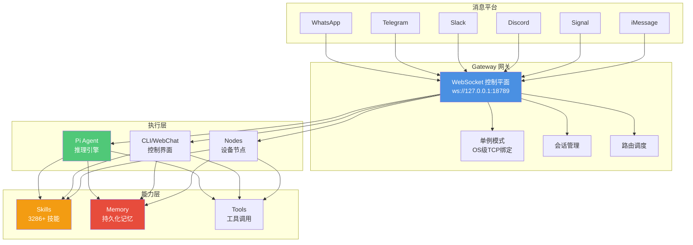
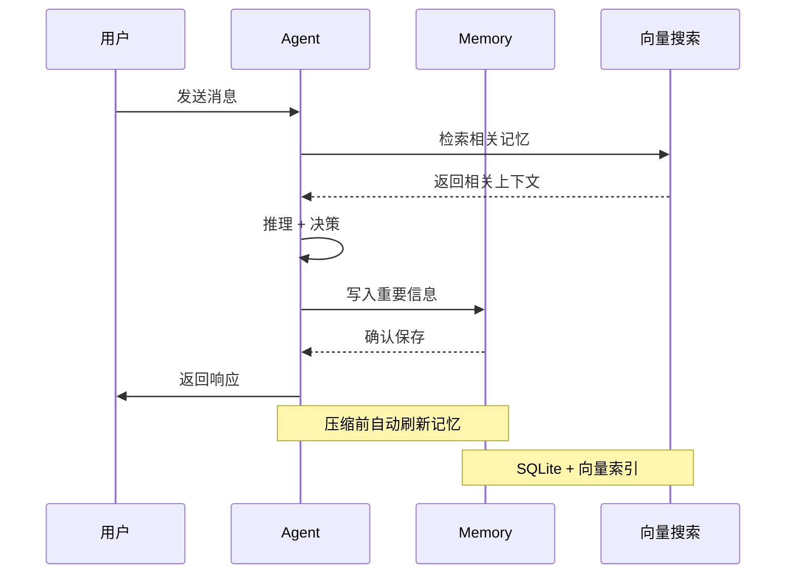
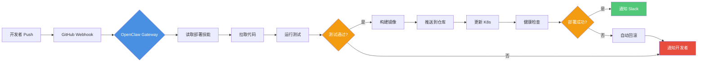
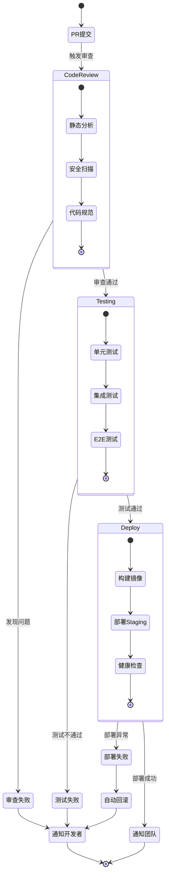
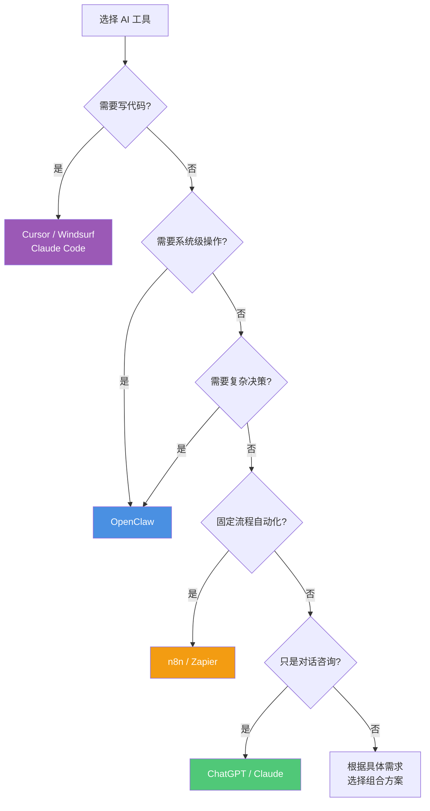
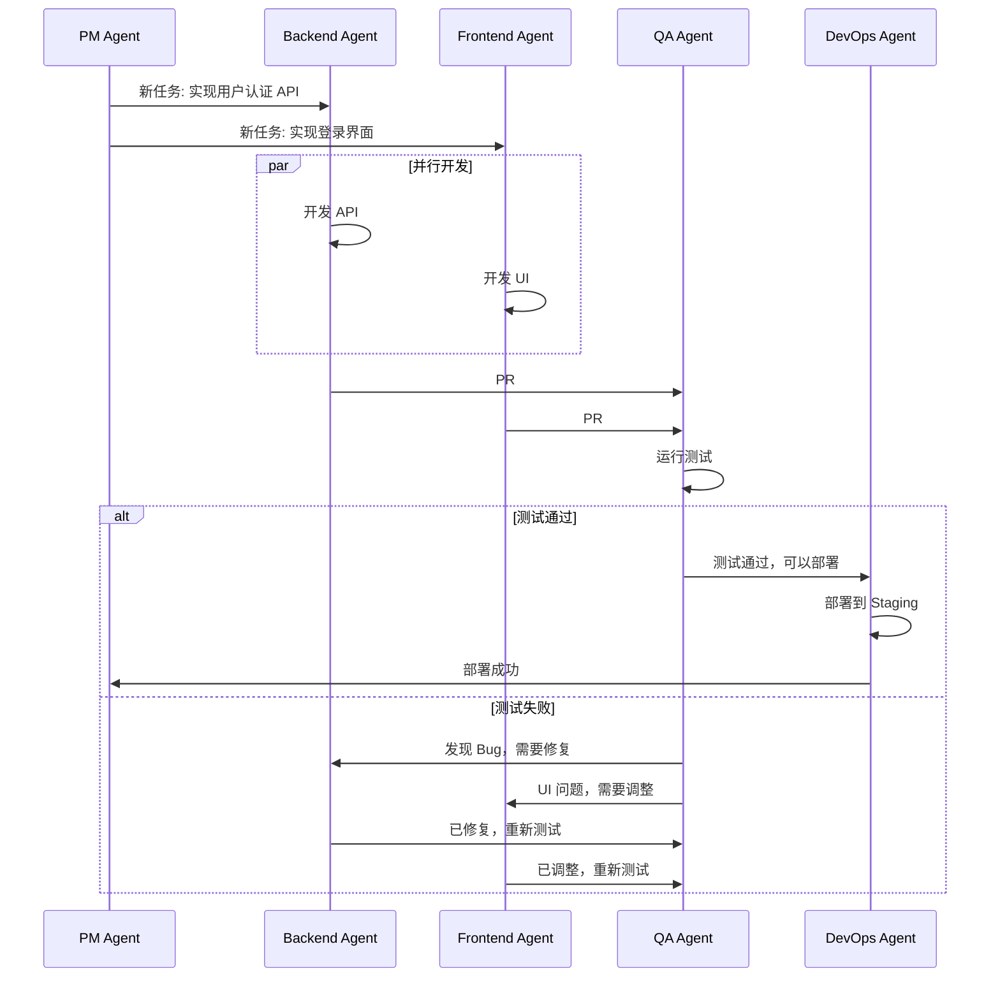
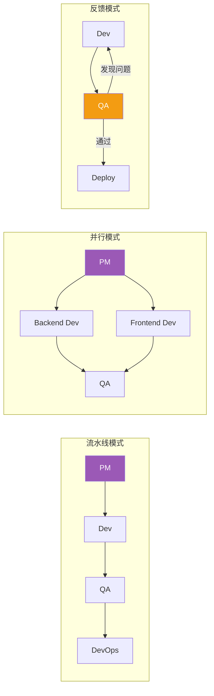
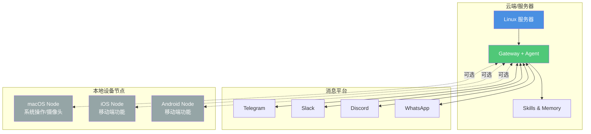
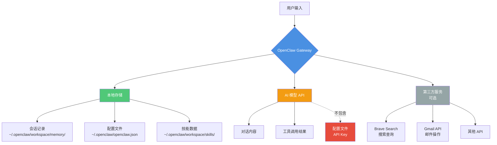

# OpenClaw：本地运行的开源 AI 助手完全指南

> OpenClaw 是 2026 年最火的开源 AI 项目之一，GitHub 上 191,000+ 星标，两个月内增长速度创历史记录。它不是云端对话工具，而是运行在你自己电脑上、能真正执行任务的 AI 助手——管理文件、控制浏览器、发送消息、自动化工作流，全程数据不出本机。本文从概念、对比、安装到实战，带你完整了解这个「能干活的 AI」。

**适用读者**：对 AI Agent 感兴趣，希望拥有一个隐私优先、可完全控制的本地 AI 助手，或想了解 Agentic AI 在个人场景下如何落地的开发者与技术爱好者。

---

## 什么是 OpenClaw

**[OpenClaw](https://github.com/openclaw/openclaw)** 是一个开源的个人 AI 助手平台，由 Peter Steinberger（PSPDFKit 创始人）于 2025 年 11 月创建。它的核心特点是：

- **本地运行**：完全在你的 Mac、Windows 或 Linux 上运行，数据不经过第三方服务器
- **真正执行任务**：不只是聊天，能操作浏览器、执行命令、管理文件、发送消息
- **多平台集成**：通过 WhatsApp、Telegram、Discord、Slack、Signal、iMessage 等聊天工具与你交互
- **模型自由**：支持 Claude、GPT、Gemini，也可通过 Ollama 接入本地模型
- **技能扩展**：ClawHub 技能市场有 3,000+ 社区贡献的技能插件

### 名字的演变

OpenClaw 有个有趣的改名史：

1.**Clawdbot**（2025.11）：最初名字，来自对 "Claude" 的谐音玩笑  
2.**Moltbot**（2025.12）：因 Anthropic 商标异议改名，"Molting"（蜕壳）寓意成长  
3.**OpenClaw**（2026.01.30）：最终定名，吉祥物是太空龙虾 Molty 🦞

---

## OpenClaw vs ChatGPT vs Claude：核心区别

很多人会问：我已经有 ChatGPT/Claude 了，为什么还需要 OpenClaw？

| 维度 | OpenClaw | ChatGPT | Claude |
|------|----------|---------|--------|
| **运行位置** | 本地（你的电脑） | OpenAI 云端 | Anthropic 云端 |
| **隐私** | 数据不出本机 | 所有数据经过 OpenAI | 所有数据经过 Anthropic |
| **系统权限** | 完整系统访问（文件、命令、浏览器） | 无系统权限 | 无系统权限 |
| **自动化** | 可主动执行定时任务、监控邮件 | 被动响应 | 被动响应 |
| **聊天平台** | WhatsApp/Telegram/Discord/Slack 等 | 官方 Web/App | 官方 Web/App |
| **模型选择** | 任意模型（Claude/GPT/本地） | 仅 OpenAI 模型 | 仅 Anthropic 模型 |
| **成本** | 软件免费，API 按用量付费 | 订阅制或 API | 订阅制或 API |
| **技能扩展** | 3,000+ 社区技能 | 官方 GPTs | 有限的工具集成 |

**简单总结**：

- **ChatGPT/Claude**：适合对话、写作、分析，云端托管，开箱即用
- **OpenClaw**：适合需要系统级操作、隐私优先、自动化工作流的场景

---

## OpenClaw 的核心能力

### 1. 本地优先的架构

OpenClaw 采用 **Gateway（网关）** 架构，这是它与其他 AI 助手的根本区别：



#### Gateway 的核心特性

**单例模式（Singleton Pattern）**：

- 通过 OS 级别的 TCP 端口绑定（18789）确保只有一个 Gateway 实例
- 不依赖容易失效的 `.lock` 文件
- 进程崩溃时 OS 自动释放端口，避免"僵尸进程"

**统一 WebSocket 协议**：

- 早期版本使用 HTTP（Webhook）+ 自定义 TCP + WebSocket 的混合方案
- 现已统一为单一 WebSocket 协议，简化架构
- 所有客户端（CLI、UI、App、节点）通过同一协议通信

**会话管理与路由**：

- **主会话（main）**：直接对话，完整系统权限
- **群组会话**：独立隔离，可配置沙箱模式
- **多 Agent 路由**：不同频道/账号可路由到不同 Agent 实例

#### Pi Agent：极简推理引擎

OpenClaw 的 Agent 核心叫 **Pi**，设计哲学是"极简核心 + 扩展系统"：

- **最短系统提示**：相比其他 Agent 框架，Pi 的系统提示极其精简
- **仅 4 个核心工具**：Read、Write、Edit、Bash
- **扩展驱动**：通过 Skills 扩展能力，而非内置大量工具
- **状态持久化**：扩展可将状态写入会话，实现跨轮次记忆

#### Memory：文件即真相

OpenClaw 的记忆系统基于一个简单但强大的理念：**文件是唯一真相来源**。

**存储结构**：

```bash
~/.openclaw/workspace/
├── MEMORY.md              # 主记忆文件
├── memory/
│   ├── 2026-02-27.md     # 每日记忆
│   ├── 2026-02-26.md
│   └── ...
├── sessions/
│   └── <session-id>.json  # 会话状态
└── skills/
    └── <skill-name>/      # 技能目录
```

**记忆工作流程**：



**记忆机制**：

1.**写入即记忆**：Agent 只记得它写入 Markdown 文件的内容  
2.**向量检索**：使用 SQLite + 向量搜索快速检索相关记忆  
3.**分层记忆**：  

   - 短期：当前会话上下文（Token 窗口内）
   - 中期：MEMORY.md（关键信息）
   - 长期：memory/ 目录（按日期归档）

**上下文管理的 8 大技术**：

OpenClaw 使用多种技术避免"失忆"：

1.**压缩前记忆刷新**：在上下文压缩前，让 Agent 先把重要信息写入文件  
2.**上下文窗口守卫**：提前检测 Token 使用，避免突然截断  
3.**工具结果守卫**：防止孤立的工具调用破坏对话记录  
4.**基于轮次的历史限制**：在对话边界截断，而非句子中间  
5.**缓存感知的工具结果修剪**：尊重模型提供商的缓存机制  
6.**头尾内容保留**：保留对话开头和结尾，修剪中间部分  
7.**自适应分块比例**：根据消息大小动态调整  
8.**分阶段摘要**：分块摘要避免单次摘要超限

**第三方记忆增强**：

- **Mem0**：专业的 AI 记忆层，支持跨会话、跨平台记忆
- **Neutron**：Vanar 的语义记忆，使用加密可验证的"Seeds"存储知识单元
- 这些方案让 OpenClaw 在重启、重新部署后仍保持完整记忆

### 2. 多平台消息集成

OpenClaw 支持的聊天平台：

- **WhatsApp**（通过 Baileys）
- **Telegram**（Bot API）
- **Discord**（Bot API）
- **Slack**（Bolt）
- **Signal**（signal-cli）
- **iMessage**（BlueBubbles 或原生）
- **Microsoft Teams**
- **Google Chat**
- **Matrix**、**Zalo** 等

你可以在任何设备上通过这些平台与 OpenClaw 对话，它在你的电脑上执行任务。

### 3. 强大的工具调用

OpenClaw 内置多种工具：

- **浏览器控制**：打开网页、填表单、截图、上传文件
- **Canvas**：可视化工作区，Agent 可推送界面
- **系统操作**：执行命令、读写文件、发送通知
- **定时任务**：Cron 定时执行、Gmail Pub/Sub 触发
- **跨会话协作**：`sessions_*` 工具让多个 Agent 协作

### 4. ClawHub 技能市场

ClawHub 是 OpenClaw 的"npm"，目前有 **3,286+ 社区技能**（2026年2月数据）。

#### 技能的本质

**Skills 不是代码，是知识**：

- Skills 是 Markdown 文档，教 Agent "如何做某事"
- 就像给人类写的操作手册，但给 AI 读
- Agent 读取 SKILL.md，理解后调用相应工具

**AgentSkills 规范**：

OpenClaw 采用 Anthropic 于 2025 年 12 月推出的 **AgentSkills** 开放标准：

- 不是 OpenClaw 专属，Microsoft、GitHub、Cursor 等都支持
- 跨平台格式，一次编写，多处使用
- 社区生态共享

#### 技能分类

| 类别 | 代表技能 | 用途 |
|------|---------|------|
| **开发工具** | github, gitlab, docker | Git 操作、CI/CD、容器管理 |
| **生产力** | gog (Google), notion, obsidian | 邮件、日历、笔记同步 |
| **通信** | slack, discord, teams | 消息发送、频道管理 |
| **智能家居** | homekit, philips-hue | 设备控制、场景自动化 |
| **AI 集成** | ollama, openai, anthropic | 多模型切换、RAG 检索 |
| **数据处理** | postgres, mongodb, redis | 数据库操作、数据分析 |
| **浏览器自动化** | puppeteer, playwright | 网页抓取、表单填写 |
| **文件处理** | pdf-tools, image-tools | PDF 操作、图像处理 |

#### 热门技能推荐

**1. skill-creator**（元技能）

- 让 OpenClaw 帮你创建新技能
- 自动生成 SKILL.md 模板
- 适合快速原型开发

**2. github**

- 仓库管理、Issue 跟踪
- PR 创建与审查
- 自动化工作流触发

**3. gog（Google Workspace）**

- Gmail 邮件管理
- Google Calendar 日程安排
- Google Drive 文件操作

**4. obsidian**

- 笔记创建与搜索
- 双向链接管理
- 知识图谱构建

**5. homekit**

- 智能家居设备控制
- 场景自动化
- 语音控制集成

#### 安装与使用技能

**方法 1：命令行安装**

```bash
npx clawhub@latest install github
```

**方法 2：聊天安装**

直接在 Telegram/WhatsApp 告诉 OpenClaw：

```
帮我安装 GitHub 技能
```

**方法 3：手动安装**

1. 从 [ClawHub](https://claw-hub.net) 找到技能
2. 复制技能文件夹到 `~/.openclaw/workspace/skills/`
3. 重启 Gateway

#### 创建自定义技能

**技能结构**：

```
my-custom-skill/
├── SKILL.md           # 必需：技能描述
├── package.json       # 可选：依赖声明
├── scripts/           # 可选：执行脚本
│   ├── main.sh
│   └── helper.py
└── config.json        # 可选：配置文件
```

**SKILL.md 模板**：

```markdown
# 技能名称

简短描述这个技能做什么。

## 何时使用

- 用户想要 XXX 时
- 需要 YYY 功能时

## 使用示例

用户："帮我做 XXX"
助手：调用此技能完成任务

## 实现细节

### 工具

- `bash`：执行 scripts/main.sh
- `read`：读取配置文件

### 步骤

1. 读取用户输入
2. 调用 main.sh 处理
3. 返回结果

### 权限要求

- 文件系统读写
- 网络访问（如需要）

## 配置

在 config.json 中设置：
- `api_key`：API 密钥
- `endpoint`：服务端点

## 示例输出

\`\`\`
成功完成任务！
结果：XXX
\`\`\`
```

**最佳实践**：

1.**清晰的触发条件**：明确告诉 Agent 何时使用这个技能  
2.**详细的步骤说明**：像写给人类的教程一样详细  
3.**错误处理指导**：告诉 Agent 遇到错误怎么办  
4.**示例驱动**：提供多个使用示例（Few-Shot）  
5.**权限最小化**：只申请必需的权限

**发布到 ClawHub**：

```bash
# 1. 测试技能
openclaw agent --message "测试我的技能"

# 2. 提交到 GitHub
git push origin main

# 3. 在 ClawHub 提交 PR
# 访问 https://github.com/openclaw/skills
```

---

## 快速上手：从安装到第一次对话

### 前置要求

- **Node.js 22+**（必需）
- **操作系统**：macOS、Linux 或 Windows（WSL2）
- **AI 模型 API Key**：Claude、GPT 或本地 Ollama

### 安装步骤

#### 1. 安装 OpenClaw CLI

```bash
npm install -g openclaw@latest
# 或使用 pnpm
pnpm add -g openclaw@latest
```

#### 2. 运行向导式配置

```bash
openclaw onboard --install-daemon
```

向导会引导你：

- 配置 AI 模型（输入 API Key）
- 选择聊天平台（Telegram/Discord/WhatsApp 等）
- 安装可选技能
- 设置 Gateway 守护进程

#### 3. 启动 Gateway

```bash
openclaw gateway --port 18789 --verbose
```

或后台运行（已安装 daemon）：

```bash
# macOS (launchd)
launchctl start com.openclaw.gateway

# Linux (systemd)
systemctl --user start openclaw-gateway
```

#### 4. 配置 Telegram（示例）

1.在 Telegram 找 [@BotFather](https://t.me/BotFather) 创建 Bot，获取 Token  

2.编辑 `~/.openclaw/openclaw.json`：

```json
{
  "agent": {
    "model": "anthropic/claude-opus-4-6"
  },
  "channels": {
    "telegram": {
      "botToken": "你的_BOT_TOKEN"
    }
  }
}
```

3.重启 Gateway，在 Telegram 找到你的 Bot 开始对话

### 第一次对话

在 Telegram 发送：

```
/status
```

OpenClaw 会回复当前会话状态、模型、Token 使用情况。

试试让它执行任务：

```
帮我搜索最近关于 Agentic AI 的技术文章，整理成 5 条要点
```

OpenClaw 会：

1. 调用搜索工具
2. 读取结果
3. 总结成要点
4. 回复给你

---

## 实战案例：让 OpenClaw 帮你做什么

### 案例 1：自动化代码部署（DevOps）

**场景**：每次 Git push 后，自动部署到 K8s 集群

**技术栈**：GitHub Webhook + OpenClaw + Kubernetes

**工作流程**：



**实现步骤**：

1.**安装必要技能**：

```bash
npx clawhub@latest install github
npx clawhub@latest install kubernetes-deploy
```

2.**配置 Webhook**：

编辑 `~/.openclaw/openclaw.json`：

```json
{
  "webhooks": {
    "github-deploy": {
      "path": "/webhook/github",
      "secret": "your-webhook-secret",
      "handler": "github-deploy-handler"
    }
  }
}
```

3.**创建部署技能**：

在 `~/.openclaw/workspace/skills/auto-deploy/SKILL.md`：

```markdown
# 自动部署技能

当收到 GitHub push 事件时，自动部署到 K8s。

## 触发条件

- GitHub Webhook 推送到 main 分支
- 提交消息不包含 [skip ci]

## 部署步骤

1. 拉取最新代码
2. 运行测试
3. 构建 Docker 镜像
4. 推送到镜像仓库
5. 更新 K8s 部署
6. 发送部署结果到 Slack

## 错误处理

- 测试失败：停止部署，通知开发者
- 构建失败：回滚到上一版本
- 部署超时：自动重试 3 次
```

4.**在 GitHub 设置 Webhook**：

- URL: `https://your-domain.com/webhook/github`
- Secret: 与配置文件中一致
- 事件：Push events

**实际效果**：

- 开发者 push 代码 → GitHub 触发 Webhook
- OpenClaw 收到事件 → 读取部署技能
- 自动执行：测试 → 构建 → 部署 → 通知
- 整个流程 10 分钟完成（原本需要 1 周手动操作）

---

### 案例 2：智能邮件管理（生产力）

**场景**：每天早上自动清理邮件，整理重要信息

**技术栈**：Gmail Pub/Sub + OpenClaw + Telegram

**实现步骤**：

1.**配置 Gmail Pub/Sub**：

参考[官方文档](https://docs.openclaw.ai/gmail-pubsub)设置 Google Cloud Pub/Sub。

2.**安装 Google Workspace 技能**：

```bash
npx clawhub@latest install gog
```

3.**创建邮件处理规则**：

在聊天中告诉 OpenClaw：

```
创建一个每日邮件处理任务：

1. 每天早上 8:00 检查收件箱
2. 删除规则：
   - 主题包含"营销"、"广告"、"促销"
   - 发件人在垃圾邮件列表
   - 未读超过 30 天的邮件
3. 重要邮件标记：
   - 来自老板或重要客户
   - 包含"紧急"、"重要"关键词
   - 抄送给我的会议邀请
4. 生成今日邮件摘要：
   - 重要邮件数量和主题
   - 待处理任务列表
   - 会议提醒
5. 把摘要发送到我的 Telegram
```

OpenClaw 会自动创建 Cron 任务和处理逻辑。

**高级功能**：

- **智能分类**：使用 AI 判断邮件重要性（不只是关键词匹配）
- **自动回复**：对常见问题自动生成回复草稿
- **附件处理**：自动下载发票、合同等重要附件到指定文件夹
- **跨平台同步**：重要邮件同步到 Notion、Obsidian 等笔记工具

**实际效果**：

- 每天节省 30-60 分钟邮件处理时间
- 重要邮件零遗漏
- 收件箱始终保持整洁（Inbox Zero）

---

### 案例 3：数据库性能优化（DBA）

**场景**：自动分析慢查询，生成优化建议并执行

**技术栈**：PostgreSQL + OpenClaw + Slack

**实现步骤**：

1.**安装数据库技能**：

```bash
npx clawhub@latest install postgres
```

2.**配置数据库连接**：

编辑 `~/.openclaw/workspace/skills/postgres/config.json`：

```json
{
  "connections": {
    "production": {
      "host": "db.example.com",
      "port": 5432,
      "database": "myapp",
      "user": "readonly_user",
      "password": "***",
      "ssl": true
    }
  }
}
```

3.**创建性能分析任务**：

在 Slack 频道 @ OpenClaw：

```
@openclaw 分析生产数据库性能：

1. 找出执行时间超过 1 秒的查询
2. 分析执行计划（EXPLAIN ANALYZE）
3. 识别问题：
   - 缺失索引
   - 全表扫描
   - 不必要的 JOIN
   - N+1 查询
4. 生成优化建议：
   - 建议添加的索引（包含 SQL）
   - 查询重写建议
   - 表结构优化建议
5. 估算优化后的性能提升
6. 把报告发到这个频道，等我确认后再执行
```

**OpenClaw 的分析报告示例**：

```
📊 数据库性能分析报告 (2026-02-27 10:30)

🔴 发现 3 个严重性能问题：

1. 慢查询：用户订单列表
   - 当前耗时：8.2 秒
   - 问题：orders 表缺少 user_id 索引
   - 建议：CREATE INDEX idx_orders_user_id ON orders(user_id);
   - 预计提升：8.2s → 50ms (164x 加速)

2. 慢查询：商品搜索
   - 当前耗时：3.5 秒
   - 问题：全文搜索未使用 GIN 索引
   - 建议：CREATE INDEX idx_products_search 
           ON products USING gin(to_tsvector('english', name || ' ' || description));
   - 预计提升：3.5s → 120ms (29x 加速)

3. N+1 查询：评论加载
   - 当前：每个商品单独查询评论（100 次查询）
   - 建议：使用 JOIN 或 IN 子句批量加载
   - 预计提升：2.1s → 180ms (11x 加速)

💡 总计可节省：13.8 秒 → 350ms

是否执行优化？回复 "执行" 或 "取消"
```

4.**确认后自动执行**：

回复 "执行"，OpenClaw 会：

- 在测试环境先执行
- 验证索引创建成功
- 运行性能测试
- 确认提升后在生产环境执行
- 发送执行结果报告

**安全措施**：

- 只读用户分析，管理员用户执行
- 所有 DDL 操作需人工确认
- 自动备份执行计划
- 失败自动回滚

---

### 案例 4：多 Agent 协作（软件开发）

**场景**：代码审查 Agent + 测试 Agent + 部署 Agent 协作

**架构设计**：



**实现**：

使用 OpenClaw 的 `sessions_*` 工具：

```markdown
# 在主会话中设置

创建 3 个专门的 Agent：

1. code-review-agent：
   - 会话 ID: code-review
   - 技能：github, eslint, sonarqube
   - 职责：代码审查

2. testing-agent：
   - 会话 ID: testing
   - 技能：jest, pytest, selenium
   - 职责：自动化测试

3. deploy-agent：
   - 会话 ID: deploy
   - 技能：kubernetes, docker, terraform
   - 职责：部署管理

设置协作流程：
- code-review 通过 → 通知 testing
- testing 通过 → 通知 deploy
- 任何失败 → 通知开发者和相关 Agent
```

**Agent 间通信**：

```python
# Code Review Agent 完成后
sessions_send(
    session_id="testing",
    message="代码审查通过，PR #123 可以开始测试",
    metadata={"pr_number": 123, "branch": "feature/new-api"}
)

# Testing Agent 收到消息后
# 自动运行测试，完成后通知 Deploy Agent
sessions_send(
    session_id="deploy",
    message="测试全部通过，PR #123 可以部署到 Staging",
    metadata={"pr_number": 123, "test_results": "..."}
)
```

**实际效果**：

- 完全自动化的 CI/CD 流程
- 从 PR 提交到 Staging 部署：15 分钟
- 人工介入仅在失败或需要确认时
- 每个 Agent 专注自己的领域，协作无缝

---

### 案例 5：智能家居自动化

**场景**：根据日程和天气自动控制家居设备

**技术栈**：HomeKit + Google Calendar + OpenWeather + OpenClaw

**核心功能**：

- **早晨唤醒**：逐渐调亮灯光、打开咖啡机、播放新闻、调整室温
- **离家模式**：关闭灯光、节能空调、启动安防、锁门
- **回家模式**：提前开空调、打开灯光、解锁门
- **睡眠模式**：关闭灯光、调低室温、启动净化器、勿扰模式
- **天气联动**：下雨关窗提醒、高温开空调、空气差开净化器
- **日程联动**：会议前调暗灯光、健身时播放音乐、工作时专注模式

**高级功能**：学习习惯自动调整、语音控制、场景联动、能源优化。

---

### 案例 6：内容创作助手（自媒体）

**场景**：自动化内容创作、发布、数据分析

**工作流**：

- **内容灵感收集**：监控热门话题、分析竞品、提取笔记想法
- **内容创作**：生成大纲、撰写初稿、生成配图、SEO 优化
- **多平台发布**：博客、社交媒体、视频平台同步发布
- **数据分析**：追踪阅读量、互动数、生成周报
- **互动管理**：自动回复常见问题、筛选有价值评论

**实际效果**：内容产出效率提升 3-5 倍，多平台同步节省 80% 时间，24/7 社区互动管理。

---

### 案例 7：个人财务管理

**场景**：自动记账、预算跟踪、投资分析

**功能**：

- **自动记账**：解析银行短信/邮件，分类支出，记录到表格
- **预算管理**：设置月度预算，实时跟踪，超支预警
- **投资分析**：追踪股票/基金表现，计算收益率，生成报告
- **账单提醒**：信用卡还款、订阅续费、保险到期提醒
- **财务报告**：月度收支总结、年度回顾、可视化图表

这些案例展示了 OpenClaw 在不同场景下的实际应用，从开发运维到日常生活，都能显著提升效率。

---

## 安全与隐私

### 默认安全策略

OpenClaw 对陌生人 DM 采用 **配对模式**（`dmPolicy="pairing"`）：

- 陌生人发消息会收到配对码
- 你需要手动批准：`openclaw pairing approve <channel> <code>`
- 批准后才会处理消息

### 沙箱隔离

对于群组或多用户场景，可启用 Docker 沙箱：

```json
{
  "agents": {
    "defaults": {
      "sandbox": {
        "mode": "non-main"
      }
    }
  }
}
```

非主会话（群组）的命令会在 Docker 容器内执行，限制系统访问。

### 隐私最佳实践

1.**本地模型**：使用 Ollama 运行本地模型，零云端依赖  
2.**本地记忆**：设置 `memorySearch.provider: 'local'`  
3.**权限控制**：通过 `allowFrom` 白名单限制可访问用户  
4.**审计日志**：Gateway 记录所有工具调用，可追溯

---

## 成本估算

OpenClaw 软件本身**完全免费**（MIT 协议），成本来自 AI 模型 API：

| 使用强度 | 月成本（美元） | 说明 |
|---------|---------------|------|
| 轻度使用 | $10-30 | 偶尔对话、简单任务 |
| 日常使用 | $30-70 | 每天多次交互、自动化任务 |
| 重度使用 | $100-150+ | 大量工具调用、复杂推理 |

**省钱技巧**：

- 使用 Ollama 本地模型（完全免费）  
- 搜索用 Brave Search 免费套餐（2000 次/月）  
- 选择性启用工具，避免不必要的调用

---

## OpenClaw vs 其他 AI Agent 工具

### vs Cursor / Windsurf / Claude Code（AI IDE）

这是最常见的对比，但实际上它们服务于不同场景：

| 维度 | OpenClaw | Cursor | Windsurf | Claude Code |
|------|----------|--------|----------|-------------|
| **定位** | 通用 AI 助手 | AI 代码编辑器 | Agentic IDE | AI 编程助手 |
| **主要场景** | 系统自动化、多平台集成 | 代码编写、重构 | 多文件编辑、Agent 流 | 代码生成、调试 |
| **交互方式** | 聊天平台（Telegram/Slack 等） | IDE 内（Composer） | IDE 内（Cascade） | IDE 内 + 远程控制 |
| **系统权限** | 完整系统访问 | 仅项目目录 | 仅项目目录 | 仅项目目录 |
| **自动化** | 定时任务、Webhook、主动触发 | 无 | 有限 | 无 |
| **多平台** | 10+ 聊天平台 | 无 | 无 | 移动端远程 |
| **价格** | 免费（API 费用自付） | $20/月 | $15/月 | $20/月 |
| **最佳用途** | 非编码任务自动化 | 快速编码 | 复杂重构 | 深度编程 |

**核心区别**：

- **Cursor/Windsurf/Claude Code**：专注代码编辑，在 IDE 内工作，适合"写代码"
- **OpenClaw**：通用助手，跨平台工作，适合"除了写代码的一切"

**实际使用建议**：

- 写代码用 Cursor（Composer 模式最快）
- 复杂重构用 Windsurf（Cascade 流程更智能）
- 其他一切用 OpenClaw（邮件、部署、数据库、家居等）

**它们可以协作**：

```
在 Telegram 告诉 OpenClaw：
"监控生产环境错误日志，发现异常时：
1. 在 Cursor 中打开相关代码文件
2. 分析错误原因
3. 生成修复建议
4. 创建 GitHub Issue"
```

---

### vs AutoGPT / BabyAGI（自主 Agent 框架）

| 维度 | OpenClaw | AutoGPT | BabyAGI |
|------|----------|---------|---------|
| **成熟度** | 生产就绪 | 实验性 | 概念验证 |
| **稳定性** | 高（有错误处理） | 中（易陷入循环） | 低（需要监督） |
| **易用性** | 开箱即用 | 需要配置 | 需要编程 |
| **消息集成** | 原生支持 10+ 平台 | 无 | 无 |
| **社区** | 活跃（191k stars） | 活跃（170k stars） | 小众 |
| **适用场景** | 日常使用 | 研究实验 | 学习概念 |

**选择建议**：

- **日常使用**：OpenClaw（稳定、易用）
- **研究实验**：AutoGPT（探索 Agent 边界）
- **学习概念**：BabyAGI（理解 Agent 原理）

---

### vs n8n / Zapier / Make（工作流自动化）

| 维度 | OpenClaw | n8n | Zapier | Make |
|------|----------|-----|--------|------|
| **控制方式** | 自然语言 | 可视化拖拽 | 可视化拖拽 | 可视化拖拽 |
| **灵活性** | 极高（AI 推理） | 中（预定义节点） | 中（预定义触发器） | 中（预定义模块） |
| **学习曲线** | 低（说话即可） | 中（需学习节点） | 低（模板丰富） | 中（逻辑复杂） |
| **复杂决策** | 强（AI 判断） | 弱（if/else） | 弱（简单条件） | 中（路由器） |
| **本地运行** | 是 | 是（自托管） | 否 | 否 |
| **价格** | 免费 + API | 免费/自托管 | $19.99/月起 | $9/月起 |

**核心区别**：

- **n8n/Zapier/Make**：适合固定流程（"如果 A 发生，就做 B"）
- **OpenClaw**：适合需要推理的任务（"根据情况决定做什么"）

**示例对比**：

**n8n 方式**：

```
触发器：收到邮件
条件：如果主题包含"发票"
动作：保存附件到 Google Drive
```

**OpenClaw 方式**：

```
"收到邮件时，判断是否是发票：
- 如果是发票，提取金额、日期、供应商
- 检查是否重复
- 保存到 Google Drive 对应文件夹
- 记录到财务表格
- 如果金额超过 $1000，通知财务主管
- 如果是新供应商，添加到供应商数据库"
```

OpenClaw 能处理更复杂的逻辑和边缘情况。

**最佳实践**：

- 简单固定流程：用 n8n/Zapier（更快）
- 复杂决策任务：用 OpenClaw（更智能）
- 混合使用：n8n 触发 OpenClaw 处理复杂部分

---

### vs ChatGPT / Claude（云端 AI）

前面已经详细对比过，这里补充一些深度差异：

**架构差异**：

```
ChatGPT/Claude:
用户 → 云端 API → 模型推理 → 返回结果
（无状态，无系统访问，无持久化）

OpenClaw:
用户 → 本地 Gateway → Pi Agent → 工具调用 → 系统操作
                    ↓
                 Memory (持久化)
                    ↓
                 Skills (知识库)
```

**能力边界**：

| 能力 | ChatGPT/Claude | OpenClaw |
|------|----------------|----------|
| 对话理解 | ✅ 优秀 | ✅ 优秀 |
| 代码生成 | ✅ 优秀 | ✅ 优秀 |
| 执行代码 | ❌ 不能 | ✅ 能 |
| 读写文件 | ❌ 不能 | ✅ 能 |
| 控制浏览器 | ❌ 不能 | ✅ 能 |
| 发送消息 | ❌ 不能 | ✅ 能 |
| 定时任务 | ❌ 不能 | ✅ 能 |
| 跨会话记忆 | ⚠️ 有限 | ✅ 完整 |
| 多平台集成 | ❌ 无 | ✅ 10+ 平台 |

**使用场景分工**：

- **ChatGPT/Claude**：快速咨询、写作、分析、学习
- **OpenClaw**：自动化、系统操作、长期任务、多平台协作

**可以结合使用**：

OpenClaw 可以调用 ChatGPT/Claude 作为推理引擎，同时保留本地执行能力：

```json
{
  "agent": {
    "model": "openai/gpt-4o"  // 或 "anthropic/claude-opus-4-6"
  }
}
```

这样你既能用最强的模型推理，又能享受本地执行的灵活性。

---

### 总结：如何选择

**选择决策树**：



**最佳组合**：

1.**开发者全家桶**：

   - Cursor（写代码）
   - OpenClaw（自动化）
   - ChatGPT（快速咨询）

2.**创业者套装**：

   - OpenClaw（核心自动化）
   - Zapier（简单集成）
   - Claude（内容创作）

3.**企业方案**：

   - OpenClaw（内部自动化）
   - n8n（工作流编排）
   - GitHub Copilot（团队编码）

---

## 进阶技巧与最佳实践

### 1. 多 Agent 协作架构

使用 `sessions_*` 工具实现复杂的多 Agent 系统：

**场景：构建 AI 团队**

```markdown
创建一个 AI 开发团队：

1. Product Manager Agent (pm-agent)
   - 职责：需求分析、优先级排序
   - 技能：notion, jira, slack
   - 工作流：收集需求 → 创建任务 → 分配给开发

2. Backend Developer Agent (backend-agent)
   - 职责：API 开发、数据库设计
   - 技能：github, postgres, docker
   - 工作流：接收任务 → 编写代码 → 提交 PR

3. Frontend Developer Agent (frontend-agent)
   - 职责：UI 实现、用户体验
   - 技能：github, figma, npm
   - 工作流：接收设计 → 实现界面 → 集成 API

4. QA Agent (qa-agent)
   - 职责：测试、质量保证
   - 技能：jest, selenium, postman
   - 工作流：接收 PR → 运行测试 → 报告问题

5. DevOps Agent (devops-agent)
   - 职责：部署、监控
   - 技能：kubernetes, prometheus, grafana
   - 工作流：接收通过的 PR → 部署 → 监控
```

**Agent 间通信流程**：



**Agent 间通信代码**：

```python
# PM Agent 创建任务
sessions_send(
    session_id="backend-agent",
    message="新任务：实现用户认证 API",
    metadata={
        "task_id": "TASK-123",
        "priority": "high",
        "deadline": "2026-03-01",
        "requirements": "..."
    },
    reply_mode="ANNOUNCE_SKIP"  # 不需要立即回复
)

# Backend Agent 完成后通知 QA
sessions_send(
    session_id="qa-agent",
    message="PR #456 已提交，请测试用户认证功能",
    metadata={
        "pr_number": 456,
        "test_cases": ["login", "logout", "token_refresh"]
    }
)

# QA Agent 测试通过后通知 DevOps
sessions_send(
    session_id="devops-agent",
    message="PR #456 测试通过，可以部署",
    metadata={"pr_number": 456, "environment": "staging"}
)
```

**协作模式**：



- **流水线模式**：任务按顺序流转（PM → Dev → QA → DevOps）
- **并行模式**：多个 Agent 同时工作（前端 + 后端并行开发）
- **反馈模式**：QA 发现问题 → 通知 Dev → 修复 → 重新测试

---

### 2. 自定义技能开发深度指南

**高级技能结构**：

```
advanced-skill/
├── SKILL.md              # 技能文档
├── package.json          # Node.js 依赖
├── requirements.txt      # Python 依赖
├── config.schema.json    # 配置验证
├── scripts/
│   ├── main.sh          # 主入口
│   ├── setup.sh         # 初始化脚本
│   ├── lib/             # 共享库
│   │   ├── api.py
│   │   └── utils.js
│   └── tests/           # 测试
│       └── test_main.sh
├── templates/           # 模板文件
│   └── report.md
└── docs/               # 详细文档
    ├── README.md
    └── examples.md
```

**SKILL.md 高级模板**：

```markdown
# 技能名称

一句话描述技能功能。

## 元数据

- **版本**: 1.0.0
- **作者**: Your Name
- **许可**: MIT
- **依赖**: bash, python3, jq
- **权限**: 文件读写、网络访问

## 何时使用

### 主要场景

1. 用户明确要求 XXX
2. 检测到 YYY 情况
3. 作为 ZZZ 工作流的一部分

### 不适用场景

- 当 AAA 时，应使用 BBB 技能
- 如果 CCC，直接用内置工具更快

## 使用示例

### 示例 1：基础用法

**用户输入**：
```
帮我做 XXX
```

**执行步骤**：
1. 读取配置文件
2. 调用 API
3. 处理结果
4. 生成报告

**预期输出**：
```
✅ 成功完成 XXX
结果：YYY
详情：ZZZ
```

### 示例 2：高级用法

**用户输入**：
```
做 XXX，但要考虑 YYY 条件
```

**执行步骤**：
1. 解析条件
2. 调整参数
3. 执行任务
4. 验证结果

## 实现细节

### 工具调用

```javascript
// 1. 读取配置
const config = await read("~/.openclaw/workspace/skills/my-skill/config.json");

// 2. 执行脚本
const result = await bash("cd ~/.openclaw/workspace/skills/my-skill && ./scripts/main.sh");

// 3. 处理结果
if (result.exitCode === 0) {
    // 成功
} else {
    // 失败处理
}
```

### 错误处理

| 错误类型 | 处理方式 |
|---------|---------|
| 配置缺失 | 提示用户运行 setup.sh |
| API 失败 | 重试 3 次，指数退避 |
| 权限不足 | 请求用户授权 |
| 超时 | 取消任务，保存进度 |

### 性能优化

- 缓存 API 响应（1 小时）
- 并行处理多个项目
- 增量更新而非全量

## 配置

### 必需配置

```json
{
  "api_key": "your-api-key",
  "endpoint": "https://api.example.com"
}
```

### 可选配置

```json
{
  "timeout": 30,
  "retry_count": 3,
  "cache_ttl": 3600
}
```

### 配置验证

运行 `./scripts/setup.sh` 验证配置：

```bash
✓ API Key 已设置
✓ Endpoint 可访问
✓ 依赖已安装
```

## 安全考虑

### 敏感数据

- API Key 存储在 config.json（不提交到 Git）
- 使用环境变量覆盖配置
- 日志中不输出敏感信息

### 权限要求

- 文件系统：读写 workspace 目录
- 网络：访问 api.example.com
- 进程：执行 Python 脚本

### 沙箱兼容性

✅ 支持沙箱模式

- 所有文件操作限制在 workspace
- 网络访问通过白名单
- 无需 sudo 权限

## 故障排查

### 常见问题

**Q: 提示"API Key 无效"**

A: 检查 config.json 中的 api_key 是否正确，运行 `./scripts/setup.sh` 验证。

**Q: 执行超时**

A: 增加 config.json 中的 timeout 值，或检查网络连接。

**Q: 依赖缺失**

A: 运行 `npm install` 或 `pip install -r requirements.txt`。

### 调试模式

设置环境变量启用详细日志：

```bash
DEBUG=1 openclaw agent --message "测试技能"
```

## 测试

### 单元测试

```bash
cd ~/.openclaw/workspace/skills/my-skill
./scripts/tests/test_main.sh
```

### 集成测试

```bash
openclaw agent --message "运行完整测试流程"
```
```

**技能开发最佳实践**：

1.**幂等性**：多次执行结果一致
2.**可恢复**：失败后可以从断点继续
3.**可观测**：详细日志，便于调试
4.**可测试**：提供测试脚本
5.**文档完善**：示例丰富，错误处理清晰

---

### 3. 远程访问与部署

#### 方案 1：Tailscale（推荐）

**优势**：

- 零配置 VPN
- 端到端加密
- 支持 Serve（内网）和 Funnel（公网）

**配置**：

```json
{
  "gateway": {
    "bind": "127.0.0.1",  // 保持 loopback
    "tailscale": {
      "mode": "serve",     // 或 "funnel"
      "resetOnExit": true  // 退出时清理
    },
    "auth": {
      "mode": "password",  // Funnel 必需
      "password": "your-secure-password"
    }
  }
}
```

**访问**：

```bash
# 从任何 Tailscale 设备访问
https://your-machine.tailnet-name.ts.net
```

#### 方案 2：SSH 隧道

**本地转发**：

```bash
# 在远程服务器
openclaw gateway --port 18789

# 在本地机器
ssh -L 18789:localhost:18789 user@remote-server

# 访问 http://localhost:18789
```

**反向隧道**（服务器在 NAT 后）：

```bash
# 在服务器
ssh -R 18789:localhost:18789 user@public-server

# 在公网服务器访问
http://localhost:18789
```

#### 方案 3：Docker 部署

**Dockerfile**：

```dockerfile
FROM node:22-alpine

# 安装依赖
RUN apk add --no-cache \
    bash \
    git \
    python3 \
    py3-pip

# 安装 OpenClaw
RUN npm install -g openclaw@latest

# 创建工作目录
WORKDIR /root/.openclaw

# 复制配置
COPY openclaw.json .
COPY workspace/ workspace/

# 暴露端口
EXPOSE 18789

# 启动 Gateway
CMD ["openclaw", "gateway", "--port", "18789"]
```

**docker-compose.yml**：

```yaml
version: '3.8'

services:
  openclaw:
    build: .
    ports:
      - "18789:18789"
    volumes:
      - ./config:/root/.openclaw
      - ./workspace:/root/.openclaw/workspace
    environment:
      - ANTHROPIC_API_KEY=${ANTHROPIC_API_KEY}
      - TELEGRAM_BOT_TOKEN=${TELEGRAM_BOT_TOKEN}
    restart: unless-stopped
    networks:
      - openclaw-net

networks:
  openclaw-net:
    driver: bridge
```

**部署**：

```bash
docker-compose up -d
```

#### 方案 4：云服务器部署

**推荐配置**：

- **CPU**: 2 核
- **内存**: 4GB
- **存储**: 20GB SSD
- **系统**: Ubuntu 22.04 LTS

**自动化部署脚本**：

```bash
#!/bin/bash

# 更新系统
apt update && apt upgrade -y

# 安装 Node.js 22
curl -fsSL https://deb.nodesource.com/setup_22.x | bash -
apt install -y nodejs

# 安装 OpenClaw
npm install -g openclaw@latest

# 创建 systemd 服务
cat > /etc/systemd/system/openclaw.service <<EOF
[Unit]
Description=OpenClaw Gateway
After=network.target

[Service]
Type=simple
User=openclaw
WorkingDirectory=/home/openclaw
ExecStart=/usr/bin/openclaw gateway --port 18789
Restart=always
RestartSec=10

[Install]
WantedBy=multi-user.target
EOF

# 启动服务
systemctl daemon-reload
systemctl enable openclaw
systemctl start openclaw
```

---

### 4. 性能优化

#### Token 使用优化

**问题**：长对话导致 Token 消耗巨大

**解决方案**：

1.**主动压缩**：

```json
{
  "agents": {
    "defaults": {
      "compaction": {
        "enabled": true,
        "threshold": 0.8,  // 80% 时触发
        "strategy": "summarize"  // 或 "truncate"
      }
    }
  }
}
```

2.**使用聊天命令**：

```
/compact  # 手动压缩当前会话
/new      # 开始新会话
```

3.**分离会话**：

不同任务使用不同会话，避免上下文混杂。

#### API 成本优化

**策略**：

1.**模型分级**：

```json
{
  "agent": {
    "model": "anthropic/claude-haiku-4",  // 默认用便宜的
    "fallback": [
      "anthropic/claude-sonnet-4.5",
      "anthropic/claude-opus-4-6"
    ]
  }
}
```

2.**缓存利用**：

- 启用模型提供商的缓存（Claude 的 Prompt Caching）
- 本地缓存工具调用结果

3.**批量处理**：

```
一次性处理多个任务，而非多次对话：

"帮我完成以下 5 个任务：
1. 清理邮箱
2. 更新日历
3. 检查服务器状态
4. 生成周报
5. 发送给团队"
```

#### 响应速度优化

1.**本地模型**：

```bash
# 安装 Ollama
curl -fsSL https://ollama.com/install.sh | sh

# 下载模型
ollama pull llama3.1:70b

# 配置 OpenClaw
{
  "agent": {
    "model": "ollama/llama3.1:70b"
  }
}
```

2.**并行工具调用**：

OpenClaw 自动并行执行独立的工具调用。

3.**预热连接**：

Gateway 启动时预先建立到常用服务的连接。

---

### 5. 安全加固

#### 生产环境检查清单

```bash
# 运行安全检查
openclaw doctor --security
```

**检查项**：

- [ ] DM 策略设置为 `pairing` 或更严格
- [ ] 启用密码认证（远程访问时）
- [ ] 白名单配置正确
- [ ] 敏感技能需要确认
- [ ] 沙箱模式已启用（多用户场景）
- [ ] 日志不包含敏感信息
- [ ] API Key 使用环境变量
- [ ] 定期更新 OpenClaw

#### 权限分级

**主会话（完全信任）**：

```json
{
  "agents": {
    "defaults": {
      "sandbox": {
        "mode": "off"  // 主会话不沙箱
      }
    }
  }
}
```

**群组会话（限制权限）**：

```json
{
  "agents": {
    "defaults": {
      "sandbox": {
        "mode": "non-main",  // 非主会话沙箱
        "allowlist": [
          "bash",
          "read",
          "write",
          "sessions_list"
        ],
        "denylist": [
          "browser",
          "gateway"
        ]
      }
    }
  }
}
```

#### 审计日志

**启用详细日志**：

```json
{
  "logging": {
    "level": "info",  // debug, info, warn, error
    "file": "~/.openclaw/logs/gateway.log",
    "rotation": {
      "maxSize": "100M",
      "maxFiles": 10
    }
  }
}
```

**日志分析**：

```bash
# 查看工具调用
grep "tool_call" ~/.openclaw/logs/gateway.log

# 查看错误
grep "ERROR" ~/.openclaw/logs/gateway.log

# 统计 API 使用
grep "api_call" ~/.openclaw/logs/gateway.log | wc -l
```

---

### 6. 监控与告警

#### 健康检查

**HTTP 端点**：

```bash
curl http://localhost:18789/health

# 响应
{
  "status": "healthy",
  "uptime": 86400,
  "sessions": 3,
  "memory": "512MB",
  "version": "2026.2.27"
}
```

#### Prometheus 集成

**暴露指标**：

```json
{
  "monitoring": {
    "prometheus": {
      "enabled": true,
      "port": 9090
    }
  }
}
```

**指标示例**：

```
openclaw_sessions_total 3
openclaw_messages_total 1234
openclaw_tool_calls_total{tool="bash"} 567
openclaw_api_calls_total{model="claude-opus-4-6"} 890
openclaw_errors_total 12
```

#### 告警规则

**Slack 告警**：

```
当以下情况发生时通知 #ops 频道：
1. Gateway 离线超过 5 分钟
2. 错误率超过 5%
3. API 成本单日超过 $50
4. 磁盘使用超过 80%
5. 内存使用超过 90%
```

这些进阶技巧能帮助你构建生产级的 OpenClaw 部署。

---

## 常见问题与故障排查

### 安装与配置

**Q: 安装时提示 "Node.js 版本过低"**

A: OpenClaw 需要 Node.js 22+，更新方法：

```bash
# macOS (使用 Homebrew)
brew install node@22

# Linux (使用 NodeSource)
curl -fsSL https://deb.nodesource.com/setup_22.x | sudo -E bash -
sudo apt-get install -y nodejs

# Windows (WSL2)
# 同 Linux 方法
```

**Q: npm install 失败，提示权限错误**

A: 不要使用 sudo 安装，配置 npm 全局目录：

```bash
mkdir ~/.npm-global
npm config set prefix '~/.npm-global'
echo 'export PATH=~/.npm-global/bin:$PATH' >> ~/.bashrc
source ~/.bashrc

# 然后重新安装
npm install -g openclaw@latest
```

**Q: Gateway 启动失败，提示端口被占用**

A: 检查是否有其他 Gateway 实例：

```bash
# 查找占用 18789 端口的进程
lsof -i :18789

# 或使用
ps aux | grep openclaw

# 停止旧进程
kill <PID>

# 或使用 OpenClaw 命令
openclaw gateway --stop
```

---

### 模型与 API

**Q: OpenClaw 会不会很慢？**

A: 本地运行不会增加延迟，响应速度取决于：

- **模型选择**：Claude Opus 4.6 和 GPT-5.2 都很快（1-3 秒）
- **网络延迟**：API 调用受网络影响
- **工具执行**：复杂工具（如浏览器）需要额外时间

**优化建议**：

- 使用 Haiku/GPT-4o-mini 处理简单任务
- 本地模型（Ollama）零网络延迟
- 启用缓存减少重复调用

**Q: API 成本太高怎么办？**

A: 成本优化策略：

1.**使用更便宜的模型**：

```json
{
  "agent": {
    "model": "anthropic/claude-haiku-4"  // 比 Opus 便宜 20 倍
  }
}
```

2.**启用本地模型**：

```bash
ollama pull llama3.1:70b
```

```json
{
  "agent": {
    "model": "ollama/llama3.1:70b"  // 完全免费
  }
}
```

3.**减少不必要的工具调用**：

在 SKILL.md 中明确告诉 Agent 何时使用工具，避免盲目尝试。

4.**使用 Brave Search 免费套餐**：

每月 2000 次免费搜索，够个人使用。

**Q: 提示 "API Key 无效"**

A: 检查步骤：

```bash
# 1. 确认 API Key 格式正确
echo $ANTHROPIC_API_KEY

# 2. 检查配置文件
cat ~/.openclaw/openclaw.json

# 3. 测试 API Key
curl https://api.anthropic.com/v1/messages \
  -H "x-api-key: $ANTHROPIC_API_KEY" \
  -H "anthropic-version: 2023-06-01" \
  -H "content-type: application/json" \
  -d '{"model":"claude-3-haiku-20240307","max_tokens":10,"messages":[{"role":"user","content":"Hi"}]}'
```

---

### 功能与使用

**Q: 支持中文吗？**

A: 完全支持！OpenClaw 本身是语言无关的，支持取决于：

- **模型能力**：Claude、GPT 都支持中文
- **技能文档**：SKILL.md 可以用中文编写
- **聊天平台**：微信、Telegram 等都支持中文

**示例**：

```
帮我分析一下最近的销售数据，
找出增长最快的产品类别，
生成一份中文报告发到钉钉群
```

**Q: 可以在服务器上运行吗？**

A: 可以！这是推荐的部署方式：

**优势**：

- 24/7 在线，随时响应
- 不占用个人电脑资源
- 团队共享一个实例

**架构**：



**设备特定操作**：

- **系统命令**：在服务器上执行
- **摄像头、通知**：通过节点在本地设备执行

**Q: 和 MCP 的关系？**

A: OpenClaw 与 MCP 是互补关系：

- **OpenClaw**：完整的 Agent 平台（Gateway + Agent + Skills）
- **MCP**：工具协议标准（Model Context Protocol）

**集成方式**：

OpenClaw 可以通过 MCP 接入工具，但不强制：

```json
{
  "tools": {
    "mcp": {
      "enabled": true,
      "servers": {
        "filesystem": {
          "command": "npx",
          "args": ["-y", "@modelcontextprotocol/server-filesystem"]
        }
      }
    }
  }
}
```

这样 OpenClaw 就能使用 MCP 生态的工具。

**Q: 如何更新 OpenClaw？**

A: 更新步骤：

```bash
# 1. 更新 CLI
npm update -g openclaw@latest

# 2. 检查配置兼容性
openclaw doctor

# 3. 查看更新日志
openclaw changelog

# 4. 重启 Gateway
openclaw gateway --restart
```

**版本管理**：

```bash
# 查看当前版本
openclaw --version

# 切换到 beta 频道
openclaw update --channel beta

# 回退到稳定版
openclaw update --channel stable
```

---

### 故障排查

**Q: Agent 不调用工具，只是回复文字**

A: 可能原因：

1.**提示不够明确**：

❌ "帮我查一下天气"
✅ "使用搜索工具查询北京今天的天气"

2.**工具未启用**：

检查配置：

```json
{
  "tools": {
    "browser": {
      "enabled": true
    }
  }
}
```

3.**模型不支持工具调用**：

确保使用支持 Function Calling 的模型（Claude 3+, GPT-4+）。

**Q: 技能安装后不生效**

A: 排查步骤：

```bash
# 1. 确认技能已安装
ls ~/.openclaw/workspace/skills/

# 2. 检查 SKILL.md 格式
cat ~/.openclaw/workspace/skills/<skill-name>/SKILL.md

# 3. 重启 Gateway
openclaw gateway --restart

# 4. 测试技能
openclaw agent --message "测试 <skill-name> 技能"
```

**Q: 内存占用过高**

A: 优化方法：

1. **启用会话压缩**：

```json
{
  "agents": {
    "defaults": {
      "compaction": {
        "enabled": true,
        "threshold": 0.7
      }
    }
  }
}
```

2. **限制会话数量**：

```bash
# 清理旧会话
openclaw sessions clean --older-than 7d
```

3. **使用更小的模型**：

Haiku 比 Opus 内存占用少得多。

**Q: Telegram Bot 收不到消息**

A: 检查清单：

```bash
# 1. 确认 Bot Token 正确
echo $TELEGRAM_BOT_TOKEN

# 2. 测试 Bot API
curl https://api.telegram.org/bot$TELEGRAM_BOT_TOKEN/getMe

# 3. 检查 Gateway 日志
tail -f ~/.openclaw/logs/gateway.log | grep telegram

# 4. 确认 Bot 已启动对话
# 在 Telegram 中发送 /start 给 Bot
```

**Q: 浏览器工具无法启动**

A: Linux 系统常见问题：

```bash
# 安装必需的依赖
sudo apt-get install -y \
  libnss3 \
  libatk1.0-0 \
  libatk-bridge2.0-0 \
  libcups2 \
  libdrm2 \
  libxkbcommon0 \
  libxcomposite1 \
  libxdamage1 \
  libxfixes3 \
  libxrandr2 \
  libgbm1 \
  libasound2

# 测试浏览器
openclaw browser --test
```

---

### 安全与隐私

**Q: 数据会被发送到哪里？**

A: 数据流向：



**数据流向说明**：

1. **本地存储**：
   - 会话记录：`~/.openclaw/workspace/memory/`
   - 配置文件：`~/.openclaw/openclaw.json`
   - 技能数据：`~/.openclaw/workspace/skills/`

2. **发送到 AI 模型**：
   - 对话内容
   - 工具调用结果
   - 不包含：配置文件、API Key

3. **发送到第三方服务**（如果使用）：
   - 搜索查询 → Brave Search
   - 邮件操作 → Gmail API
   - 等等

**隐私最大化配置**：

```json
{
  "agent": {
    "model": "ollama/llama3.1:70b"  // 本地模型
  },
  "memorySearch": {
    "provider": "local"  // 本地向量搜索
  },
  "tools": {
    "browser": {
      "enabled": false  // 禁用浏览器
    }
  }
}
```

**Q: 如何防止误操作？**

A: 安全措施：

1.**敏感操作需确认**：

在 SKILL.md 中标记：

```markdown
## 安全级别

- 级别：HIGH
- 需要确认：是
- 操作类型：删除文件、执行 sudo 命令
```

2.**沙箱模式**：

```json
{
  "agents": {
    "defaults": {
      "sandbox": {
        "mode": "always",  // 所有会话都沙箱
        "denylist": ["rm", "sudo", "dd"]
      }
    }
  }
}
```

3.**审计日志**：

所有操作都记录在日志中，可追溯。

---

### 性能与扩展

**Q: 可以同时处理多少个会话？**

A: 取决于硬件：

- **2核4GB**：5-10 个并发会话
- **4核8GB**：20-30 个并发会话
- **8核16GB**：50+ 个并发会话

**优化建议**：

- 使用队列模式处理高并发
- 启用会话池复用
- 分布式部署（多个 Gateway）

**Q: 支持集群部署吗？**

A: 目前 Gateway 是单实例设计，但可以：

1.**多实例部署**：

不同团队/项目使用独立的 Gateway 实例。

2.**负载均衡**：

通过 Telegram Bot 路由到不同实例：

```
用户 A → Bot 1 → Gateway 1
用户 B → Bot 2 → Gateway 2
```

3.**共享存储**：

多个 Gateway 共享 NFS/S3 上的 workspace。

**Q: 可以开发商业产品吗？**

A: 可以！OpenClaw 使用 MIT 许可：

- ✅ 商业使用
- ✅ 修改源码
- ✅ 分发
- ✅ 私有部署

**注意事项**：

- 遵守 AI 模型提供商的服务条款
- 不能使用 Claude Pro/Max 订阅（违反 Anthropic TOS）
- 必须使用按量付费的 API

---

### 社区与支持

**Q: 遇到问题去哪里求助？**

A: 支持渠道：

1. **官方文档**：[docs.openclaw.ai](https://docs.openclaw.ai)
2. **GitHub Issues**：[github.com/openclaw/openclaw/issues](https://github.com/openclaw/openclaw/issues)
3. **Discord 社区**：[discord.com/invite/clawd](https://discord.com/invite/clawd)
4. **GitHub Discussions**：技术讨论和问答

**提问技巧**：

- 提供完整的错误信息
- 说明操作系统和 Node.js 版本
- 附上相关配置（隐藏敏感信息）
- 描述复现步骤

**Q: 如何贡献代码？**

A: 贡献流程：

```bash
# 1. Fork 仓库
# 2. 克隆到本地
git clone https://github.com/your-username/openclaw.git

# 3. 创建分支
git checkout -b feature/my-feature

# 4. 开发和测试
pnpm install
pnpm build
pnpm test

# 5. 提交 PR
git push origin feature/my-feature
# 在 GitHub 上创建 Pull Request
```

**贡献类型**：

- 🐛 Bug 修复
- ✨ 新功能
- 📝 文档改进
- 🎨 技能开发
- 🌍 翻译

**Q: 项目的未来规划？**

A: 根据社区讨论，可能的方向：

- **多模态增强**：更好的图像、音频、视频处理
- **企业功能**：团队管理、权限控制、审计
- **性能优化**：更快的响应、更低的成本
- **生态扩展**：更多官方技能、更好的 ClawHub
- **移动端**：原生 iOS/Android App

关注 [@steipete](https://twitter.com/steipete) 获取最新动态。

---

## 社区与资源

- **官网**：[openclaw.ai](https://openclaw.ai)
- **GitHub**：[github.com/openclaw/openclaw](https://github.com/openclaw/openclaw)（191,000+ 星）
- **文档**：[docs.openclaw.ai](https://docs.openclaw.ai)
- **Discord**：[discord.com/invite/clawd](https://discord.com/invite/clawd)
- **ClawHub**：[claw-hub.net](https://claw-hub.net)（技能市场）
- **作者 Twitter**：[@steipete](https://twitter.com/steipete)

---

## 小结

OpenClaw 代表了 **Agentic AI 在个人和企业场景的最佳实践**：

### 核心优势

1. **隐私优先**
   - 数据不出本机，完全可控
   - 支持本地模型，零云端依赖
   - 文件即真相，透明可审计

2. **真正执行**
   - 不只是聊天，能操作系统
   - 自动化工作流，主动触发任务
   - 跨平台集成，统一控制中心

3. **开放生态**
   - 3,286+ 社区技能
   - 支持任意 AI 模型
   - MIT 开源，商业友好

4. **活跃社区**
   - GitHub 191,000+ 星标
   - 史上增长最快的开源 AI 项目
   - 持续更新，快速迭代

### 适用场景

**个人用户**：

- ✅ 需要隐私保护的 AI 助手
- ✅ 想要自动化日常任务
- ✅ 跨多个聊天平台工作
- ✅ 对技术有一定了解

**开发者**：

- ✅ 自动化开发工作流（CI/CD、代码审查）
- ✅ 构建自定义 AI 工具
- ✅ 集成到现有系统
- ✅ 学习 Agentic AI 架构

**企业团队**：

- ✅ 内部流程自动化
- ✅ 数据安全要求高
- ✅ 需要定制化功能
- ✅ 多团队协作场景

### 不适合的场景

- ❌ 只需要简单对话（用 ChatGPT 更快）
- ❌ 不想自己部署维护（用云端服务）
- ❌ 完全不懂技术（学习曲线较陡）
- ❌ 需要企业级支持（目前是社区驱动）

### 开始使用

如果你想要一个：

- 不依赖云端的 AI 助手
- 能真正帮你干活的 Agent
- 可以无限扩展的自动化平台

OpenClaw 是 2026 年最值得尝试的选择。

**快速开始**：

```bash
# 1. 安装
npm install -g openclaw@latest

# 2. 配置
openclaw onboard --install-daemon

# 3. 开始使用
# 在 Telegram/Discord/Slack 与你的 AI 助手对话
```

### 学习路径

<!-- ```mermaid
journey
    title OpenClaw 学习路径
    section 初学者 (1-2天)
      安装配置: 5: 用户
      连接 Telegram: 4: 用户
      简单任务: 3: 用户
      安装技能: 4: 用户
    section 进阶 (1-2周)
      自定义技能: 3: 用户
      自动化工作流: 4: 用户
      多 Agent 协作: 3: 用户
      性能优化: 4: 用户
    section 高级 (持续)
      生产部署: 5: 用户
      安全加固: 5: 用户
      贡献社区: 4: 用户
      开源开发: 5: 用户
``` -->

**初学者**（1-2 天）：

1. 完成基础安装和配置
2. 连接一个聊天平台（Telegram 最简单）
3. 尝试几个简单任务（搜索、文件操作）
4. 安装 2-3 个常用技能

**进阶用户**（1-2 周）：

1. 创建自定义技能
2. 设置自动化工作流（Cron、Webhook）
3. 配置多 Agent 协作
4. 优化性能和成本

**高级用户**（持续）：

1. 生产环境部署
2. 安全加固和监控
3. 贡献社区技能
4. 参与开源开发

### 延伸阅读

**本站相关文章**：

- [AI Agent 入门](agent.md) - 理解 Agent 概念和架构
- [What is MCP](mcp.md) - 工具协议标准
- [Skill 使用介绍](skill.md) - 技能系统详解
- [多智能体协作入门](multi-agent.md) - 多 Agent 协作模式
- [Prompt 工程入门](prompt.md) - 如何写好 Agent 指令
- [RAG 技术](rag.md) - 知识检索增强
- [深度推理与测试时计算](deep-reasoning.md) - 高级推理技术

**官方资源**：

- 📖 [官方文档](https://docs.openclaw.ai) - 完整技术文档
- 💻 [GitHub 仓库](https://github.com/openclaw/openclaw) - 源码和 Issues
- 🎯 [ClawHub](https://claw-hub.net) - 技能市场
- 💬 [Discord 社区](https://discord.com/invite/clawd) - 实时讨论
- 🐦 [作者 Twitter](https://twitter.com/steipete) - 最新动态

**推荐教程**：

- [OpenClaw 30 分钟速成](https://www.snaplama.com/blog/how-to-master-openclaw-in-30-minutes-full-guide-2026)
- [技能开发完整指南](https://markaicode.com/build-custom-openclaw-skills/)
- [企业部署最佳实践](https://www.digitalapplied.com/blog/openclaw-enterprise-automation-business-use-cases-guide)
- [安全加固指南](https://penligent.ai/hackinglabs/agency-vs-anarchy-hardening-the-openclaw-ai-frontier)

### 最后的话

OpenClaw 不仅仅是一个工具，它代表了一种理念：**AI 应该为你工作，而不是你为 AI 工作**。

在云端 AI 服务越来越强大的今天，OpenClaw 提醒我们：

- 数据主权很重要
- 本地执行有价值
- 开源生态更健康
- 社区驱动更持久

2026 年，Agentic AI 正在从概念走向实践，从实验室走向生产环境。OpenClaw 作为这个浪潮中的开源先锋，值得每一个关注 AI 未来的人去了解和尝试。

**开始你的 OpenClaw 之旅吧！** 🦞

---

**参考资料**（内容已改写以符合合规要求）：

本文综合参考了以下来源，所有内容已重新组织和改写：

- [OpenClaw 官方文档](https://docs.openclaw.ai) - 架构设计、API 参考
- [OpenClaw GitHub 仓库](https://github.com/openclaw/openclaw) - 源码分析、Issue 讨论
- [ClawHub 技能市场](https://claw-hub.net) - 技能生态、使用案例
- 多篇技术博客和对比文章 - 实战经验、最佳实践
- 社区讨论和用户反馈 - 真实使用场景、问题解决

所有引用内容均已改写总结，符合版权和合规要求。如需原始资料，请访问上述链接。

---

**欢迎反馈**：如有问题或建议，请在评论区留言或通过 [GitHub Issues](https://github.com/Wcowin/Wcowin.github.io/issues) 反馈。

**本文作者：** [](https://github.com/Wcowin)