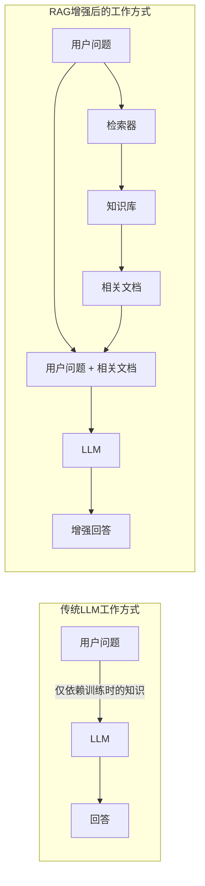
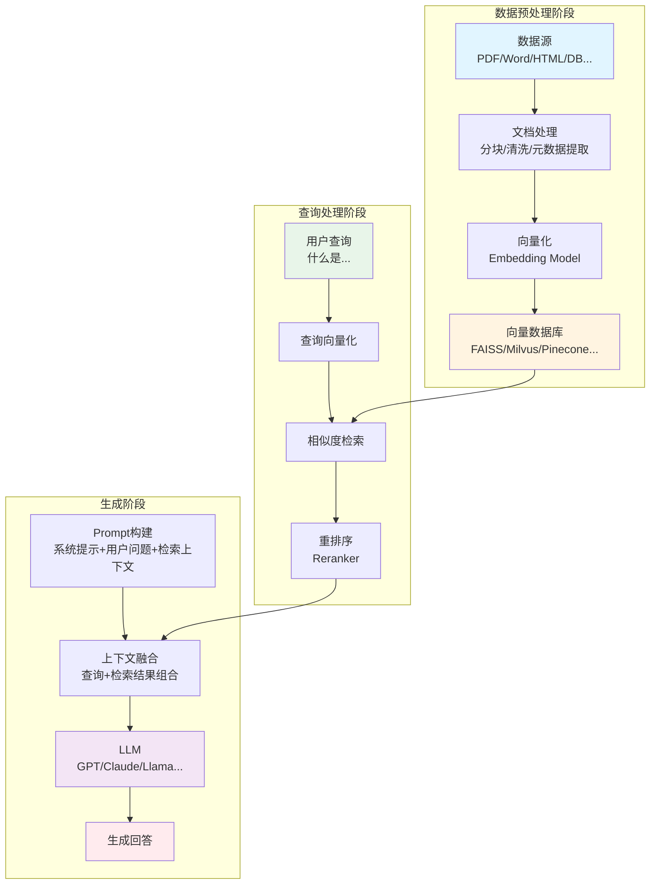
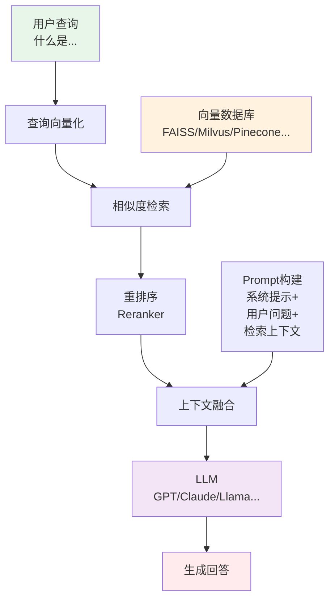
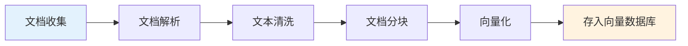
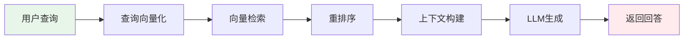
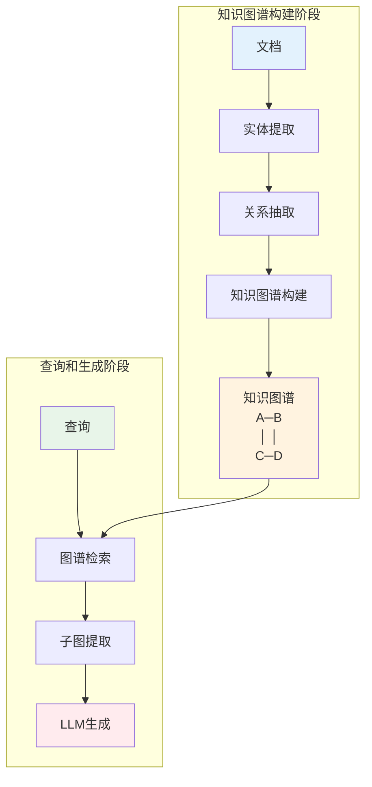

# RAG：检索增强生成技术深度解析

## 什么是RAG？

**RAG（Retrieval-Augmented Generation，检索增强生成）** 是一种将信息检索技术与大型语言模型（LLM）生成能力相结合的人工智能框架。该技术通过从外部知识库中检索相关信息，并将其作为上下文输入给LLM，从而显著增强模型处理知识密集型任务的能力。

RAG 由 Lewis 等人于 2020 年在 NeurIPS 发表的论文 *Retrieval-Augmented Generation for Knowledge-Intensive NLP Tasks* 中首次系统提出（作者单位包括 Meta AI Research 等），将预训练序列到序列模型与稠密检索索引相结合，在开放域问答等任务上取得当时最优结果。此后 RAG 迅速成为大模型应用中最主流的增强方案之一。

> **核心理念**：RAG 的本质是「让 LLM 在回答问题时先查阅外部资料，再结合检索结果与自身知识生成答案」——类似于开卷考试中的「先查资料再作答」。

**本文结构**：先说明为何需要 RAG、其核心架构与工作流程，再讨论 RAG 的局限与挑战，然后介绍高级技术（查询改写、HyDE、多跳检索、CRAG、Self-RAG、GraphRAG）、评估指标与主流框架，最后给出技术栈选型与完整示例、应用场景及与微调/长上下文的对比。

---

## 为什么需要RAG？

### LLM面临的核心挑战

尽管大型语言模型（如GPT-4、Claude、Llama等）展现出了惊人的语言理解和生成能力，但它们仍然面临几个关键问题：

| 问题类型 | 描述 | 影响 |
|---------|------|------|
| **知识截止** | LLM的知识仅限于训练数据的时间点，无法获取最新信息 | 无法回答时事问题、最新技术动态等 |
| **幻觉问题** | 模型可能会"自信地"生成看似合理但实际错误的内容 | 降低回答的可信度和准确性 |
| **领域知识缺乏** | 通用模型难以深入掌握特定领域的专业知识 | 在垂直领域应用受限 |
| **私有数据隔离** | 企业私有数据无法直接被模型访问 | 无法利用内部知识资产 |

### RAG如何解决这些问题



**RAG的核心优势**：

1. **实时性**：可以接入最新的外部数据源，突破知识截止限制
2. **准确性**：基于检索到的真实文档生成回答，大幅减少幻觉
3. **可追溯性**：回答可以引用具体来源，增强可信度
4. **成本效益**：无需频繁重新训练模型，只需更新知识库
5. **隐私安全**：私有数据保留在本地，不需要上传到模型提供商

---

## RAG核心架构

RAG系统的架构主要由三大核心模块组成：**检索模块（Retriever）**、**增强模块（Augmenter）** 和 **生成模块（Generator）**。

### 整体架构图



### RAG工作流程



### 1. 检索模块（Retriever）

检索模块是RAG系统的"信息获取引擎"，负责从知识库中找到与用户查询最相关的文档片段。

#### 1.1 文本嵌入（Text Embedding）

文本嵌入是将文本转换为高维向量表示的过程，使得语义相似的文本在向量空间中距离更近。

**常用嵌入模型**：

| 模型名称 | 提供商 | 向量维度 | 特点 |
|---------|--------|---------|------|
| text-embedding-3-large | OpenAI | 3072 | 性能优秀，支持多语言 |
| text-embedding-3-small | OpenAI | 1536 | 性价比高 |
| BGE-large-zh | BAAI | 1024 | 中文效果优秀 |
| M3E | Moka AI | 768 | 开源中文模型 |
| Sentence-BERT | Hugging Face | 768 | 开源通用模型 |
| Cohere Embed | Cohere | 1024 | 多语言支持好 |

**嵌入过程示例**：

```python
from sentence_transformers import SentenceTransformer

# 加载嵌入模型
model = SentenceTransformer('BAAI/bge-large-zh-v1.5')

# 文本转向量
texts = [
    "RAG是一种检索增强生成技术",
    "大语言模型可以理解和生成自然语言",
    "向量数据库用于存储和检索向量"
]

# 生成嵌入向量
embeddings = model.encode(texts)
print(f"向量维度: {embeddings.shape}")  # (3, 1024)
```

#### 1.2 向量数据库

向量数据库是专门为高效存储和检索向量数据而设计的数据库系统。

**主流向量数据库对比**：

| 数据库 | 类型 | 特点 | 适用场景 |
|--------|------|------|---------|
| **FAISS** | 开源库 | Meta开发，高性能，支持GPU加速 | 研究、中小规模应用 |
| **Milvus** | 开源数据库 | 分布式架构，支持十亿级向量 | 企业级大规模应用 |
| **Pinecone** | 云服务 | 全托管，易于使用 | 快速原型开发 |
| **Weaviate** | 开源数据库 | 支持混合搜索，GraphQL接口 | 需要灵活查询的场景 |
| **Qdrant** | 开源数据库 | Rust编写，高性能 | 对性能要求高的场景 |
| **ChromaDB** | 开源数据库 | 轻量级，易于集成 | 小型项目、快速开发 |
| **Elasticsearch** | 搜索引擎 | 支持向量搜索+全文搜索 | 需要混合搜索的场景 |

#### 1.3 检索策略

**稠密检索（Dense Retrieval）**：
使用向量相似度（如余弦相似度）进行语义检索。

```python
import numpy as np
from numpy.linalg import norm

def cosine_similarity(vec1, vec2):
    """计算余弦相似度"""
    return np.dot(vec1, vec2) / (norm(vec1) * norm(vec2))

# 查询向量与文档向量的相似度计算
query_embedding = model.encode("什么是RAG技术？")
similarities = [cosine_similarity(query_embedding, doc_emb) for doc_emb in doc_embeddings]
```

**稀疏检索（Sparse Retrieval）**：
基于关键词匹配的传统检索方法，如BM25算法。

```python
from rank_bm25 import BM25Okapi

# BM25检索示例
corpus = [doc.split() for doc in documents]
bm25 = BM25Okapi(corpus)

query = "RAG检索增强"
tokenized_query = query.split()
scores = bm25.get_scores(tokenized_query)
```

**混合检索（Hybrid Search）**：
结合稠密检索和稀疏检索的优势，是2024年RAG系统的主流方案。

```python
def hybrid_search(query, alpha=0.5):
    """
    混合检索：结合向量检索和BM25
    alpha: 向量检索权重 (0-1)
    """
    # 向量检索得分
    dense_scores = vector_search(query)
    # BM25检索得分
    sparse_scores = bm25_search(query)
    
    # 归一化并加权融合
    dense_scores_norm = normalize(dense_scores)
    sparse_scores_norm = normalize(sparse_scores)
    
    final_scores = alpha * dense_scores_norm + (1 - alpha) * sparse_scores_norm
    return final_scores
```

### 2. 增强模块（Augmenter）

增强模块负责将检索到的信息与用户查询进行有效融合，构建高质量的Prompt。

#### 2.1 文档分块策略（Chunking）

文档分块是RAG预处理的关键步骤，直接影响检索质量。

**常见分块策略**：

| 策略 | 描述 | 优点 | 缺点 |
|------|------|------|------|
| **固定大小分块** | 按固定字符/token数切分 | 简单易实现 | 可能切断语义 |
| **句子分块** | 按句子边界切分 | 保持句子完整性 | 块大小不均匀 |
| **段落分块** | 按段落切分 | 保持段落语义 | 段落长度差异大 |
| **语义分块** | 基于语义相似度切分 | 语义完整性好 | 计算成本高 |
| **递归分块** | 多层次递归切分 | 灵活性高 | 实现复杂 |

**分块最佳实践**：

```python
from langchain.text_splitter import RecursiveCharacterTextSplitter

# 推荐的分块配置
text_splitter = RecursiveCharacterTextSplitter(
    chunk_size=500,           # 每块约500字符
    chunk_overlap=50,         # 块之间重叠50字符，保持上下文连贯
    separators=["\n\n", "\n", "。", "！", "？", "；", " ", ""],
    length_function=len,
)

chunks = text_splitter.split_text(document)
```

#### 2.2 重排序（Reranking）

重排序是在初步检索后，使用更精确的模型对结果进行二次排序。

**为什么需要重排序？**

- 初步检索（向量检索）速度快但精度有限
- 重排序模型可以更精确地判断查询与文档的相关性
- 显著提升最终检索质量

**常用重排序模型**：

| 模型 | 提供商 | 特点 |
|------|--------|------|
| Cohere Rerank | Cohere | 商用API，效果优秀 |
| BGE-Reranker | BAAI | 开源，中文效果好 |
| Cross-Encoder | Sentence-Transformers | 开源，灵活性高 |
| Jina Reranker | Jina AI | 多语言支持 |

```python
from sentence_transformers import CrossEncoder

# 加载重排序模型
reranker = CrossEncoder('BAAI/bge-reranker-large')

# 对检索结果重排序
query = "什么是RAG？"
passages = ["RAG是检索增强生成...", "LLM是大语言模型...", ...]

# 计算相关性得分
pairs = [[query, passage] for passage in passages]
scores = reranker.predict(pairs)

# 按得分排序
ranked_results = sorted(zip(passages, scores), key=lambda x: x[1], reverse=True)
```

#### 2.3 Prompt工程

构建高质量的Prompt是RAG系统的关键环节。

**RAG Prompt模板示例**：

```python
RAG_PROMPT_TEMPLATE = """你是一个专业的AI助手。请基于以下提供的参考资料回答用户的问题。

## 参考资料
{context}

## 回答要求
1. 仅基于上述参考资料进行回答
2. 如果参考资料中没有相关信息，请明确告知用户
3. 回答要准确、简洁、有条理
4. 如适用，请引用具体的参考资料来源

## 用户问题
{question}

## 回答
"""
```

### 3. 生成模块（Generator）

生成模块使用大语言模型，基于增强后的Prompt生成最终回答。

**LLM选择考量因素**：

| 因素 | 说明 |
|------|------|
| **上下文窗口** | 决定能处理的检索结果数量 |
| **推理能力** | 影响回答的逻辑性和准确性 |
| **响应速度** | 影响用户体验 |
| **成本** | API调用费用或部署成本 |
| **数据隐私** | 是否需要本地部署 |

---

## RAG工作流程详解

### 离线索引阶段（Indexing）



**详细步骤**：

1. **文档收集**：从各种数据源（PDF、Word、网页、数据库等）收集原始文档
2. **文档解析**：使用专门的解析工具提取文本内容
   - PDF：PyPDF2、pdfplumber、Unstructured
   - Word：python-docx
   - HTML：BeautifulSoup
3. **文本清洗**：去除噪声、格式化文本、提取元数据
4. **文档分块**：将长文档切分为适当大小的块
5. **向量化**：使用嵌入模型将文本块转换为向量
6. **存储索引**：将向量和原文存入向量数据库

### 在线查询阶段（Querying）



**详细步骤**：

1. **接收查询**：获取用户的自然语言问题
2. **查询处理**：可选的查询改写、扩展
3. **向量化**：将查询转换为向量
4. **检索**：在向量数据库中检索相似文档
5. **重排序**：使用重排序模型优化结果排序
6. **构建Prompt**：将检索结果与查询组合成Prompt
7. **LLM生成**：调用LLM生成回答
8. **后处理**：格式化、添加引用等

---

## RAG 的局限与挑战

理解 RAG 的局限性有助于在架构设计和评估时有的放矢。失败大致可归纳为**检索阶段失败**、**生成阶段失败**和**系统/数据层面问题**。

### 检索阶段

| 问题 | 表现 | 影响 |
|------|------|------|
| **低精确率** | 返回的文档中混入与查询无关的内容 | 无关信息作为上下文注入，干扰生成甚至诱发幻觉 |
| **低召回率** | 未能检索到部分关键文档 | 模型缺少必要信息，无法正确回答或选择“瞎编” |
| **排序偏差** | 最相关文档未排在前列 | 受上下文窗口限制，真正有用的文档被截断 |
| **语义鸿沟** | 查询与文档表述方式不一致（同义词、专业术语） | 纯向量检索难以命中 |

### 生成阶段

即便检索质量尚可，生成模块仍可能：

- **脱离检索内容（幻觉）**：在检索上下文之外编造事实或细节。
- **未充分利用上下文**：更依赖自身参数知识，忽略或弱化检索到的证据。
- **答非所问**：生成内容与用户问题相关性不足。

原因之一在于：多数通用大模型并非在「严格依据给定文档作答」的目标下训练，Follow 检索知识的能力需要通过提示设计、微调或专门训练来强化。

### 数据与系统层面

- **知识库质量**：过时、错误或冗余数据会拉低检索与生成质量。
- **查询歧义**：用户表述模糊时，检索意图不明确，易导致无关检索或漏检。
- **上下文窗口限制**：检索结果过多时，有用信息被稀释或截断，模型难以聚焦。

**应对方向**（后文会涉及）：查询改写与扩展、混合检索与重排序、Corrective RAG / Self-RAG 等自洽与纠错机制、以及针对忠实度与相关性的评估与迭代。

---

## 高级RAG技术

### 1. 查询改写（Query Rewriting）

通过改写用户查询来提升检索效果。

```python
def query_rewrite(original_query, llm):
    """使用LLM改写查询"""
    prompt = f"""请将以下用户查询改写为更适合检索的形式，生成3个不同角度的查询：

原始查询：{original_query}

改写后的查询（每行一个）："""
    
    rewritten_queries = llm.generate(prompt)
    return rewritten_queries.split('\n')
```

### 2. 假设性文档嵌入（HyDE）

先让LLM生成假设性答案，再用答案进行检索。

```python
def hyde_retrieval(query, llm, retriever):
    """HyDE检索策略"""
    # 1. 生成假设性答案
    hypothetical_answer = llm.generate(
        f"请回答以下问题（即使你不确定）：{query}"
    )
    
    # 2. 用假设性答案进行检索
    results = retriever.search(hypothetical_answer)
    
    return results
```

### 3. 多跳检索（Multi-hop Retrieval）

对于复杂问题，进行多轮检索以获取完整信息。

```python
def multi_hop_retrieval(query, retriever, llm, max_hops=3):
    """多跳检索"""
    context = []
    current_query = query
    
    for hop in range(max_hops):
        # 检索相关文档
        docs = retriever.search(current_query)
        context.extend(docs)
        
        # 判断是否需要继续检索
        need_more = llm.generate(
            f"基于当前信息，是否需要更多信息来回答'{query}'？"
        )
        
        if "不需要" in need_more:
            break
            
        # 生成下一轮查询
        current_query = llm.generate(
            f"为了回答'{query}'，还需要查询什么信息？"
        )
    
    return context
```

### 4. 自适应检索（Adaptive Retrieval）

根据查询类型动态调整检索策略。

```python
def adaptive_retrieval(query, retriever):
    """自适应检索策略"""
    # 分析查询类型
    query_type = classify_query(query)
    
    if query_type == "factual":
        # 事实性问题：精确检索
        return retriever.search(query, top_k=3, threshold=0.8)
    elif query_type == "exploratory":
        # 探索性问题：广泛检索
        return retriever.search(query, top_k=10, threshold=0.5)
    elif query_type == "comparative":
        # 比较性问题：多角度检索
        return multi_perspective_search(query, retriever)
    else:
        return retriever.search(query, top_k=5)
```

### 5. Corrective RAG（CRAG）与 Self-RAG

**Corrective RAG（CRAG）** 针对「检索到无关或低质文档时反而拉低生成质量」的问题，在检索后增加**检索质量评估**，再决定如何使用检索结果：

- **Correct**：检索结果整体相关时，对文档做「分解—过滤—重组」，去掉噪声后再交给生成器。
- **Incorrect**：检索结果均不相关时，放弃当前检索结果，可转而调用外部 API（如网页搜索）获取知识。
- **Ambiguous**：介于二者之间时，可结合过滤后的文档与外部检索结果一起增强。

评估器通常用轻量模型（如 T5-large）对 query–document 相关性打分，再根据分数选择上述分支。CRAG 能显著降低「坏检索」带来的幻觉与答非所问。

**Self-RAG** 则让模型在生成过程中**自我判断**是否需检索、检索结果是否相关、是否足以支撑当前回答等，通过引入特殊 reflection tokens（如 `[Retrieve]`、`[ISREL]`、`[ISSUP]`、`[ISUSE]`）在推理时按需检索并评估。与 CRAG 不同，Self-RAG 将「何时检索、是否采纳检索」内化到生成流程，无需单独的训练好的检索评估器，但需要针对 reflection 进行训练。

| 对比项 | CRAG | Self-RAG |
|--------|------|----------|
| 评估方式 | 外部检索评估器（如 T5） | 模型内部 reflection tokens |
| 检索策略 | 固定检索后按分数分支 | 按需检索（on-demand） |
| 是否依赖外部 API | 可选（如 Web 搜索） | 一般不依赖 |
| 训练需求 | 评估器微调 | Generator + Critic 联合训练 |

两者都可视为「在基础 RAG 上增加质量控制与纠错」，适合对准确性与可控性要求高的场景。

### 6. GraphRAG

微软于2024年开源的 GraphRAG，通过构建知识图谱来增强检索效果。

**GraphRAG核心思想**：

1. **实体提取**：从文档中提取实体和关系
2. **图谱构建**：构建知识图谱
3. **社区检测**：识别图谱中的社区结构
4. **层次化摘要**：生成不同层次的摘要
5. **图谱检索**：基于图结构进行检索



---

## RAG评估指标

### 检索质量评估

| 指标 | 描述 | 计算方式 |
|------|------|---------|
| **召回率（Recall）** | 相关文档被检索到的比例 | 检索到的相关文档数 / 总相关文档数 |
| **精确率（Precision）** | 检索结果中相关文档的比例 | 检索到的相关文档数 / 检索结果总数 |
| **MRR** | 平均倒数排名 | 第一个相关结果排名的倒数的平均值 |
| **NDCG** | 归一化折损累积增益 | 考虑排名位置的相关性评分 |
| **Hit Rate** | 命中率 | 至少检索到一个相关文档的查询比例 |

### 生成质量评估

| 指标 | 描述 | 评估方式 |
|------|------|---------|
| **忠实度（Faithfulness）** | 回答是否忠实于检索内容，有无在上下文外编造 | LLM 评估或 NLI 模型 |
| **答案相关性（Answer Relevancy）** | 回答与用户问题的匹配程度 | LLM 评估或 embedding 相似度 |
| **上下文精确率（Context Precision）** | 检索到的段落中有多少真正支撑了答案 | 基于排序的精确率 |
| **上下文召回率（Context Recall）** | 标准答案所需证据被检索到的比例 | 需参考答案或关键事实 |
| **完整性 / 简洁性** | 是否完整覆盖问题、是否冗余 | 多为人工作业或启发式 |

### 评估框架

**RAGAS**（RAG Assessment）是当前广泛使用的 RAG 自动评估框架，可在无人工标注参考答案的情况下，从忠实度、答案相关性、上下文精确率与上下文召回率等维度打分，便于迭代检索与 Prompt：

```python
from ragas import evaluate
from ragas.metrics import (
    faithfulness,
    answer_relevancy,
    context_precision,
    context_recall,
)

# 准备评估数据
eval_data = {
    "question": ["什么是RAG？"],
    "answer": ["RAG是检索增强生成技术..."],
    "contexts": [["RAG全称是...", "RAG的核心是..."]],
    "ground_truth": ["RAG是一种结合检索和生成的AI技术"]
}

# 执行评估
result = evaluate(
    eval_data,
    metrics=[faithfulness, answer_relevancy, context_precision, context_recall]
)

print(result)
```

**ARES**（Automated RAG Evaluation System）等后续工作通过为检索与生成各环节定制的 LLM 评判器，在少量人工标注上微调评估模型，往往能获得比固定提示的 RAGAS 更高的评估一致性，适合对评估稳定性要求高的生产或研究场景。选择时可根据是否需要参考答案、是否有标注预算以及是否多域评估来权衡 RAGAS 与 ARES。

---

## RAG实践：构建完整系统

### 技术栈选择

**推荐技术栈**：

| 组件 | 推荐选择 | 备选方案 |
|------|---------|---------|
| **框架** | LangChain / LlamaIndex | Haystack |
| **向量数据库** | Milvus / Qdrant | ChromaDB / Pinecone |
| **嵌入模型** | BGE / OpenAI Embedding | M3E / Cohere |
| **重排序** | BGE-Reranker | Cohere Rerank |
| **LLM** | GPT-4 / Claude | Llama / Qwen |

### 完整代码示例

以下示例展示 RAG 的典型流水线（文档加载 → 分块 → 向量化 → 检索 → 生成）。LangChain 的包与 API 会随版本调整（如 `langchain_community`、`langchain_openai`、`langchain_huggingface` 等），实际使用时请以当前官方文档为准并安装对应依赖（如 `langchain`, `langchain-community`, `langchain-openai` 等）。

```python
"""
RAG 系统完整实现示例（结构示意，导入路径请按所用 LangChain 版本调整）
"""

# 以下导入路径可能随 LangChain 版本变化，请参考官方文档
# 例如: from langchain_community.document_loaders import PyPDFLoader
#      from langchain_huggingface import HuggingFaceEmbeddings
#      from langchain_openai import ChatOpenAI
from langchain.document_loaders import PyPDFLoader
from langchain.text_splitter import RecursiveCharacterTextSplitter
from langchain.embeddings import HuggingFaceEmbeddings
from langchain.vectorstores import Milvus
from langchain.chat_models import ChatOpenAI
from langchain.chains import RetrievalQA
from langchain.prompts import PromptTemplate

class RAGSystem:
    def __init__(self, 
                 embedding_model="BAAI/bge-large-zh-v1.5",
                 llm_model="gpt-4",
                 collection_name="my_knowledge_base"):
        
        # 初始化嵌入模型
        self.embeddings = HuggingFaceEmbeddings(
            model_name=embedding_model,
            model_kwargs={'device': 'cuda'}
        )
        
        # 初始化LLM
        self.llm = ChatOpenAI(
            model=llm_model,
            temperature=0
        )
        
        # 初始化向量数据库
        self.vector_store = Milvus(
            embedding_function=self.embeddings,
            collection_name=collection_name,
            connection_args={"host": "localhost", "port": "19530"}
        )
        
        # 初始化文本分割器
        self.text_splitter = RecursiveCharacterTextSplitter(
            chunk_size=500,
            chunk_overlap=50
        )
        
        # 设置Prompt模板
        self.prompt_template = PromptTemplate(
            template="""基于以下参考资料回答问题。如果资料中没有相关信息，请说明。

参考资料：
{context}

问题：{question}

回答：""",
            input_variables=["context", "question"]
        )
    
    def add_documents(self, file_paths):
        """添加文档到知识库"""
        all_chunks = []
        
        for file_path in file_paths:
            # 加载文档
            loader = PyPDFLoader(file_path)
            documents = loader.load()
            
            # 分块
            chunks = self.text_splitter.split_documents(documents)
            all_chunks.extend(chunks)
        
        # 添加到向量数据库
        self.vector_store.add_documents(all_chunks)
        print(f"成功添加 {len(all_chunks)} 个文档块")
    
    def query(self, question, top_k=5):
        """查询知识库"""
        # 创建检索链
        qa_chain = RetrievalQA.from_chain_type(
            llm=self.llm,
            chain_type="stuff",
            retriever=self.vector_store.as_retriever(
                search_kwargs={"k": top_k}
            ),
            chain_type_kwargs={"prompt": self.prompt_template},
            return_source_documents=True
        )
        
        # 执行查询
        result = qa_chain({"query": question})
        
        return {
            "answer": result["result"],
            "sources": [doc.page_content for doc in result["source_documents"]]
        }


# 使用示例
if __name__ == "__main__":
    # 初始化RAG系统
    rag = RAGSystem()
    
    # 添加文档
    rag.add_documents(["document1.pdf", "document2.pdf"])
    
    # 查询
    result = rag.query("什么是RAG技术？")
    print("回答:", result["answer"])
    print("来源:", result["sources"])
```

---

## RAG应用场景

### 1. 企业知识库问答

- **场景**：员工查询公司政策、产品文档、技术手册
- **优势**：快速获取准确信息，减少重复咨询

### 2. 智能客服系统

- **场景**：自动回答客户常见问题
- **优势**：24/7服务，回答准确且可追溯

### 3. 法律/医疗咨询

- **场景**：基于专业文献提供咨询建议
- **优势**：确保回答有据可依，降低风险

### 4. 学术研究助手

- **场景**：文献检索、论文摘要、研究问答
- **优势**：快速定位相关研究，提高效率

### 5. 代码助手

- **场景**：基于代码库和文档回答开发问题
- **优势**：理解项目上下文，提供针对性建议

---

## RAG vs 微调 vs 长上下文

| 特性 | RAG | 微调（Fine-tuning） | 长上下文 |
|------|-----|-------------------|---------|
| **知识更新** | 实时更新 | 需要重新训练 | 每次查询时提供 |
| **成本** | 中等 | 高（训练成本） | 高（推理成本） |
| **准确性** | 高（有来源） | 中等 | 中等 |
| **可解释性** | 高（可追溯） | 低 | 中等 |
| **适用场景** | 知识密集型任务 | 特定领域/风格 | 单次大量上下文 |
| **隐私保护** | 好（数据本地化） | 需上传数据 | 需上传数据 |

**最佳实践**：三种方法可以组合使用，根据具体需求选择最优方案。

---

## RAG 发展趋势

### 1. 多模态 RAG

支持图像、音频、视频等多模态的检索与生成，以及跨模态对齐与融合，适用于文档、产品图、会议记录等场景。

### 2. Agent + RAG

将 RAG 作为 Agent 的「工具」之一，按需检索、多步推理与规划，实现更复杂的问答与任务执行。

### 3. 自洽与纠错机制

CRAG、Self-RAG 等通过检索质量评估、按需检索与 reflection tokens，减少「坏检索」带来的幻觉，提升可控性与可解释性。

### 4. 本地化与隐私

随着开源嵌入模型与小型 LLM 的成熟，全链路本地化或混合部署的 RAG 方案越来越多，满足数据不出域与合规需求。

### 5. 评估标准化

RAGAS、ARES 等框架与忠实度、答案相关性、上下文精确率/召回率等指标逐渐成为业界常用标准，便于复现与对比。

### 6. 端到端优化

检索器与生成器的联合训练、检索感知的生成微调等，使模型更善于「跟随」检索上下文，减少脱离文档的幻觉。

---

## 总结

RAG（检索增强生成）通过将**信息检索**与**大语言模型生成**相结合，有效缓解了 LLM 的知识截止、幻觉与领域知识不足等问题，已成为当前大模型应用中最主流的增强方案之一。其核心优势在于：

1. **实时性**：可接入最新外部数据，突破训练截止时间
2. **准确性**：基于检索到的真实文档生成，降低无据幻觉
3. **可追溯性**：回答可引用具体来源，便于核查与合规
4. **成本效益**：多数场景下仅需更新知识库与检索/提示，无需频繁重训模型
5. **隐私与可控性**：私有数据可保留在本地或自有检索系统中

同时，RAG 仍面临检索精确率与召回率、噪声注入、生成阶段脱离上下文等挑战；通过**混合检索与重排序、查询改写、Corrective RAG / Self-RAG** 等高级技术，以及 **RAGAS / ARES** 等评估框架的迭代，可以系统性地提升鲁棒性与可维护性。未来 RAG 将向多模态、Agent 协同、端到端优化与评估标准化等方向持续演进。

---

## 参考资料

### 论文与报告

1. **Lewis, P., Perez, E., Piktus, A., Petroni, F., Karpukhin, V., Goyal, N., Küttler, H., Lewis, M., Yih, W.-t., Rocktäschel, T., Riedel, S., & Kiela, D.** (2020). *Retrieval-Augmented Generation for Knowledge-Intensive NLP Tasks.* NeurIPS 2020.  
   [NeurIPS](https://papers.nips.cc/paper/2020/hash/6b493230205f780e1bc26945df7481e5-Abstract.html)

2. **Yao, S., et al.** (2024). *Retrieval-Augmented Generation for Large Language Models: A Survey.* arXiv:2312.10997 及后续综述（如 arXiv:2410.12837 等）对 RAG 架构、检索优化、评估与鲁棒性有系统梳理。

3. **Microsoft Research.** (2024). *GraphRAG: Unlocking LLM discovery on narrative private data.* 基于知识图谱的层次化检索与摘要。

4. **Shi, E., et al.** (2023). *Ragas: Automated Evaluation of Retrieval Augmented Generation.* arXiv:2309.15217. RAGAS 评估框架的忠实度、答案相关性、上下文精确率与召回率等指标。

5. **Santhanam, K., et al.** (2024). *ARES: An Automated Evaluation Framework for Retrieval-Augmented Generation Systems.* NAACL 2024. 基于定制化 LLM 评判器的 RAG 自动评估。

### 文档与工具

6. LangChain Documentation: https://python.langchain.com  
7. LlamaIndex Documentation: https://docs.llamaindex.ai  
8. RAGAS: https://docs.ragas.io  
9. RAGFlow: https://ragflow.io
