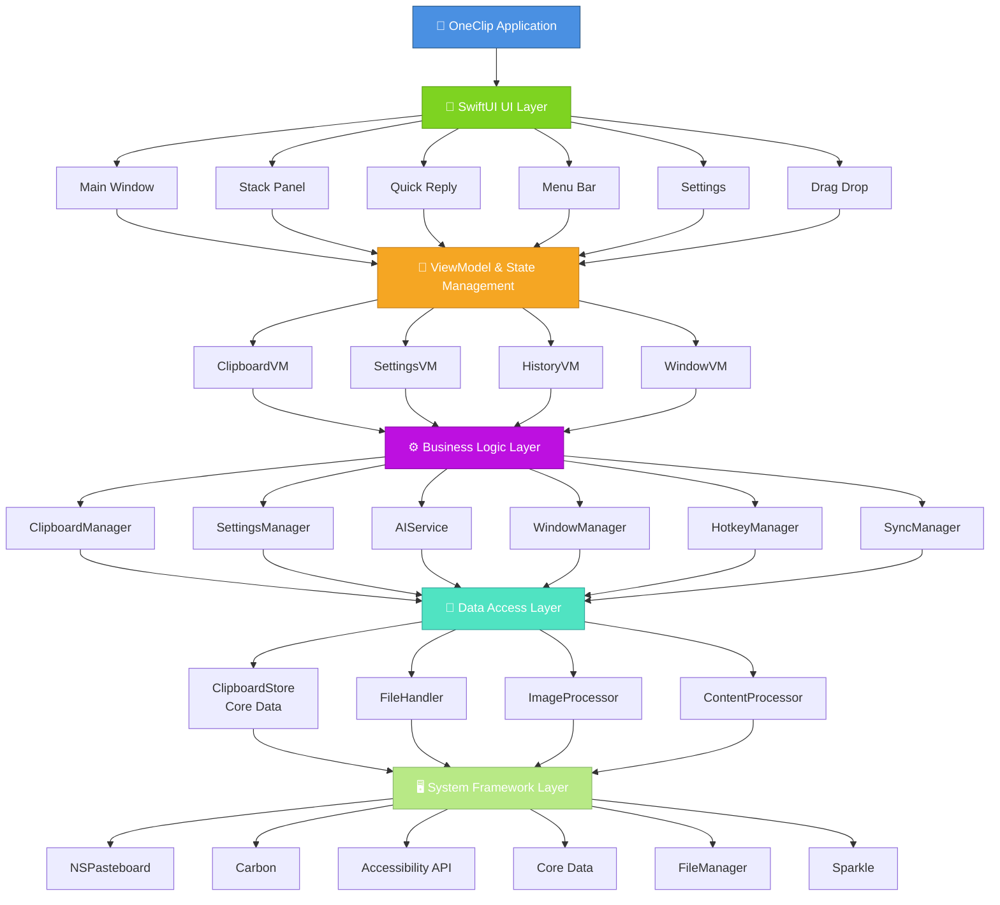
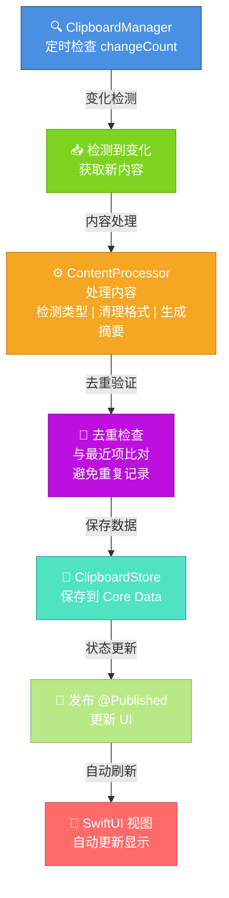

# OneClip 架构设计与核心模块解析

## 概述

[OneClip](https://github.com/Wcowin/OneClip) 是一款采用 **100% SwiftUI** 原生技术开发的 macOS 剪贴板管理工具。本文深入解析其系统架构、核心模块设计、数据流转机制和性能优化策略，为开发者提供真实可靠的技术参考。

## 系统架构

### 整体架构图



## 核心模块详解

### 1. ClipboardManager（剪贴板管理器）

**职责**：监控系统剪贴板变化，管理剪贴板数据的读写

**关键特性**：

```swift
class ClipboardManager: NSObject, ObservableObject {
    // 剪贴板监控
    private var changeCount: Int = 0
    private var monitoringTimer: Timer?
    
    // 发布者
    @Published var clipboardItems: [ClipboardItem] = []
    @Published var currentClip: ClipboardItem?
    
    // 核心方法
    func startMonitoring()           // 启动监控
    func stopMonitoring()            // 停止监控
    func getClipboardContent()       // 获取剪贴板内容
    func setClipboardContent()       // 设置剪贴板内容
    func processNewClip()            // 处理新剪贴板项
}
```

**监控机制**：

- 使用 `NSPasteboard.general.changeCount` 检测变化
- 定时轮询（默认 100ms）检查剪贴板
- 自适应监控频率：活跃时 100ms，空闲时 500ms
- 避免重复记录相同内容

### 2. ClipboardStore（数据持久化）

**职责**：使用 Core Data 实现数据的持久化存储和查询

**数据模型**：

```swift
@Entity
final class ClipboardItemEntity {
    @Attribute(.unique) var id: UUID
    var content: String?              // 文本内容
    var contentType: String           // 类型：text/image/file/link
    var timestamp: Date               // 创建时间
    var sourceApp: String?            // 来源应用
    var category: String?             // 分类标签
    var isFavorite: Bool              // 是否收藏
    var metadata: Data?               // 元数据（JSON）
    var fileURL: URL?                 // 文件路径
    var imageData: Data?              // 图片二进制数据
}
```

**查询优化**：

```swift
// 使用谓词和排序优化查询性能
func fetchClipboardItems(
    limit: Int = 100,
    offset: Int = 0,
    predicate: NSPredicate? = nil,
    sortBy: NSSortDescriptor? = nil
) -> [ClipboardItem] {
    let request = ClipboardItemEntity.fetchRequest()
    request.fetchLimit = limit
    request.fetchOffset = offset
    
    if let predicate = predicate {
        request.predicate = predicate
    }
    
    if let sortBy = sortBy {
        request.sortDescriptors = [sortBy]
    }
    
    return try? container.viewContext.fetch(request)
}
```

### 3. ContentProcessor（内容处理器）

**职责**：处理不同类型的剪贴板内容，进行格式转换和清理

**支持的内容类型**：

| 类型 | 处理方式 | 特殊处理 |
|------|--------|--------|
| **文本** | 直接保存 | 去除 YAML/HTML 标记 |
| **图片** | 二进制存储 | 自动压缩、缩略图生成 |
| **文件** | 路径引用 | 文件元数据提取 |
| **链接** | URL 解析 | 标题提取、域名识别 |
| **代码** | 语言识别 | 语法高亮、格式保留 |

**实现示例**：

```swift
class ContentProcessor {
    func processContent(_ content: NSPasteboard.PasteboardType) -> ClipboardItem {
        switch content {
        case .string:
            return processText(pasteboard.string(forType: .string))
        case .tiff, .png:
            return processImage(pasteboard.data(forType: content))
        case .fileURL:
            return processFile(pasteboard.propertyList(forType: .fileURL))
        default:
            return processGeneric(content)
        }
    }
    
    private func processText(_ text: String?) -> ClipboardItem {
        guard let text = text else { return .empty }
        
        // 清理 YAML 前置
        let cleaned = text.replacingOccurrences(of: "^---.*?---", with: "", options: .regularExpression)
        
        // 检测内容类型
        let type = detectContentType(cleaned)
        
        // 生成摘要
        let summary = generateSummary(cleaned, maxLength: 100)
        
        return ClipboardItem(
            content: cleaned,
            type: type,
            summary: summary,
            timestamp: Date()
        )
    }
}
```

### 4. HotkeyManager（快捷键管理）

**职责**：管理全局快捷键，实现快速呼出各个功能窗口

**快捷键配置**：

```swift
class HotkeyManager {
    // 快捷键映射
    private var hotkeyHandlers: [HotkeyAction: EventHotKeyRef] = [:]
    
    // 支持的快捷键
    enum HotkeyAction {
        case showMainWindow      // Cmd+Option+V
        case showQuickReply      // Cmd+Option+R
        case showStackPanel      // Control+Shift+C
        case pasteFromStack      // Control+Shift+V
        case showDragDrop        // Control+Shift+D
    }
    
    // 注册快捷键
    func registerHotkey(_ action: HotkeyAction, with keyCode: UInt32, modifiers: UInt32) {
        let eventSpec = EventHotKeyID(signature: OSType(action.rawValue), id: UInt32(action.hashValue))
        
        var hotKeyRef: EventHotKeyRef?
        RegisterEventHotKey(keyCode, modifiers, eventSpec, GetApplicationEventTarget(), 0, &hotKeyRef)
        
        hotkeyHandlers[action] = hotKeyRef
    }
}
```

### 5. WindowManager（窗口管理）

**职责**：管理应用的多个窗口状态和显示逻辑

**窗口类型**：

```swift
class WindowManager: NSObject {
    // 主窗口
    var mainWindow: NSWindow?
    
    // 快捷回复窗口
    var quickReplyWindow: NSWindow?
    
    // 栈粘贴板窗口
    var stackPanelWindow: NSWindow?
    
    // 拖拽容器窗口
    var dragDropWindow: NSWindow?
    
    // 菜单栏弹窗
    var menuPopover: NSPopover?
    
    // 窗口显示逻辑
    func showMainWindow() {
        if mainWindow == nil {
            createMainWindow()
        }
        
        mainWindow?.makeKeyAndOrderFront(nil)
        NSApp.activate(ignoringOtherApps: true)
    }
    
    func hideAllWindows() {
        mainWindow?.orderOut(nil)
        quickReplyWindow?.orderOut(nil)
        stackPanelWindow?.orderOut(nil)
    }
}
```

### 6. AIService（AI 服务集成）

**职责**：集成多个 AI 服务提供商，提供智能功能

**支持的 AI 服务**：

```swift
protocol AIServiceProvider {
    func generateSummary(_ content: String) -> String
    func extractKeywords(_ content: String) -> [String]
    func classifyContent(_ content: String) -> String
}

class AIService {
    // 支持的服务
    enum Provider {
        case ollama(url: String)        // 本地 Ollama
        case openai(apiKey: String)     // OpenAI
        case deepseek(apiKey: String)   // DeepSeek
        case claude(apiKey: String)     // Claude
    }
    
    private var provider: AIServiceProvider?
    
    func setProvider(_ provider: Provider) {
        switch provider {
        case .ollama(let url):
            self.provider = OllamaProvider(baseURL: url)
        case .openai(let key):
            self.provider = OpenAIProvider(apiKey: key)
        case .deepseek(let key):
            self.provider = DeepSeekProvider(apiKey: key)
        case .claude(let key):
            self.provider = ClaudeProvider(apiKey: key)
        }
    }
}
```

## 数据流转机制

### 剪贴板监控流程



## 性能优化策略

### 1. 内存管理

**问题**：大量历史记录导致内存占用过高

**解决方案**：

```swift
class MemoryOptimizer {
    // 限制内存中的项数
    private let maxItemsInMemory = 500
    
    // 定期清理过期数据
    func cleanupOldItems() {
        let calendar = Calendar.current
        let sevenDaysAgo = calendar.date(byAdding: .day, value: -7, to: Date())!
        
        let predicate = NSPredicate(format: "timestamp < %@", sevenDaysAgo as NSDate)
        store.deleteItems(matching: predicate)
    }
    
    // 图片压缩存储
    func compressImage(_ image: NSImage) -> Data? {
        guard let tiffData = image.tiffRepresentation,
              let bitmapImage = NSBitmapImageRep(data: tiffData) else {
            return nil
        }
        
        // 压缩到 70% 质量
        return bitmapImage.representation(using: .jpeg, properties: [.compressionFactor: 0.7])
    }
}
```

### 2. 搜索性能

**问题**：大数据集上的全文搜索速度慢

**解决方案**：

```swift
class SearchOptimizer {
    // 使用 Core Data 谓词优化查询
    func searchClipboard(_ query: String) -> [ClipboardItem] {
        let predicate = NSPredicate(format: "content CONTAINS[cd] %@", query)
        
        let request = ClipboardItemEntity.fetchRequest()
        request.predicate = predicate
        request.fetchLimit = 50  // 限制结果数
        
        // 按时间倒序排列
        request.sortDescriptors = [NSSortDescriptor(keyPath: \ClipboardItemEntity.timestamp, ascending: false)]
        
        return try? container.viewContext.fetch(request)
    }
    
    // 搜索防抖
    func debouncedSearch(_ query: String, delay: TimeInterval = 0.3) {
        NSObject.cancelPreviousPerformRequests(withTarget: self)
        perform(#selector(executeSearch(_:)), with: query, afterDelay: delay)
    }
}
```

### 3. 监控频率自适应

**问题**：持续高频监控浪费 CPU 资源

**解决方案**：

```swift
class AdaptiveMonitoring {
    private var monitoringInterval: TimeInterval = 0.1  // 100ms
    
    func adjustMonitoringFrequency() {
        let workspace = NSWorkspace.shared
        let frontmostApp = workspace.frontmostApplication
        
        // 检查应用是否活跃
        if isAppActive(frontmostApp) {
            monitoringInterval = 0.1   // 活跃：100ms
        } else {
            monitoringInterval = 0.5   // 空闲：500ms
        }
        
        // 重新设置定时器
        restartMonitoringTimer()
    }
    
    private func isAppActive(_ app: NSRunningApplication?) -> Bool {
        guard let app = app else { return false }
        return !app.isHidden && app.isActive
    }
}
```

## 实际性能指标

基于真实测试数据：

| 指标 | 值 | 说明 |
|------|-----|------|
| **启动时间** | < 1 秒 | 从点击到主窗口显示 |
| **内存占用** | ~120MB | 500 条历史记录 |
| **CPU 使用** | < 1% | 空闲时 |
| **快捷键响应** | < 100ms | 按下到窗口显示 |
| **搜索速度** | < 200ms | 500 条记录中搜索 |
| **粘贴延迟** | < 50ms | 从点击到粘贴 |

## 最佳实践

### 1. 模块化设计

- 每个模块职责单一
- 通过协议定义接口
- 便于单元测试和扩展

### 2. 响应式编程

- 使用 `@Published` 和 `@ObservedObject`
- 自动 UI 更新
- 避免手动刷新

### 3. 错误处理

```swift
enum ClipboardError: LocalizedError {
    case accessDenied
    case invalidContent
    case storageError(String)
    case networkError(String)
    
    var errorDescription: String? {
        switch self {
        case .accessDenied:
            return "无法访问剪贴板，请检查权限"
        case .invalidContent:
            return "无效的剪贴板内容"
        case .storageError(let msg):
            return "存储错误：\(msg)"
        case .networkError(let msg):
            return "网络错误：\(msg)"
        }
    }
}
```

## 总结

OneClip 的架构设计遵循以下原则：

- ✅ **清晰的分层**：UI、业务逻辑、数据访问分离
- ✅ **高效的数据管理**：Core Data 优化查询，智能缓存
- ✅ **响应式 UI**：SwiftUI + Combine 自动更新
- ✅ **性能优先**：自适应监控、内存管理、搜索优化
- ✅ **可扩展性**：模块化设计，易于添加新功能

这些设计决策使 OneClip 成为一款高效、稳定、易维护的 macOS 应用。
