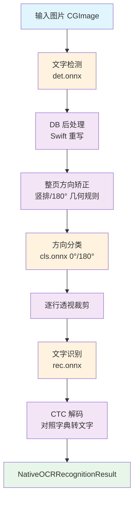

# OneClip 原生 PP-OCRv5 ONNX 方案解析

## 为什么要从 Python 架构迁移

在 [PP-OCRv5 使用指南](PP-OCRv5-Guide.md) 中介绍的早期方案，依赖 Python + `rapidocr-onnxruntime` 在外部进程中跑推理。它在本机可用，但作为 macOS 原生 App 的 OCR 引擎存在几个硬伤：

- 必须随包携带 Python 运行时或要求用户自备环境；
- 识别时需启动外部进程，冷启动慢、与主进程通信成本高；
- 模型与运行环境耦合，难以随 App 一同签名分发，也不利于沙盒化。

OneClip 最终选择**把 PaddlePaddle 训练好的 PP-OCRv5 模型，直接用原生 ONNX Runtime 在 macOS 上跑起来，并把原本 Python 的整套后处理算法用 Swift 重写**。结果是：完全离线、不依赖 Python、随 App 一起签名发布、用户下载模型即用。

本文讲清楚这套「原生 ONNX 方案」是怎么落地的。

## 一句话定位

> 我们**没有封装**任何现成的 OCR 服务或 SDK，而是把 PP-OCR 的 ONNX 模型加载进原生 ONNX Runtime，并**用 Swift 重新实现了整条识别流水线**（检测后处理、方向分类、CTC 解码、几何矫正）。

## 整体架构



底座是 `OnnxRuntimeBindings`（微软 ONNX Runtime 的 Swift 绑定），作为 App 的原生依赖随签名发布；三个 `.onnx` 模型与字符字典由用户下载，与代码解耦。

## 运行时底座：原生 ONNX Runtime

核心代码在 `OneClip/Services/NativeOCR/NativePPOCRRuntime.swift`，关键设计：

- 用 `actor NativePPOCRRuntime` 隔离推理状态，保证线程安全；
- 通过 `ORTEnv` + `ORTSession` 把三个模型加载成推理会话（`det` / `rec` / `cls`）；
- `loadIfNeeded(...)` 懒加载，模型只加载一次；模型目录或版本变化时 `reset()` 释放旧会话；
- `CIContext` 做图像几何变换（裁剪、旋转），零额外依赖。

```swift
let env = try ORTEnv(loggingLevel: .warning)
let options = try ORTSessionOptions()
let detSession = try ORTSession(env: env, modelPath: detURL.path, sessionOptions: options)
let recSession = try ORTSession(env: env, modelPath: recURL.path, sessionOptions: options)
let clsSession = try ORTSession(env: env, modelPath: clsURL.path, sessionOptions: options)
```

模型与代码通过 `PPOCRModelVersion`（`.v5Mobile` / `.v6Small`）解耦，文件名、unclip 系数等都按版本配置，切换模型无需改推理逻辑。

## 重写的识别流水线

这是「封装」与「重写」的本质区别——PP-OCR 官方后处理是 Python 写的，我们用 Swift 全部重写。

### 1. 文字检测 + DB 后处理

`detectText(in:)` 调用检测模型得到概率图，随后用 Swift 实现 **DB（Differentiable Binarization）后处理**：阈值化、二值化、找轮廓、提取文本区域多边形框，再规约为 `NativeOCRBox`（含四点坐标与分数）。

### 2. 整页方向矫正（PP-OCR 官方没有的增强）

识别前的几何矫正做了两件事，保证输出文字顺序正确：

- `isPredominantlyVertical(_:)`：根据检测框长宽方向判断是否为竖排文档，是则先 90° 旋转；
- `shouldRotatePage180(image:boxes:)`：对面积最大的若干框投票，判断整页是否倒置，是则 180° 旋转。

逐行单独矫正会让倒排文字可读但顺序错乱，所以这里先做整页矫正再排序。

### 3. 方向分类

`correctTextOrientation(_:)` 调用 `cls.onnx`，只处理 0°/180°（竖排的 90° 已由上面几何规则处理），分类置信度 ≥ 0.9 才旋转。

### 4. 逐行透视裁剪

`perspectiveCrop(_:points:)` 用 `CIContext` 对每行四点做透视变换，摆正成水平文本块再送识别。

### 5. 文字识别 + CTC 解码

`recognizeLine(_:)` 是流水线的关键：

- 输入预处理 `makeRecognitionInput(_:)`：固定高度 48、按宽高比缩放、归一化到 `像素/127.5-1`、排成 **BGR 的 CHW** 张量（与 PP-OCR 训练时一致）；
- 跑 `rec.onnx` 得到 `[1, T, C]` 的 logits；
- **CTC 贪心解码**：沿时间步取 argmax，跳过 blank（索引 0）与重复字符，按索引查 `ppocrv5_dict.txt` 字典还原文字，同时累加置信度；
- 过滤低置信度行（`< 0.35`），返回 `(text, confidence)`。

```swift
for timestep in 0..<timesteps {
    // 取当前时间步最优类别
    guard bestIndex != 0, bestIndex != previousIndex, bestIndex < characters.count else { continue }
    text += characters[bestIndex]
    confidenceSum += bestScore
    characterCount += 1
}
```

整条流水线输出 `NativeOCRRecognitionResult`，含合并文本、逐行结果（坐标 + 文字 + 置信度）以及坐标是否匹配原图空间——后者供表格 OCR 复用同一套几何。

## 表格 OCR

`NativeTableOCRRuntime.swift` 复用同一套 ONNX Runtime 底座，独立加载表格结构模型，识别单元格与行列结构。它调用 `recognizeLines(...)` 的「原图坐标系」路径，保证表格模型与文字模型共享几何，互不干扰。

## 模型分发与完整性校验

模型不进安装包（高精度模型体积大），由用户在 `设置 → OCR` 页主动下载。分发链路：

- 模型 ZIP 托管在 `Wcowin/homebrew-oneclip` 的 GitHub / Gitee Release；
- `oneclip_ocr_models_latest.json` 描述版本、大小、SHA-256、下载地址；
- `OCRPluginManager` 多源拉取该 JSON（GitHub + Gitee 双保险），校验 `schemaVersion`、`modelID`、`archiveSize`；
- 下载后 `verifyFile(...)` 校验 **ZIP 大小 + SHA-256**；解压后再校验包内 `manifest.json` 与各 ONNX 文件的大小/哈希；
- 全部通过才替换旧模型；**任何一步失败，旧模型保持不变**，不会把功能搞坏。

```swift
let digest = SHA256.hash(data: data).map { String(format: "%02x", $0) }.joined()
guard digest.caseInsensitiveCompare(expectedSHA256) == .orderedSame else {
    throw OCRPluginError.downloadFailed("\(displayName) SHA-256 校验失败")
}
```

「检查更新」只拉一个很小的 JSON，不自动下载模型；确认有新版本再点「更新模型」才下载替换。

## 模型下载

<div class="grid cards" markdown>

-   :material-download:{ .lg .middle } **下载 PP-OCR 模型**

    ---

    OneClip 的 PP-OCRv5 / PP-OCRv6 模型包托管在 `homebrew-oneclip` 仓库的 Release 中，用户可在设置页一键下载，也可在此手动获取。

    [:material-github: PP-OCRv6 模型下载](https://github.com/Wcowin/homebrew-oneclip/releases/tag/ocr-v6.0.0){ .md-button .md-button--primary }

</div>

!!! tip "下载说明"
    - 模型不随安装包发布，需用户主动下载；
    - 下载后 App 会自动做 SHA-256 与包内 `manifest.json` 完整性校验，全部通过才启用；
    - 应用内「设置 → OCR」页面也内置了同样的下载入口，无需手动操作。

## 用户视角

1. 安装 OneClip，原生 ONNX Runtime 运行环境随包就绪；
2. 打开 `设置 → OCR`，看到 PP-OCRv5 Mobile、PP-OCRv6 Small、表格 OCR 三张卡片；
3. 点对应「下载」按钮，进度条实时显示，完成后状态徽章变绿「已就绪」；
4. 之后所有截图 / 选区 / 图片 OCR 默认走本地 PP-OCR，**完全离线、不联网、不上传任何图片**。

一句话：**装好 App，设置里点一下下载模型，就能永久离线、隐私安全地用我们的 PP-OCR 高精度识别**，无需装 Python、无需配环境、无需联网。

## 如何在你自己的 App 里使用

本文讲的不是黑盒服务，而是**一套可复用的原生方案**：你拿到 `NativePPOCRRuntime.swift` 这份代码和模型文件，照着下面做，就能在自己的 macOS 12+ Swift 项目里跑起来。

### 1. 引入 ONNX Runtime 依赖

在 Xcode 的 `File → Add Package Dependencies` 中加入：

```text
https://github.com/microsoft/onnxruntime-swift-package-manager
```

选择 `OnnxRuntimeBindings` 库。所有推理都在 App 进程内完成，**无需 Python、无需外部进程**。

### 2. 实现推理代码

本文第 5 节给出了一套**完整、可照抄实现**的参考代码，覆盖从模型加载到 CTC 解码的整条流水线。你可以参照它**自行实现**自己的推理模块（OneClip 自身的源码不直接分发，这里给的是独立可读的实现片段）。

推荐把这些能力封装成一个 `actor` 推理运行时，保证线程安全、模型只加载一次。核心结构：

- 模型加载与版本切换（`PPOCRModelVersion`：`.v5Mobile` / `.v6Small`）；
- 检测 + DB 后处理、方向分类、透视裁剪、CTC 解码、整页方向矫正；
- 结果类型（坐标 + 文字 + 置信度）。

### 3. 准备模型与字典

从 [PP-OCRv6 模型下载](https://github.com/Wcowin/homebrew-oneclip/releases/tag/ocr-v6.0.0) 获取对应版本的文件，放到你的 App 可写目录（如 `Application Support/ocr`）：

| 文件 | 说明 |
|------|------|
| `ch_PP-OCRv5_det_mobile.onnx` | 检测（v5） |
| `PP-OCRv6_det_small.onnx` | 检测（v6） |
| `ch_PP-OCRv5_rec_mobile.onnx` / `PP-OCRv6_rec_small.onnx` | 识别 |
| `ch_ppocr_mobile_v2.0_cls_mobile.onnx` | 方向分类 |
| `ppocrv5_dict.txt` / `ppocrv6_dict.txt` | 字符字典 |

!!! tip "模型较大，建议运行时下载"
    模型不一定要随包发布。可参考 OneClip 的下载 + `SHA-256` 校验逻辑（`verifyFile`），下载后校验通过再启用。

### 4. 直接可用的调用代码

下面是一段**可以原样复制**的调用示例（`recognize` 是 `actor` 方法，需 `await`；同时会 `throws`）：

```swift
import OnnxRuntimeBindings
import CoreGraphics

// 你的模型目录（det/rec/cls 三个 onnx + 字典都在这里）
let modelsDir = try FileManager.default
    .url(for: .applicationSupportDirectory, in: .userDomainMask, appropriateFor: nil, create: true)
    .appendingPathComponent("ocr", isDirectory: true)

let runtime = NativePPOCRRuntime()
let image: CGImage = /* 你的截图 / 剪贴板图片 / 文件图片 */

// 识别，返回合并后的全部文字
let text = try await runtime.recognize(
    image,
    modelsDirectory: modelsDir,
    modelVersion: .v6Small   // 或 .v5Mobile
)
print(text)

// 若要逐行坐标与置信度，用 recognizeResult：
let result = try await runtime.recognizeResult(
    image,
    modelsDirectory: modelsDir,
    modelVersion: .v6Small
)
for line in result.lines {
    print(line.text, line.score, line.box)
}
```

### 5. 核心算法参考（可照抄实现）

下面给出整条流水线的**关键实现**，读者把这几段拼起来即可复刻。配套 helper（`rgbaPixels` 用 `CGContext` 取 RGBA、`convexHull` 用 Graham 扫描、`polygonScore` 求框内均值）按常规写法补齐即可。

**① 模型加载与推理封装**

```swift
struct SessionInfo {
    let session: ORTSession
    let inputName: String
    let outputNames: Set<String>
}

func loadSession(_ env: ORTEnv, _ url: URL) throws -> SessionInfo {
    let session = try ORTSession(env: env, modelPath: url.path, sessionOptions: ORTSessionOptions())
    let inputName = try session.inputNames().first ?? "input"
    let outputNames = try session.outputNames()          // 返回 Set<String>
    return SessionInfo(session: session, inputName: inputName, outputNames: outputNames)
}

func run(_ info: SessionInfo, input: [Float], shape: [Int]) throws -> [Float] {
    let data = NSMutableData(bytes: input, length: input.count * MemoryLayout<Float>.stride)
    let tensor = try ORTValue(tensorData: data, elementType: .float, shape: shape.map(NSNumber(value:)))
    let outputs = try info.session.run(
        withInputs: [info.inputName: tensor],
        outputNames: info.outputNames,
        runOptions: nil
    )
    let value = try outputs.values.first!
    let tensorData = try value.tensorData() as Data
    return tensorData.withUnsafeBytes { Array($0.bindMemory(to: Float.self)) }
}
```

**② 检测输入预处理**（短边 736、长边 2048、32 对齐、归一化到 `BGR/CHW`）

```swift
func makeDetectionInput(_ image: CGImage) -> (data: [Float], height: Int, width: Int) {
    let minSide = 736, maxSide = 2048
    let ow = image.width, oh = image.height
    var scale: CGFloat = 1
    if min(ow, oh) < minSide { scale = CGFloat(minSide) / CGFloat(min(ow, oh)) }
    if CGFloat(max(ow, oh)) * scale > CGFloat(maxSide) { scale = CGFloat(maxSide) / CGFloat(max(ow, oh)) }
    let width = max(32, Int((CGFloat(ow) * scale / 32).rounded()) * 32)
    let height = max(32, Int((CGFloat(oh) * scale / 32).rounded()) * 32)
    let pixels = rgbaPixels(image, width: width, height: height)   // [r,g,b,a] * N
    var chw = [Float](repeating: 0, count: width * height * 3)
    for i in 0..<width*height {
        chw[i]                   = Float(pixels[i*4+2]) / 127.5 - 1   // B
        chw[width*height + i]    = Float(pixels[i*4+1]) / 127.5 - 1   // G
        chw[width*height*2 + i]  = Float(pixels[i*4])   / 127.5 - 1   // R
    }
    return (chw, height, width)
}
```

**③ 检测后处理：阈值 + 连通域 + 凸包 + 分数过滤 + unclip**

```swift
func detectionBoxes(
    probabilityMap: [Float], mapWidth: Int, mapHeight: Int, unclipRatio: CGFloat
) -> [[CGPoint]] {
    let threshold: Float = 0.3
    let boxThreshold: Float = 0.5
    var visited = [Bool](repeating: false, count: mapWidth * mapHeight)
    let neighbors = [(-1,-1),(0,-1),(1,-1),(-1,0),(1,0),(-1,1),(0,1),(1,1)]
    var boxes: [[CGPoint]] = []

    for seed in 0..<mapWidth*mapHeight {
        if visited[seed] || probabilityMap[seed] <= threshold { continue }
        visited[seed] = true
        var queue = [seed], head = 0, pixelCount = 1, boundary: [CGPoint] = []
        while head < queue.count {
            let cur = queue[head]; head += 1
            let x = cur % mapWidth, y = cur / mapWidth
            var isEdge = false
            for (dx, dy) in neighbors {
                let nx = x+dx, ny = y+dy
                guard nx >= 0, nx < mapWidth, ny >= 0, ny < mapHeight else { isEdge = true; continue }
                let next = ny*mapWidth + nx
                if probabilityMap[next] <= threshold { isEdge = true; continue }
                if !visited[next] { visited[next] = true; queue.append(next); pixelCount += 1 }
            }
            if isEdge { boundary.append(CGPoint(x: CGFloat(x)+0.5, y: CGFloat(y)+0.5)) }
        }
        guard pixelCount >= 8, boundary.count >= 3 else { continue }
        let hull = convexHull(boundary)
        guard hull.count >= 3 else { continue }
        let score = polygonScore(hull, probabilityMap: probabilityMap, width: mapWidth, height: mapHeight)
        guard score >= boxThreshold else { continue }             // 框内概率均值需达标
        let expanded = unclip(hull, ratio: unclipRatio)           // 见 ④
        if let quad = minimumAreaRectangle(for: expanded) { boxes.append(quad) }
    }
    return boxes
}

func polygonScore(_ polygon: [CGPoint], probabilityMap: [Float], width: Int, height: Int) -> Float {
    guard let first = polygon.first else { return 0 }
    let minX = max(0, Int(floor(polygon.dropFirst().reduce(first.x) { min($0, $1.x) })))
    let maxX = min(width-1, Int(ceil(polygon.dropFirst().reduce(first.x) { max($0, $1.x) })))
    let minY = max(0, Int(floor(polygon.dropFirst().reduce(first.y) { min($0, $1.y) })))
    let maxY = min(height-1, Int(ceil(polygon.dropFirst().reduce(first.y) { max($0, $1.y) })))
    guard minX <= maxX, minY <= maxY else { return 0 }
    var total: Float = 0, count = 0
    for y in minY...maxY {
        for x in minX...maxX where pointInPolygon(CGPoint(x: CGFloat(x)+0.5, y: CGFloat(y)+0.5), polygon: polygon) {
            total += probabilityMap[y*width + x]; count += 1
        }
    }
    return count == 0 ? 0 : total / Float(count)
}

func pointInPolygon(_ point: CGPoint, polygon: [CGPoint]) -> Bool {
    var inside = false, prev = polygon.count - 1
    for cur in polygon.indices {
        let a = polygon[cur], b = polygon[prev]
        if (a.y > point.y) != (b.y > point.y) {
            let crossX = (b.x - a.x) * (point.y - a.y) / (b.y - a.y) + a.x
            if point.x < crossX { inside.toggle() }
        }
        prev = cur
    }
    return inside
}
```

**④ unclip 与最小外接矩形**

```swift
func unclip(_ polygon: [CGPoint], ratio: CGFloat) -> [CGPoint] {
    guard polygon.count >= 3 else { return polygon }
    var area: CGFloat = 0, perimeter: CGFloat = 0
    for i in polygon.indices {
        let n = polygon[(i+1) % polygon.count]
        area += polygon[i].x*n.y - n.x*polygon[i].y
        perimeter += hypot(n.x-polygon[i].x, n.y-polygon[i].y)
    }
    area /= 2
    guard perimeter > 0 else { return polygon }
    let distance = abs(area) * ratio / perimeter
    let points = area < 0 ? Array(polygon.reversed()) : polygon
    let lines = points.indices.map { i -> (point: CGPoint, direction: CGPoint) in
        let s = points[i], e = points[(i+1)%points.count]
        let dir = CGPoint(x: e.x-s.x, y: e.y-s.y)
        let len = max(hypot(dir.x, dir.y), 0.0001)
        let out = CGPoint(x: dir.y/len, y: -dir.x/len)
        return (CGPoint(x: s.x+out.x*distance, y: s.y+out.y*distance), dir)
    }
    return lines.indices.map { i in
        let p = lines[(i+lines.count-1) % lines.count]
        let c = lines[i]
        return lineIntersection(p, c) ?? c.point
    }
}

func lineIntersection(_ lhs: (point: CGPoint, direction: CGPoint),
                      _ rhs: (point: CGPoint, direction: CGPoint)) -> CGPoint? {
    let denom = lhs.direction.x*rhs.direction.y - lhs.direction.y*rhs.direction.x
    guard abs(denom) > 0.0001 else { return nil }
    let delta = CGPoint(x: rhs.point.x-lhs.point.x, y: rhs.point.y-lhs.point.y)
    let t = (delta.x*rhs.direction.y - delta.y*rhs.direction.x) / denom
    return CGPoint(x: lhs.point.x + lhs.direction.x*t, y: lhs.point.y + lhs.direction.y*t)
}

func minimumAreaRectangle(for points: [CGPoint]) -> [CGPoint]? {
    guard points.count >= 3 else { return nil }
    var bestArea = CGFloat.greatestFiniteMagnitude, bestCorners: [CGPoint]?
    for i in points.indices {
        let n = points[(i+1) % points.count]
        let a = atan2(n.y-points[i].y, n.x-points[i].x)
        let cs = cos(a), sn = sin(a)
        var minX = CGFloat.infinity, maxX = -CGFloat.infinity, minY = CGFloat.infinity, maxY = -CGFloat.infinity
        for p in points {
            let x = p.x*cs + p.y*sn, y = -p.x*sn + p.y*cs
            minX = min(minX, x); maxX = max(maxX, x); minY = min(minY, y); maxY = max(maxY, y)
        }
        let area = (maxX-minX)*(maxY-minY)
        guard area < bestArea else { continue }
        bestArea = area
        bestCorners = [CGPoint(x:minX,y:minY), CGPoint(x:maxX,y:minY),
                       CGPoint(x:maxX,y:maxY), CGPoint(x:minX,y:maxY)]
            .map { CGPoint(x: $0.x*cs - $0.y*sn, y: $0.x*sn + $0.y*cs) }
    }
    return bestCorners
}
```

**⑤ 识别输入预处理**（固定高 48、BGR/CHW、归一化）

```swift
func makeRecognitionInput(_ image: CGImage) -> (data: [Float], shape: [Int]) {
    let targetHeight = 48
    let w = max(1, min(3200, Int(ceil(CGFloat(targetHeight) * CGFloat(image.width) / CGFloat(image.height)))))
    let canvas = max(320, w)
    let pixels = rgbaPixels(image, width: w, height: targetHeight)
    var chw = [Float](repeating: 0, count: targetHeight * canvas * 3)
    for y in 0..<targetHeight {
        for x in 0..<w {
            let s = (y*w + x)*4, d = y*canvas + x
            chw[d]                       = Float(pixels[s+2]) / 127.5 - 1
            chw[targetHeight*canvas + d] = Float(pixels[s+1]) / 127.5 - 1
            chw[targetHeight*canvas*2 + d] = Float(pixels[s]) / 127.5 - 1
        }
    }
    return (chw, [1, 3, targetHeight, canvas])
}
```

**⑥ CTC 贪心解码**（对照字典还原文字，索引 0 为 blank）

```swift
func ctcDecode(_ output: [Float], timesteps: Int, classes: Int, characters: [String]) -> (text: String, score: Float) {
    var text = "", previousIndex = -1, sum: Float = 0, count = 0
    for t in 0..<timesteps {
        let offset = t * classes
        var bestIndex = 0, bestScore = output[offset]
        for i in 1..<classes where output[offset + i] > bestScore {
            bestScore = output[offset + i]; bestIndex = i
        }
        defer { previousIndex = bestIndex }
        guard bestIndex != 0, bestIndex != previousIndex, bestIndex < characters.count else { continue }
        text += characters[bestIndex]
        sum += bestScore; count += 1
    }
    return (text, count == 0 ? 0 : sum / Float(count))
}
```

**⑦ 加载字符字典**（PP-OCR 字典首行是空串，索引 0 即 blank）

```swift
func loadCharacters(from url: URL) -> [String] {
    let content = try! String(contentsOf: url, encoding: .utf8)
        .replacingOccurrences(of: "\r\n", with: "\n")
    return content.components(separatedBy: "\n").filter { !$0.isEmpty }
}
```

把这 7 段 + `rgbaPixels`（用 `CGContext` 取 RGBA）、`convexHull`（Graham 扫描）两个常规 helper 拼起来，就是一个可运行的原生 PP-OCR 推理器。

### 6. 你需要自己补的 only 一件事

本方案只负责 **`CGImage → 文字`**。你需要自己实现「图片从哪来」这一步：

- 截图：用 `CGDisplayCreateImage` / `ScreenCaptureKit`；
- 剪贴板图片：读 `NSPasteboard` 的 `tiff` / `png` 转 `CGImage`；
- 文件图片：`CGImageSourceCreateWithURL`。

转成 `CGImage` 后直接丢给上面的 `recognize(...)` 即可。

### 集成清单

| 步骤 | 操作 | 来源 |
|------|------|------|
| 运行时 | SPM 加 `onnxruntime-swift-package-manager` | 微软官方库 |
| 推理 | 拷贝 `NativePPOCRRuntime.swift` | 本文 / OneClip 仓库 |
| 模型 | 下载 onnx + 字典（见第 3 步） | [ocr-v6.0.0 Release](https://github.com/Wcowin/homebrew-oneclip/releases/tag/ocr-v6.0.0) |
| 触发 | 自己接截图 / 剪贴板 / 文件 | 你的 App 业务 |

照此六步，你就能在**自己的 macOS App 里获得和 OneClip 一样的离线、隐私、高精度 PP-OCR 能力**，完全不依赖 Python 或任何在线服务。

## 与 Python 方案的对比

| 维度 | 早期 Python 方案 | 原生 ONNX 方案（当前） |
|------|----------------|----------------------|
| 运行环境 | 依赖 Python / rapidocr | 无外部依赖，ONNX Runtime 随包签名 |
| 进程模型 | 外部进程 + 通信 | App 进程内 `actor` 推理 |
| 后处理 | Python 库实现 | **Swift 重写**（DB / CTC / 几何） |
| 离线隐私 | 是 | 是，且模型用户主动下载 |
| 分发 | 需自备环境 | 设置页一键下载 + 多重校验 |
| 增强能力 | 官方标准流程 | 整页自动旋转、表格 OCR |

## 相关链接

- [PP-OCRv5 使用指南（Python 架构）](PP-OCRv5-Guide.md)
- [PaddleOCR GitHub](https://github.com/PaddlePaddle/PaddleOCR)
- [ONNX Runtime](https://onnxruntime.ai/)

**本文作者：** [<span class="author-avatar-wrapper"><span class="author-name-popover">王科文</span></span>](https://github.com/Wcowin)

未经允许不得转载😀
