<div align="center">


</div>

<div align="center">


<a href="https://github.com/Wcowin/OneClip/blob/main/LICENSE"></a>

<p>为 macOS Finder 提供直观的剪切粘贴体验</p>

</div>

---

## ✨ 简介

FinderClip 是一个轻量级的 macOS 菜单栏应用，让你可以在 Finder 中使用熟悉的 **⌘X** 和 **⌘V** 快捷键来剪切和移动文件，就像在 Windows 中一样自然。

[前往GitHub仓库下载 :fontawesome-solid-download:](https://github.com/Wcowin/Mac-Finder-Clipboard/releases){ .md-button }

## 🎯 功能特点

| 功能 | 说明 |
|------|------|
| ✂️ **真正的剪切** | 在 Finder 中使用 ⌘X 剪切文件 |
| 📋 **智能粘贴** | 使用 ⌘V 移动文件到目标位置 |
| 🎯 **场景识别** | 自动区分文件选择和文本编辑状态 |
| 🔔 **可视化反馈** | 剪切/粘贴操作提供清晰的通知提示 |
| ⏱️ **超时保护** | 剪切超时时间可自定义（1-30分钟） |
| ⌨️ **快捷取消** | 按 Esc 取消剪切操作 |
| 🌐 **双语支持** | 支持中文/English语言切换 |
| 🚀 **开机自启** | 支持开机自动启动 |
| ⚙️ **设置界面** | 精美的偏好设置面板 |
| 🔄 **自动更新** | 内置 Sparkle 自动更新 |

## 📖 使用方法

### 基本操作

1. ⌘X — 在 Finder 中选择文件后按 ⌘X 剪切
2. ⌘V — 导航到目标文件夹后按 ⌘V 移动
3. Esc — 按 Esc 键取消剪切状态


## 🚀 快速开始

### 系统要求

- macOS 12.0 或更高版本
- Xcode Command Line Tools

### 从源码构建

**方式一：使用 Xcode（推荐）**
```bash
git clone https://github.com/Wcowin/Mac-Finder-Clipboard.git
cd Mac-Finder-Clipboard
open FinderClip.xcodeproj
# 在 Xcode 中按 ⌘R 运行
```

**方式二：命令行构建**
```bash
git clone https://github.com/Wcowin/Mac-Finder-Clipboard.git
cd Mac-Finder-Clipboard

# 构建并运行
./scripts/build.sh --run

# 或仅构建
./scripts/build.sh
```

### 首次使用

1. 运行应用后，菜单栏会出现剪刀图标 ✂️
2. 如果显示 "⚠ 点击授予权限..."，点击它打开系统设置
3. 在辅助功能列表中找到并勾选 FinderClip
4. 返回应用，菜单栏显示 "✓ 已就绪" 即可使用

## 🛠 技术实现

### 核心技术

- **CGEvent API** - 拦截全局键盘事件
- **Accessibility API** - 检测焦点元素状态
- **UserNotifications** - 现代化的通知系统
- **ServiceManagement** - 开机自启支持

### 工作原理

```mermaid
flowchart TD
    A[用户按下 ⌘X] --> B[检测是否在 Finder]
    B --> C[检测是否在文本编辑状态]
    C --> D[模拟 ⌘C 复制文件]
    D --> E[标记剪切模式]
    E --> F[用户按下 ⌘V]
    F --> G[转换为 ⌘⌥V（系统剪切粘贴）]
    G --> H[文件移动完成]
    style A fill:#e8f5e9
    style H fill:#c8e6c9
```



## 📁 项目结构

```
Mac-Finder-Clipboard/
├── main.swift                    # 应用入口
├── AppDelegate.swift             # 应用代理和菜单栏
├── FinderCutPasteManager.swift   # 核心功能实现
├── SettingsManager.swift         # 设置管理
├── SettingsWindowController.swift # 设置界面
├── Assets.xcassets/              # 应用图标资源
├── FinderClip.xcodeproj/         # Xcode 项目
├── Info.plist                    # 应用配置
├── FinderClip.entitlements       # 权限配置
├── appcast.xml                   # Sparkle 更新源
├── build.sh                      # 构建脚本入口
├── scripts/
│   └── build.sh                  # 完整构建/发布脚本
├── tools/sparkle/                # Sparkle 签名工具
├── LICENSE                       # MIT 许可证
└── README.md                     # 说明文档
```

## 🚀 构建命令

```bash
./scripts/build.sh              # 构建 Debug 版本
./scripts/build.sh --run        # 构建并运行
./scripts/build.sh --release    # 构建 Release 版本
./scripts/build.sh --release 1.0.3  # 发布 v1.0.3
./scripts/build.sh --clean      # 清理构建
./scripts/build.sh --status     # 查看项目状态
./scripts/build.sh --help       # 显示帮助
```

## 🤝 贡献

欢迎参与项目开发！

1. Fork 本仓库
2. 创建你的特性分支 (`git checkout -b feature/AmazingFeature`)
3. 提交你的更改 (`git commit -m 'Add some AmazingFeature'`)
4. 推送到分支 (`git push origin feature/AmazingFeature`)
5. 打开一个 Pull Request

也欢迎提交 [Issue](https://github.com/Wcowin/Mac-Finder-Clipboard/issues) 报告 Bug 或建议新功能！

## 📄 许可证

本项目采用 [MIT License](LICENSE) 开源。

## 👨‍💻 作者

**Wcowin** - [GitHub](https://github.com/Wcowin)

## 📝 更新日志

### v1.0.3 (2025-12-30)
- 🌐 添加语言选择功能（中文/English）
- 🎛️ 设置界面新增语言切换器
- 💾 语言偏好自动保存并持久化
- 🔄 切换语言后界面立即更新
- 📐 优化设置窗口布局

### v1.0.2
- 简化设置界面，更加简洁美观
- 优化菜单栏布局
- 授权后立即生效，无需重启应用
- 移除冗余功能

### v1.0.1
- 首个公开发布版本

## ⭐ Star History

如果这个项目对你有帮助，请给它一个 Star ⭐


<div align="center">
  Made with ❤️ by Wcowin
</div>

---

PS：打个广告，如果你需要 Mac 的粘贴板管理工具，可以试试 [OneClip](https://github.com/Wcowin/OneClip)。OneClip 已经内置了 FinderClip 的功能，更加全面，欢迎体验！

  
<!--  -->

