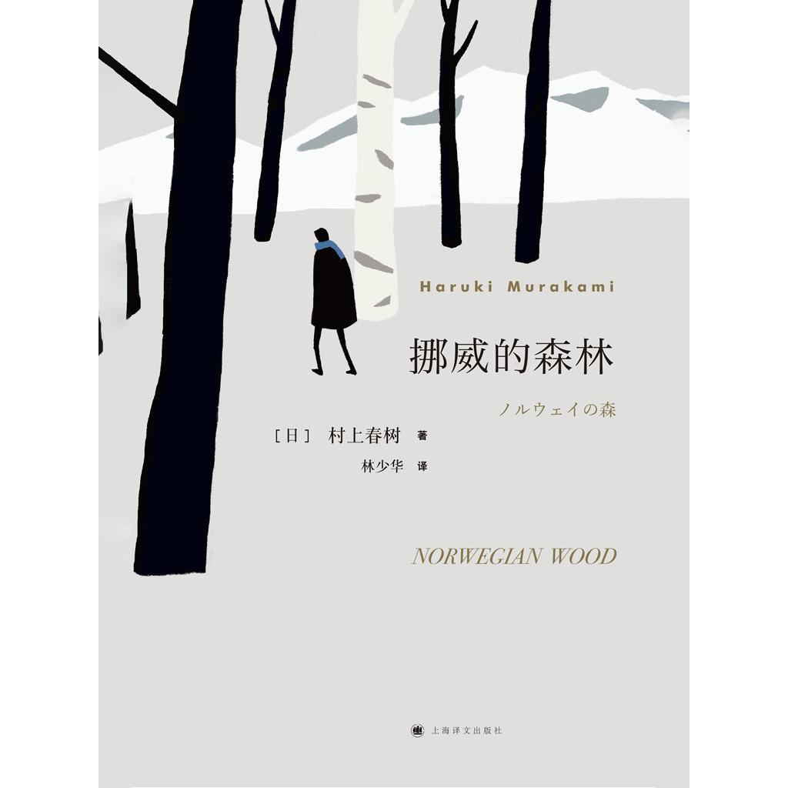
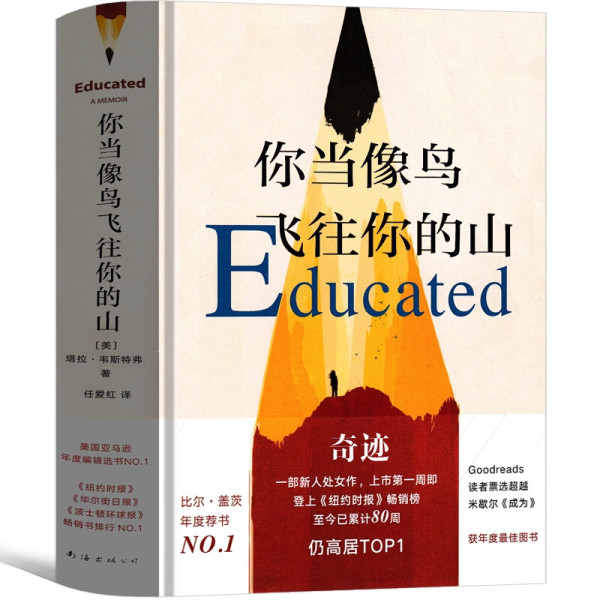
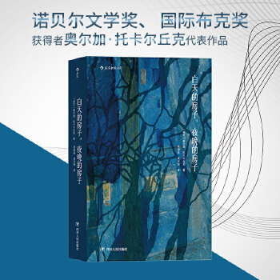

## 观史知今，当思进退，读书明志可识春秋

## 《平凡的世界》  

平凡就是一种不完美，有缺憾，苦难与抗争的平衡，而生命在缓缓徐行，不会为谁停留
***
## 《目送》  

我慢慢地、慢慢地了解到，所谓父女母子一场，只不过意味着，你和他的缘分就是今生今世不断地在目送他的背影渐行渐远。你站在小路的这一端，看着他逐渐消失在小路转弯的地方，而且，他用背影默默告诉你，不必追。
——龙应台《目送》
***

## 《挪威的森林》

***
## 《四大名著》  
《三国演义》，《红楼梦》，《水浒传》，《西游记》
***
## 《你当像鸟飞往你的山》

***
## 《一往无前》

***
## 《白天的房子，夜晚的房子》

***
## 《围城》

***
## 《春山好》  

***
## 《追风筝的人》 
为你，千千万万遍

***
