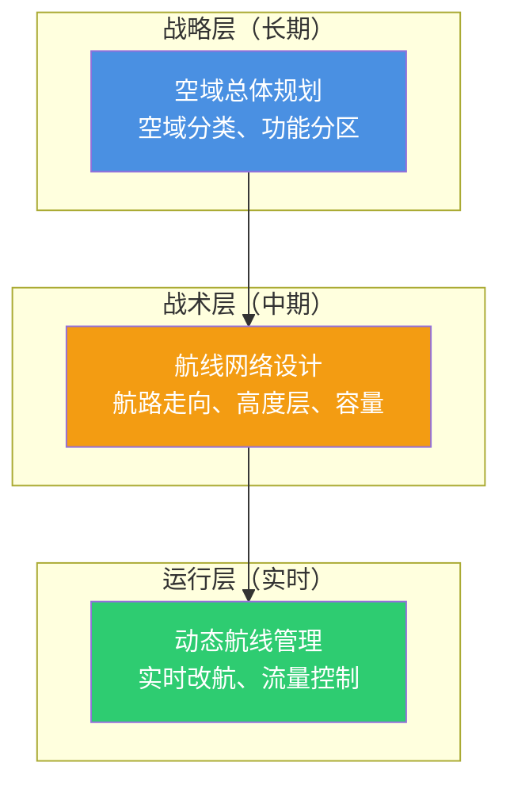
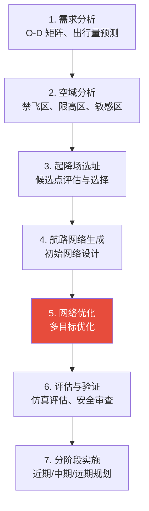

# 低空航线网络规划

## 引言

低空航线网络规划是智能立体交通工程的核心问题之一。如果说低空交通系统建模回答的是"低空交通是什么样的"，那么航线网络规划回答的就是"**飞行器应该在哪里飞**"。

> 航线网络是低空交通的"道路基础设施"。好的航线网络需要在**安全性**（避免冲突、远离敏感区域）、**效率性**（满足需求、最小化飞行成本）和**可行性**（考虑气象、噪声、空域限制）之间取得平衡。

本文从航路构型、规划方法、多目标优化和案例分析四个维度，系统介绍低空航线网络规划的理论与方法。

## 一、航线网络的基本概念

### 1.1 什么是低空航线网络

低空航线网络（Air Route Network）是在低空空域中规划的、供 eVTOL 和无人机等飞行器使用的**标准化飞行通道集合**。类似于地面交通中的道路网络，它是低空交通运行的基础设施。

### 1.2 航线网络的层次结构



### 1.3 航线网络与地面道路网络的对比

| 维度 | 地面道路网络 | 低空航线网络 |
|------|-------------|-------------|
| **拓扑结构** | 固定（道路、桥梁） | 半固定（航路 + 动态调整） |
| **维度** | 二维 | 三维（含高度层） |
| **容量** | 由车道数决定 | 由安全间隔和空域体积决定 |
| **信号控制** | 红绿灯 | 无（依赖间隔管理和优先级规则） |
| **建设成本** | 极高（物理基础设施） | 极低（虚拟划设） |
| **调整灵活性** | 极低 | 高（可动态开关航路） |

## 二、航路构型

### 2.1 主要航路构型类型

| 构型 | 说明 | 优点 | 缺点 |
|------|------|------|------|
| **自由飞行** | 无固定航路，飞行器自主规划路径 | 灵活、距离最短 | 安全管理难度大、容量低 |
| **管道式航路** | 固定宽度管道，类似"空中高速公路" | 安全可控、容量高 | 绕行距离长、灵活性差 |
| **航路点网络** | 通过航路点连接的航段网络 | 兼顾灵活性和可控性 | 需要精心设计航路点布局 |
| **网格化空域** | 将空域划分为网格单元 | 便于数字化管理 | 网粒度选择影响效率 |

### 2.2 管道式航路设计

管道式航路是目前最主流的构型。一条管道航路包含以下参数：

```
┌─────────────────────────────────────────────────┐
│              管道航路参数                          │
├─────────────┬───────────────────────────────────┤
│ 中心线坐标   │ (x₁,y₁,h₁) → (x₂,y₂,h₂)        │
│ 管道宽度     │ w（水平方向，通常 200-500m）       │
│ 高度范围     │ [h_min, h_max]                     │
│ 飞行方向     │ 单向 / 双向                        │
│ 容量         │ C（架次/小时）                      │
│ 速度限制     │ [v_min, v_max]                     │
│ 气象限制     │ 最大风速、最低能见度                 │
│ 噪声约束     │ 地面噪声限值（dB）                  │
└─────────────┴───────────────────────────────────┘
```

### 2.3 航路点网络设计

航路点网络是更灵活的构型，通过在关键位置设置航路点，飞行器在航路点之间沿直线或曲线飞行：

$$
G = (V_W, E_W)
$$

- $V_W$：航路点集合（起降场、交叉点、转弯点）
- $E_W$：航段集合（航路点之间的连接）

**航路点选址原则**：

| 原则 | 说明 |
|------|------|
| **需求覆盖** | 航路点应覆盖主要 O-D 对 |
| **地理约束** | 避开禁飞区、敏感区域（学校、医院） |
| **间隔要求** | 航路点之间距离满足最小飞行时间要求 |
| **高度过渡** | 在航路点处进行高度层切换 |
| **冗余设计** | 关键航路点应有备用路径 |

## 三、航线网络规划方法

### 3.1 规划流程



### 3.2 数学规划模型

#### 基础模型：最小成本网络设计

$$
\min \sum_{(i,j) \in E} c_{ij} f_{ij} + \sum_{(i,j) \in E} F_{ij} y_{ij}
$$

$$
\text{s.t.} \quad \sum_{j:(i,j) \in E} f_{ij} - \sum_{j:(j,i) \in E} f_{ij} = d_i, \quad \forall i \in V
$$

$$
f_{ij} \leq C_{ij} y_{ij}, \quad \forall (i,j) \in E
$$

$$
y_{ij} \in \{0, 1\}, \quad f_{ij} \geq 0
$$

其中：
- $f_{ij}$：航段 $(i,j)$ 上的流量
- $y_{ij}$：是否建设航段 $(i,j)$
- $c_{ij}$：单位流量成本
- $F_{ij}$：航段建设固定成本
- $C_{ij}$：航段容量
- $d_i$：节点 $i$ 的净需求

#### 多目标优化模型

航线网络规划本质上是多目标优化问题：

$$
\min \left\{ f_1(\mathbf{x}), f_2(\mathbf{x}), f_3(\mathbf{x}) \right\}
$$

| 目标 | 函数 | 说明 |
|------|------|------|
| $f_1$ | $\sum_{(i,j)} d_{ij} f_{ij}$ | **最小化总飞行距离**（效率） |
| $f_2$ | $\sum_{(i,j)} r_{ij} y_{ij}$ | **最小化安全风险**（安全性） |
| $f_3$ | $\sum_{k} \max(0, q_k - C_k)$ | **最小化拥堵程度**（容量） |

### 3.3 求解算法

| 算法类型 | 代表算法 | 适用场景 |
|----------|----------|----------|
| **精确算法** | 分支定界、Benders 分解 | 小规模网络 |
| **元启发式** | 遗传算法（GA）、粒子群优化（PSO） | 中大规模网络 |
| **多目标进化** | NSGA-II、NSGA-III、MOEA/D | 多目标优化 |
| **图算法** | 最短路径、最小生成树、网络流 | 特定子问题 |
| **AI 方法** | GNN + RL、LLM 辅助设计 | 前沿探索 |

#### U-NSGA-III 在航线网络中的应用

U-NSGA-III（统一非支配排序遗传算法 III）是目前航线网络规划中最常用的多目标优化算法之一。成都案例研究表明，U-NSGA-III 能在三个优化目标之间找到良好的 Pareto 前沿。

**编码方案**：将航线网络编码为可变长度染色体，支持不同数量的航路：

```
染色体编码示例：
| 航路 1: 起降场A → 航路点3 → 航路点7 → 起降场B |
| 航路 2: 起降场A → 航路点1 → 航路点5 → 起降场C |
| 航路 3: 起降场B → 航路点4 → 起降场C            |
```

## 四、关键约束条件

### 4.1 空域约束

| 约束类型 | 说明 | 建模方式 |
|----------|------|----------|
| **禁飞区** | 机场周边、军事禁区、政府机关 | 硬约束，航路不得穿越 |
| **限高区** | 建筑物密集区、居民区 | 高度上限约束 |
| **临时空域** | 大型活动、应急情况 | 动态约束 |
| **缓冲区** | 禁飞区/限高区外围的安全缓冲 | 软约束，惩罚函数 |

### 4.2 气象约束

$$
\text{可行} \Leftrightarrow v_{\text{wind}} \leq v_{\max}^{\text{wind}} \land \text{visibility} \geq V_{\min} \land \text{precipitation} \leq P_{\max}
$$

### 4.3 噪声约束

$$
L_{\text{ground}}(x, y) = L_0 - 20 \log_{10}(r) - 11 \leq L_{\max}
$$

其中 $r$ 为飞行器到地面点的距离，$L_0$ 为声功率级，$L_{\max}$ 为噪声限值（居民区通常为 55-65 dB）。

### 4.4 安全间隔约束

$$
d_{\text{horizontal}} \geq d_h^{\min}, \quad d_{\text{vertical}} \geq d_v^{\min}
$$

## 五、国内实践与案例

### 5.1 城际低空航线规划

2025-2026 年，中国多个城市开展了城际低空航线规划实践：

| 城市/区域 | 进展 | 特点 |
|-----------|------|------|
| **深圳-珠海** | eVTOL 跨海航线已试运营 | 全国首条跨海 eVTOL 航线 |
| **长三角城市群** | 多源数据驱动的航线网络规划 | 两级航路点系统（机场级 + 乡镇级） |
| **成渝地区** | U-NSGA-III 多目标优化 | 覆盖效率、安全、容量三目标 |
| **北上广深** | eVTOL 通勤航线网络规划 | 多源数据融合 + Agent-Based 建模 |

### 5.2 航线分类体系

根据 2024 年《低空经济场景白皮书》，低空航线可分为四类：

| 类型 | 说明 | 规划重点 |
|------|------|----------|
| **跨省航线** | 省际长距离（>200km） | 高度层选择、气象走廊 |
| **省内航线** | 省内中距离（50-200km） | 起降场布局、需求覆盖 |
| **跨海航线** | 海岛/海湾连接 | 海上气象、应急备降 |
| **旅游航线** | 景区空中游览 | 景观路径、噪声控制 |

### 5.3 规划实施策略

低空航线网络应分阶段实施：

| 阶段 | 时间 | 内容 |
|------|------|------|
| **近期（1-2 年）** | 示范运营 | 重点城市间的点对点航线 |
| **中期（3-5 年）** | 网络扩展 | 形成区域航线网络，覆盖主要城市群 |
| **远期（5-10 年）** | 成熟运营 | 全国性航线网络，实现多模式协同 |

## 六、研究前沿

| 方向 | 说明 |
|------|------|
| **动态航线网络** | 根据实时需求/气象动态调整航路 |
| **多模式协同** | 地面-低空联运的联合网络规划 |
| **AI 辅助设计** | LLM + 优化算法的交互式航线设计 |
| **数字孪生** | 航线网络的实时数字镜像与仿真推演 |
| **公平性考量** | 不同区域/群体的航线服务公平性 |
| **碳中和** | 绿色航线规划（最小化碳排放/噪声） |

## 总结

| 维度 | 要点 |
|------|------|
| **核心问题** | 在安全性、效率性、可行性之间平衡 |
| **航路构型** | 管道式（主流）、航路点网络、网格化空域 |
| **规划方法** | 数学规划 + 多目标优化（NSGA-III） |
| **关键约束** | 空域、气象、噪声、安全间隔 |
| **国内实践** | 深圳-珠海跨海、长三角、成渝、北上广深 |
| **实施策略** | 近期示范 → 中期扩展 → 远期成熟 |

> **一句话总结**：低空航线网络规划的本质是一个**多约束、多目标的网络优化问题**。好的规划方法需要在数学严谨性和工程可行性之间取得平衡，同时考虑分阶段实施的策略。

---

**相关文章**：

- [低空交通系统建模](/research/aerotech/system-modeling/) — 航线网络规划的输入基础
- [冲突检测与解脱](/research/aerotech/conflict-resolution/) — 航线网络运行中的冲突管理
- [低空基础设施选址优化](/research/aerotech/facility-location/) — 起降场选址与航线网络的联合优化
