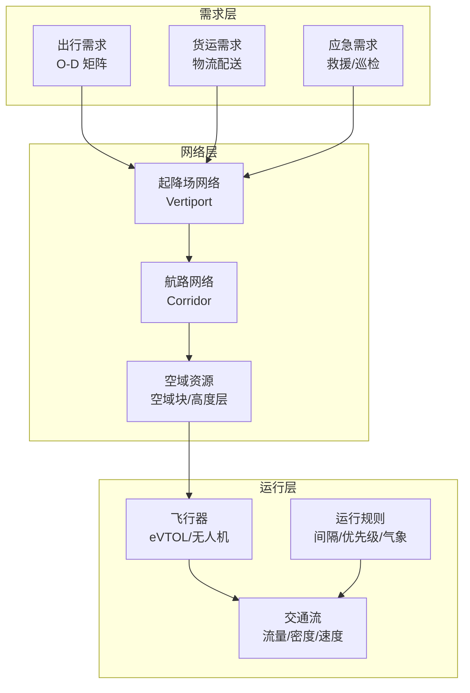
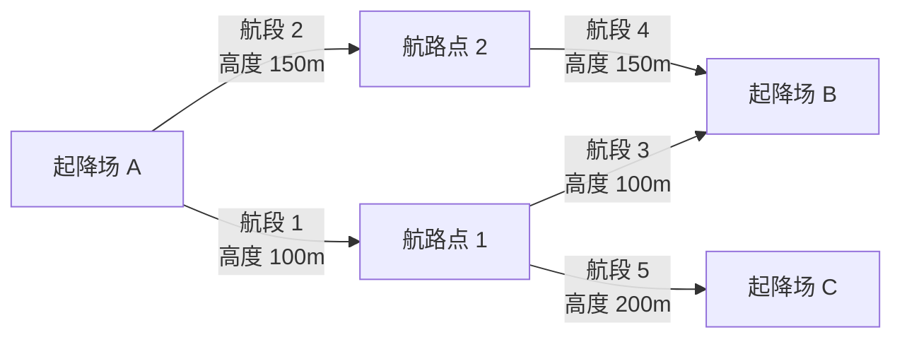

# 低空交通系统建模

## 引言

低空交通系统建模是智能立体交通工程的基础。与地面交通不同，低空交通具有**三维空间自由度、飞行器性能约束多样、气象敏感性强、安全间隔要求高**等特点，传统的地面交通建模方法无法直接套用。

> 低空交通系统建模的核心问题：如何在三维空域中，准确描述 eVTOL/无人机等飞行器的运行特征、需求分布、交通流演化规律，为航线规划、调度优化和流量管理提供可靠的数学基础。

本文从运行场景建模、交通流理论、需求建模和网络建模四个维度，系统梳理低空交通系统建模的关键方法与研究进展。

## 一、低空交通系统概述

### 1.1 与地面交通的本质区别

| 维度 | 地面交通 | 低空交通 |
|------|----------|----------|
| **空间维度** | 二维网络（道路/交叉口） | 三维空域（高度层 + 航路） |
| **运动约束** | 道路拓扑约束、信号灯 | 飞行包线、性能包线、气象包线 |
| **基础设施** | 固定（道路、桥梁） | 半固定（航路、起降场）+ 动态（临时航线） |
| **安全间隔** | 车间时距（秒级） | 空间间隔（水平/垂直，百米级） |
| **交通参与者** | 同质（均为车辆） | 异构（eVTOL、无人机、传统航空器） |
| **环境影响** | 相对可控 | 高度敏感（风、能见度、降水） |

### 1.2 低空交通系统的组成要素

## 二、运行场景建模

### 2.1 运行场景分类

低空交通的运行场景可分为以下几类：

| 场景类型 | 说明 | 典型应用 |
|----------|------|----------|
| **点对点通勤** | 固定起降场之间的定期航班 | 城市内/城际 eVTOL 通勤 |
| **按需出行** | 乘客实时呼叫，动态分配 | 空中出租车（Air Taxi） |
| **物流配送** | 无人机从枢纽到目的地的货物运输 | 即时配送、医疗物资运输 |
| **公共服务** | 巡检、搜救、测绘等 | 电力巡线、应急救援 |
| **混合运行** | 多类型飞行器在同一空域运行 | eVTOL + 无人机 + 通用航空 |

### 2.2 运行场景建模方法

#### 确定性场景建模

适用于需求相对稳定、可预测的场景（如定期通勤航线）：

$$
\min \sum_{(i,j) \in E} c_{ij} x_{ij} \quad \text{s.t.} \quad \sum_{j} x_{ij} - \sum_{j} x_{ji} = d_i, \quad \forall i \in V
$$

其中 $c_{ij}$ 为航段 $(i,j)$ 的成本，$x_{ij}$ 为流量，$d_i$ 为节点的净需求。

#### 随机场景建模

低空交通需求具有高度不确定性，需要引入随机建模：

- **需求随机性**：出行需求服从非齐次泊松过程
$$
N_p(t) \sim \text{Poisson}(\lambda_p(t))
$$

- **服务时间随机性**：飞行时间受气象、空域限制等因素影响
$$
T_{ij} = \bar{t}_{ij} + \epsilon_{ij}, \quad \epsilon_{ij} \sim \mathcal{N}(0, \sigma^2_{ij})
$$

- **供给随机性**：飞行器可用性受维护、故障等影响

#### 场景生成方法

| 方法 | 说明 | 适用场景 |
|------|------|----------|
| **历史数据驱动** | 基于现有交通数据生成场景 | 有运营数据的城市 |
| **蒙特卡洛模拟** | 随机采样生成大量场景 | 不确定性分析 |
| **情景规划** | 构建典型情景（乐观/基准/悲观） | 战略规划 |
| **Agent-Based 建模** | 模拟个体出行决策 | 微观行为分析 |

## 三、低空交通流理论

### 3.1 低空交通流的基本参数

借鉴地面交通流理论，定义低空交通流的三参数：

| 参数 | 定义 | 单位 |
|------|------|------|
| **流量 $q$** | 单位时间通过某截面的飞行器数 | 架次/小时 |
| **密度 $k$** | 单位空域体积内的飞行器数 | 架次/km² |
| **速度 $v$** | 飞行器的平均飞行速度 | km/h |

基本关系：

$$
q = k \cdot v
$$

### 3.2 低空交通流特性

与地面交通流相比，低空交通流有以下独特性：

**（1）三维空间特性**

低空交通流在三维空间中分布，密度定义需要考虑高度维度：

$$
k(x, y, z, t) = \lim_{\Delta V \to 0} \frac{N(\Delta V, t)}{\Delta V}
$$

其中 $\Delta V = \Delta x \cdot \Delta y \cdot \Delta z$ 为三维空间微元。

**（2）安全间隔约束**

飞行器之间必须保持最小安全间隔：

$$
d_{ij} \geq d_{\min}^{h} \quad (\text{水平间隔}), \qquad \Delta h_{ij} \geq d_{\min}^{v} \quad (\text{垂直间隔})
$$

这直接决定了空域容量上限。

**（3）异构交通流**

不同类型飞行器（eVTOL、物流无人机、巡检无人机）具有不同的性能参数，形成异构交通流：

$$
q = \sum_{m \in M} q_m, \quad k = \sum_{m \in M} k_m
$$

### 3.3 空域容量模型

空域容量是低空交通系统建模的核心指标之一：

$$
C = \frac{T}{\Delta t_{\min}} = \frac{T}{d_{\min} / \bar{v}}
$$

其中 $T$ 为时间窗口，$\Delta t_{\min}$ 为最小时间间隔，$d_{\min}$ 为最小安全间隔，$\bar{v}$ 为平均速度。

**影响因素**：

| 因素 | 影响 |
|------|------|
| 安全间隔要求 | 间隔越大，容量越小 |
| 航路结构 | 管道式 > 自由飞行 |
| 气象条件 | 恶劣天气显著降低容量 |
| 飞行器性能 | 速度差异越大，容量越小 |
| 通信导航能力 | 精度越高，间隔可越小 |

### 3.4 低空三维路阻函数

将地面交通的路阻函数扩展到三维空间，构建低空三维路阻函数：

$$
f(x,y,z,t) = \lambda_1 w(x,y,z,t) + \lambda_2 d(x,y,z,t) + \lambda_3 l(x,y,z,t)
$$

其中：
- $w$：天气影响因子（风速、能见度、降水）
- $d$：交通密度影响因子（拥堵程度）
- $l$：空域限制因子（禁飞区、限高区）
- $\lambda_1, \lambda_2, \lambda_3$：权重系数，$\lambda_1 + \lambda_2 + \lambda_3 = 1$

## 四、需求建模

### 4.1 需求建模方法分类

| 方法 | 原理 | 优点 | 缺点 |
|------|------|------|------|
| **四阶段法** | 生成→分布→方式划分→分配 | 成熟、可解释 | 静态、数据需求大 |
| **随机效用模型** | 离散选择模型（Logit/Probit） | 微观行为建模 | 需要大量调查数据 |
| **深度学习** | LSTM/GNN/Transformer 预测 | 可捕捉复杂模式 | 可解释性差、需大量数据 |
| **Agent-Based** | 模拟个体决策 | 灵活、可模拟涌现行为 | 计算成本高、校准难 |

### 4.2 基于随机效用模型的需求预测

最常用的方法是多项 Logit 模型（MNL），预测出行者选择 eVTOL 的概率：

$$
P_{\text{eVTOL}} = \frac{e^{V_{\text{eVTOL}}}}{e^{V_{\text{eVTOL}}} + e^{V_{\text{ground}}} + e^{V_{\text{transit}}}}
$$

其中效用函数：

$$
V_{\text{eVTOL}} = \beta_1 \cdot \text{Time}_{\text{eVTOL}} + \beta_2 \cdot \text{Cost}_{\text{eVTOL}} + \beta_3 \cdot \text{Safety}_{\text{eVTOL}} + \beta_4 \cdot \text{Comfort}_{\text{eVTOL}}
$$

**关键影响因素**：

- **时间节省**：eVTOL 相比地面交通的时间优势（最重要的因素）
- **票价**：eVTOL 票价与地面交通的比值
- **安全感知**：公众对低空飞行的安全担忧
- **舒适度**：噪声、颠簸、晕眩等因素
- **接驳时间**：从出发地到起降场的"第一公里"和"最后一公里"

### 4.3 空间-时间需求建模

低空需求具有显著的时空异质性：

$$
D(s, t) = D_{\text{base}}(s) \cdot f_{\text{temporal}}(t) \cdot f_{\text{weather}}(t) \cdot f_{\text{event}}(s, t)
$$

其中：
- $D_{\text{base}}(s)$：空间基础需求（由人口密度、经济活动决定）
- $f_{\text{temporal}}(t)$：时间因子（早晚高峰、工作日/周末）
- $f_{\text{weather}}(t)$：天气修正因子（恶劣天气需求骤降）
- $f_{\text{event}}(s, t)$：事件因子（大型活动、节假日）

### 4.4 O-D 矩阵估计

O-D（Origin-Destination）矩阵是低空交通系统建模的核心输入：

$$
Q = [q_{ij}]_{n \times n}
$$

其中 $q_{ij}$ 为从起点 $i$ 到终点 $j$ 的出行需求量。

**估计方法**：

| 方法 | 数据需求 | 精度 |
|------|----------|------|
| **调查法** | 问卷调查、意向调查 | 高但成本大 |
| **重力模型** | 人口、经济数据 | 中等 |
| **手机信令** | 匿名手机数据 | 中等 |
| **仿真生成** | Agent-Based 模型 | 取决于校准 |

## 五、网络建模

### 5.1 低空交通网络表示

低空交通网络可以用图 $G = (V, E)$ 表示：

- **节点 $V$**：起降场（Vertiport）、航路交叉点、空域入口/出口
- **边 $E$**：航段（Corridor），具有长度、容量、高度层等属性

### 5.2 多层网络建模

低空交通网络本质上是多层网络：

$$
G = \bigcup_{h \in H} G_h = \bigcup_{h \in H} (V_h, E_h)
$$

其中 $H$ 为高度层集合，$G_h$ 为第 $h$ 层的网络。

**层间关系**：
- **垂直转换**：爬升/下降航段连接不同高度层
- **容量耦合**：同一空域柱体中各层容量相互影响
- **约束传播**：一层的变化可能影响其他层

### 5.3 随机网络建模

低空交通网络面临多种不确定性：

| 不确定性来源 | 建模方法 |
|--------------|----------|
| 需求波动 | 随机 O-D 矩阵 |
| 航段容量 | 容量服从概率分布 |
| 飞行时间 | 随机路阻函数 |
| 网络拓扑 | 航路动态开关 |

**两阶段随机规划模型**：

$$
\min_{x} \left\{ c^T x + \mathbb{E}_\xi \left[ \min_{y(\xi)} q^T y(\xi) \right] \right\}
$$

其中 $x$ 为第一阶段决策（网络设计），$y(\xi)$ 为第二阶段决策（场景 $\xi$ 下的运行调度）。

## 六、常用仿真工具

| 工具 | 类型 | 特点 |
|------|------|------|
| **VertiSim** | 开源离散事件仿真 | 专为 UAM 设计，建模乘客流、飞行器运行和能源动态 |
| **NetLogo** | Agent-Based 仿真 | 适合自组织行为和涌现特性研究 |
| **MATLAB/Simulink** | 数值仿真 | 灵活、适合算法验证 |
| **SUMO + 扩展** | 交通仿真 | 地面-低空联合仿真 |
| **AnyLogic** | 多方法仿真 | 支持离散事件、Agent-Based 和系统动力学 |
| **AirSim** | 高保真仿真 | 微软开发，支持飞行器物理仿真 |

## 七、研究前沿与挑战

| 方向 | 说明 |
|------|------|
| **数据驱动建模** | 利用真实运营数据（手机信令、出行平台）校准模型 |
| **实时在线建模** | 基于实时数据的动态模型更新 |
| **多模式耦合** | 地面-低空-地下交通的联合建模 |
| **AI 增强建模** | 用 LLM/GNN 等提升建模效率和精度 |
| **不确定性量化** | 气象、需求、供给多重不确定性下的建模 |
| **数字孪生** | 构建低空交通系统的实时数字镜像 |

## 总结

低空交通系统建模是智能立体交通工程研究的基石。核心要点：

| 维度 | 要点 |
|------|------|
| **与地面交通的区别** | 三维空间、异构参与者、气象敏感、安全间隔 |
| **运行场景** | 确定性 + 随机性建模，场景生成方法 |
| **交通流** | 三维密度、安全间隔约束、异构流、空域容量 |
| **需求建模** | 随机效用模型、时空异质性、O-D 矩阵估计 |
| **网络建模** | 多层网络、随机网络、两阶段随机规划 |
| **仿真工具** | VertiSim、NetLogo、MATLAB、AnyLogic |

> **一句话总结**：低空交通系统建模的核心挑战在于**三维空间的复杂性**和**多重不确定性**。好的模型需要在精度和可计算性之间取得平衡，为下游的航线规划和调度优化提供可靠输入。

---

**相关文章**：

- [低空航线网络规划](/research/aerotech/route-network/) — 基于系统建模的航线网络设计方法
- [冲突检测与解脱](/research/aerotech/conflict-resolution/) — 基于网络模型的冲突管理
- [低空出行需求预测](/research/aerotech/demand-forecasting/) — 需求建模的深入展开
